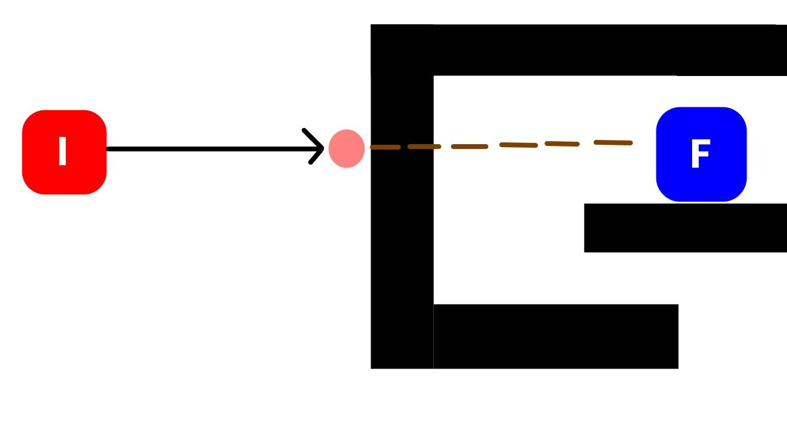

# BUSCA HEURÍSTICA

A busca heurística é uma busca em árvore ou grafo aonde para definir o próximo nó a ser avaliado usa-se, além do custo para chegar até aquele nó, um valor chamado custo heurístico. Os algoritmos usados aqui são otimizações de busca que define de forma mais inteligente quais opções priorizar na busca. O custo para chegar no ponto atual define quão longe estamos do ponto inicial e o custo heurístico define o quão longe estamos do objetivo final. Com isso podemos priorizar qual caminho explorar pegando sempre a menor soma.

> Muito importante: O cálculo da heurística é um **PALPITE**. Ele não precisa nem costuma ser o cálculo exato de quanto falta para chegar, até porque essa informação só se tem quando de fato chega.

## Aplicações

Ele é muito usado para definição de rotas, GPS, robótica e cálculos espaciais. Seus principais usos são para distâncias físicas (GPS, movimentação de robôs e máquinas pela fábrica ou casa, movimetação de personagens num jogo de videogame, definir trajetória para carros autônomos ou logística). Os usos mais clássicos são definir a trajetória do carro pela cidade ou do robô limpador pela casa.

Outros exemplos é na área de logística, aonde um **entregador, caminhão, ônibus, ou caixeiro viajante** precisa passar em todos os pontos definidos gastando menor tempo ou combustível. Outro exemplo clássico é solução de labirintos, pois na prática é o mesmo que definir um percurso pela cidade ou pela casa.

## Opções de busca

O primeiro tipo de algoritmo de busca que se pnsa é a busca em largura e profundidade. Eles testam todas as opções até acabar a árvore/grafo ou encontrar o objetivo. Eles são muito custosos pois, além de não dar a melhor resposta, ainda podem demorar muito pois testam todas as opções possíveis.

Um algoritmo mais complexo é o Djikstra, que calcula o custo até chegar naquele nó (nº de nós até ele ou a distância entre os pontos). A forma de calcular o custo até o ponto depende do que faz sentido para sua aplicação, mas ele representa o custo para sair do ponto inicial até o ponto atual. Cada nó tem seu custo e é priorizado sempre os nós com menor custo para serem avaliados em seguida.

Os algoritmos de heurística adicionam ao Djikstra mais uma conta: o quão longe está do objetivo final. Ao somar o quanto já andou e o quanto falta andar para chegar ao objetivo se tem uma métrica melhor que a do Djikstra para saber qual nó analisar. Esses algoritmos encontram a opção de forma mais rápida, embora não necessariamente seja sempre o menor caminho. `Eles trocam o melhor resultado por velocidade de processamento`. Porém de modo geral seus retornos são próximos da solução ótima.

## Restrições

Como precisa modelar de algum modo o custo para chegar no objetivo final esses algoritmos só podem ser usados em sistema que se conhece onde está objetivo final e quão longe, custoso ou difícil será sair de cada ponto até ele. Por isso ele é muito usado para calcular distâncias físicas e rotas. Aplicações em que não se conhece o ambiente inteiro (como caminho a ser percorrido por um pacote para chegar ao servidor final) não tem como usá-lo. Também são mais complexos pois adicionam uma camada extra de conhecimento sobre o ambiente.

> **Para usá-lo é preciso um conhecimento de todo o ambiente**.

## Principais formas de cálculo

Dependendo do contexto você pode ter cálculos específicos para a heurística, mas os mais padrões são:

- Distância em linha reta: calcula a distância euclidiana
  - Precisa ter o ponto X e Y (ou latitude e longitude) de cada nó e do ponto final
- Distância matricial: calcula a distância via Wavefront
  - Os pontos ao lado do objetivo final tem distância 1, os pontos em volta desse 2 e assim por diante
  - Funciona bem para matrizes. Para grafos precisa rodar todo o grafo dando valores de distância para eles
- Contagem de peças fora do lugar
  - Usado em videogames como quebra-cabeças e jogo dos 8

## Principais algoritmos

Os algoritmos mais famosos são:

### Busca Gulosa (Greedy Best-First Search)

Usa como único parâmetro a distância para o objetivo final. Ou seja, não considera a distância caminhada até o ponto atual. É super rápida quando dá certo, porém pode não encontrar a solução se envolver dar uma volta maior, ficando facilmente preso em mínimos locais ou ficar andando em círculos. O exemplo abaixo mostra como o algoritmo pode ficar preso em um mínimo local.

### A* (A Estrela)

É o exemplo clássico de algoritmo de heurística, sendo o usado no exemplo comparado com o Djiskstra acima. Ele é uma evolução do Djikstra adicionando a função heurística e somando ela com o custo de chegada ao ponto atual. Sempre encontra uma solução, não fica preso em mínimos locais e sua resposta pode ser ótima caso a função heurística não subestime a facilidade de chegar ao ponto final.

Ou seja, caso haja muitos obstáculos e tenha de dar muitas voltar para chegar no ponto final a heurística pode subestimar a distância ao ponto final, dando sempre um valor baixo quando na verdade é alto, assim insistindo num percurso longo e só percebendo isso quando o custo até o ponto atual (o quanto já andou) se tornou muito alto.

### Subida de Encosta (Hill Climbing)

Calcula a distância ao ponto final do ponto atual e de todos os vizinhos e vai para o vizinho com melhor resultado. Ele é imaginado como um espaço 3D aonde quanto mais alto o ponto melhor. Você está perdido e sem mapa e tem apenas sua visão para decidir para que lado ir. Porém você só consegue enxergar a 1 passo de distância. Então você dá sempre 1 passo para o lado mais alto (para o vizinho com melhor resultaod na heurística).

Ele faz uma busca local entre os vizinhos (busca em largura só até profundidade 1). Por só fazer uma busca na região em volta ele pega sempre a melhor opção no momento, chegando à melhor opção local. Ou seja, é um algoritmo que tem chances de ficar preso em mínimos locais. Ele não funciona bem quando chega em platôs (todos os vizinhos com mesma distância do ponto final) ou quando chega no melhor ponto dentre os vizinhos (mínimo local), podendo parar nesses pontos sem concluir a execução.

A grande vantagem desse algoritmo é a pouca memória que ocupa, pois não cria uma grande árvore de possibilidades nem listas de nós visitados. Ele só conhece onde está e seus próximos passos, sem grande memória. Isso faz dele o algoritmo mais econômico em questão de memória. Podemos fazer uma versão com memória dos pontos já visitados, evitando que ele fique preso andando em círculos.

#### Comparação com Gradiente descendente

> Muito importante: Subida de encosta não tem relações com gradiente descendente! A subida de encosta **não usa** derivadas ou matemática complexa para definir o melhor próximo passo.

A única semelhança entre os dois é ficarem presos em mínimos locais. Além disso o gradiente descendente tem como objetivo minimizar uma outra função (de custo ou de erro). É diferente da subida de encosta que define qual próximo passo de acordo com a função de custo. 

Também não podemos usar o gradiente descendente para minimizar a função de custo da subida de encosta, pois o gradiente traaaaaaabalha com equações e derivadas, ou seja, exige uma expressão matemática da função a ser minimizada. A subida de encosta não fornece uma representação matemática do espaço físico, ao invés disso temos uma árvore, matriz ou grafo e não temos como calcular a derivada dessas estrutura de dados.

# CÓDIGOS PRESENTES

Aqui temos 3 exercícios feitos com o algoritmo A* mostrando como usá-lo. Uma busca pelo melhor caminho em um grafo, a resolução de um labirinto e resolução do jogo dos 8.

Nos 2 primeiros o A* será comparado com o Djikistra para vermos a diferença entre as 2 soluções. No jogo dos 8 será usado A* também, mas não haverá comparação com Djikstra. A função heurística será o número de peças fora do lugar e será feito através de uma busca em grafo também, aonde cada nó é uma combinação de posições.