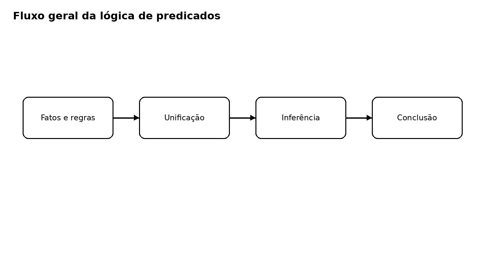
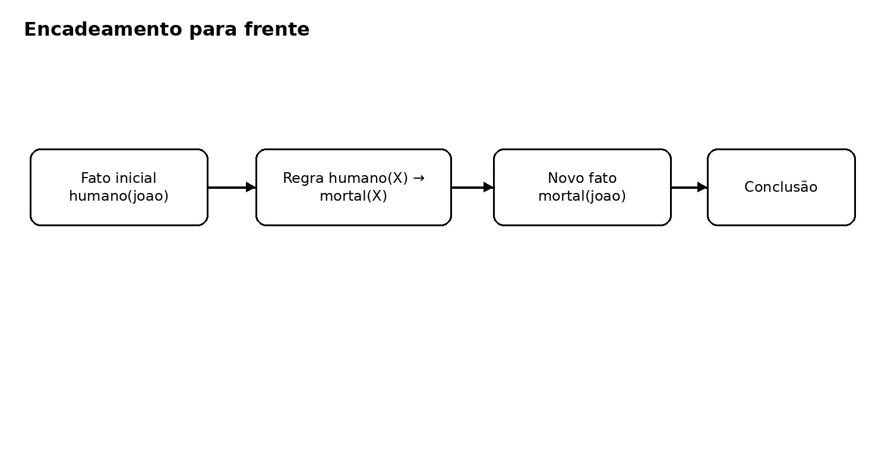
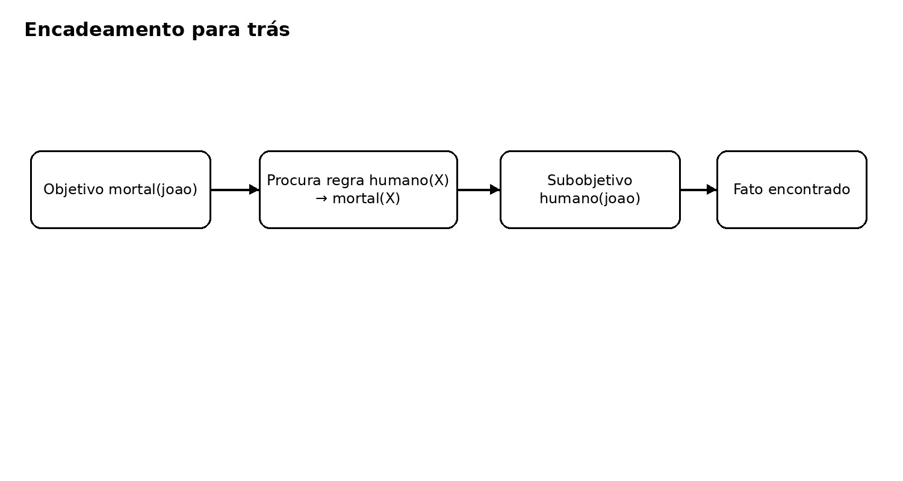

# LÓGICA DE PREDICADOS

A **lógica de predicados**, ou **lógica de primeira ordem (First-Order Logic — FOL)**, é uma das principais técnicas clássicas de representação de conhecimento em IA simbólica. Ela é uma evolução da lógica proposicional, aumentando suas capacidades ao adicionar entidades e relações nas proposições. 

A lógica proposicional trabalha com proposições inteiras:

```text
P = "João é programador"
Q = "João conhece Python"
```

Já a lógica de predicados permite representar entidades, propriedades e relações:

```text
programador(joao)
conhece(joao, python)
```

Isso permite que um sistema de IA represente conhecimento sobre um domínio e derive novas conclusões por meio de inferência. Esse funcionamento de representar formalmente e de forma organizada conceitos e relações é chamado de **Ontologia**.

O fluxo geral de como esse tipo de IA funciona é representado abaixo.



# COMO REPRESENTAR CONHECIMENTO

## Predicados

Um **predicado** representa uma propriedade ou relação. Ela é a base de todo esse paradigma e como o conhecimento é estruturado no sistema.

```text
humano(joao)
```

`humano` é o predicado e `joao` é seu argumento.

Com dois argumentos:

```text
programa(joao, python)
```

Isso representa a relação "João programa em Python".

Com os predicados conseguimos definir fatos dentro do sistema. Um fato é uma afirmação sobre o mundo e é verdadeira.

```text
humano(joao)
programador(joao)
conhece(joao, python)
```

A ideia é transformar uma afirmação do mundo real em uma representação formal que o mecanismo de inferência consiga manipular.

## Constantes e variáveis

Uma **constante** representa uma entidade específica. Toda variável que já teve seu valor identificado é uma constante.

```text
joao
maria
python
brasil
```

Uma **variável** representa uma entidade que ainda não foi especificada:

```text
programador(X)
```

## Regras

Uma **regra** é uma função aonde inferimos informações sobre uma variável. As regras definem relações entre objetos, pessoas e causalidade. Com isso conseguimos mais definir mais informações sobre as variáveis e constantes, aumentando nosso conhecimento sobre eles. 

A cada regra executada sobre uma constante desvendamos mais informações sobre o mesmo. A regra é chamada ao se definir uma característica sobre uma variável ou constante, assim ao descobrir uma informação ela sai disparando novas regras que descobrem mais e por sua vez disparam mais regras até defirnimos tudo que podemos sobre aquela variável. `Mapear todas as regras e todas as relações é o maior desafio desse paradigma`.

```text
programador(X) → conhece_computacao(X)
```

A regra acima é interpretada como:

> Se X é programador, então X conhece computação.

Podemos criar regras mais complexas com múltiplas condições:

```text
programador(X) ∧ conhece(X, python) → desenvolvedor_python(X)
```

O que significa:

> Se X é programador e X conhece python, então X é um desenvolvedor python.

## Quantificadores

### Quantificador universal

O símbolo `∀` significa "para todo":

```text
∀X humano(X) → mortal(X)
```

> Para todo X, se X é humano, então X é mortal.

### Quantificador existencial

O símbolo `∃` significa "existe":

```text
∃X programador(X)
```

> Existe pelo menos uma entidade que é programadora.

## Unificação

Unificação nada mais é que substituir uma variável por uma constante em uma regra (função). É um nome complicado para algo muito simples: se existe uma regra com a variável X e eu defini um predicado (fato) com esse mesmo nome, então a constante no predicado pode ser usada nessa regra para descobrir mais coisas sobre ela.

Em termos oficiais, **unificação** é o processo de encontrar substituições que tornam duas expressões compatíveis.

Considere a regra:

```text
programa(X, python)
```

e o predicado:

```text
programa(joao, python)
```

A substituição é:

```text
X = joao
```

Portanto:

```text
programa(X, python)
=
programa(joao, python)
```

Logo, as expressões unificam.

## Inferência e Motor de inferência

A inferência é a execução de tudo que vimos até agora. É chamado de inferência executar as regras (substituindo a variável por uma constante atravś da unificação) e assim descobrir novos fatos. 

Um exemplo de inferência:

```text
FATO:
humano(joao)

REGRA:
humano(X) → mortal(X)

INFERÊNCIA:
X = joao
mortal(joao)
humano(joao) → mortal(joao)

PORTANTO:
mortal(joao)
```

O motor de inferência é o componente da linguagem de programação que verifica quais regras podem ser chamadas para essa constante a partir do que sabemos agora. Nós os chamamos, descobrimos mais coisas e portanto podemos chamar mais regras. O motor define as regras que podem ser chamadas para cada objeto a cada nova descoberta sobre ele. Posso entender o motor como o sistema fazendo continuamente essa pergunta: **Posso aplicar uma regra?**

Podemos entender o motor de inferência como um sistema orientado a eventos que reage a cada mudança nos objetos observados. Ao mudar algum atributo do objeto um evento é disparado, que roda funções que verificam se o objeto tem novas alterações.

# RESUMO

Com isso definimos uma lógica de predicados como um sistema que possiu:

- **Base de conhecimento**: fatos e regras
- **Regras**: funções que podem alterar os atributos dos objetos
- **Motor de inferência**: orientação a eventos disparando regras a cada alteração no objeto

Os tópicos vistos acima podem ser dividios da seguinte forma:

```text
┌───────────────────────────┐
│     BASE DE CONHECIMENTO  │
│                           │
│ Fatos                     │
│ Regras                    │
└─────────────┬─────────────┘
              │
              ▼
┌───────────────────────────┐
│     MOTOR DE INFERÊNCIA   │
│                           │
│ busca                     │
│ unificação                │
│ aplicação das regras      │
│ encadeamento              │
└─────────────┬─────────────┘
              │
              ▼
        nova informação
```

# ARQUITETURA DE UM MOTOR DE INFERÊNCIA

Existem 2 estratégias principais por dentro de um motor de inferência. Cada linguagem de programação usa uma delas. Por exemplo o Prolog usa encadeamento para trás.

## Encadeamento para frente

O **forward chaining** começa com os fatos conhecidos e aplica regras sucessivamente. O sistema executa todas as regras sobre o atributo da minha constante, descobre mais atributos sobre ela e então executa todas as regras sobre o novo atributo descoberto até não ter mais regras ou confirmar a afirmação buscada. Essa estratégia é considerada **orientada a dados**. O funcionamento é:

```text
fato original → regra aplicável → novo fato → outra regra → novo fato... → conclusão
```



Exemplo: José é avô de alguém maior de idade?

```text
pai(josé, joão)
pai(joão, enzo)
idade(enzo, 18)

REGRA:
pai(X,Y) && pai(Y,Z) → avo(X, Z)
idade(X) >= 18 → maiorIdade(X)

Resposta: Sim!
```

## Encadeamento para trás

O **backward chaining** começa com uma conclusão desejada e vai tentando descobrir se ela é verdadeira ou falsa. Ele funciona a partir da pergunta "**Consigo provar essa afirmação?**". Ele avalia quais regras levam para esse fato e com isso muda o fato a ser provado. Essa estratégia é considerada **orientada a objetivo**. O funcionamento é:

```text
OBJETIVO
mortal(joao)
     ↓
Qual regra produz isso?
     ↓
humano(X) → mortal(X)
     ↓
Preciso provar:
humano(joao)
     ↓
Existe esse fato?
     ↓
    NÃO
     ↓
Qual regra produz isso?
     ↓
pessoa(X) → humano(X)
     ↓
Preciso provar:
pessoa(joao)
     ↓
Existe esse fato?
     ↓
    SIM

Objetivo provado
```

Ele funciona em loop testando cada novo fato sobre o objeto que queremos provar a afirmação. Primeiro testa se existe o fato e caso não haja, verifica quais regras atribuem aquele fato a uma variável e checa se o objeto cumpre a regra (prova que a regra se aplica a ele).

Exemplo: José é avô de alguém maior de idade?

```text
pai(josé, joão)
pai(joão, enzo)
idade(enzo, 18)

REGRA:
1: pai(X,Y) && pai(Y,Z) → avo(X,Z)
2: idade(X) >= 18 → maiorIdade(X) 

OBJETIVO: avo(josé, X) && maiorIdade(X)

Regra 1 gera o atributo avô em X, logo X=josé e preciso provar pai(josé,Y) && pai(Y,Z)
Regra 2 gera o atributo maiorIdade em Z, logo Z=neto e preciso provar idade(Z) >= 18

tenho algum atributo Z que tenha os fatos idade(Z) >= 18 e pai(josé,Y) e pai(Y,Z)?

Resposta: Sim!
```



## Quando usar cada uma

Use encadiameto para **frente** quando você tem **muitos fatos disponíveis** e quer descobrir quais conclusões podem ser retiradas deles.

Use encadiameto para **trás** quando você tem um objetivo/situação e quer descobrir **quais fatos tem de ser verdade para ele acontecer**. Por isso ele é muito bom para diagnósticos de doenças, aonde preciso provar que alguém está doente (objetivo) a partir de sintomas (regras).

| Característica | Forward chaining | Backward chaining |
|---|---|---|
| Direção | Fatos → conclusões | Objetivo → fatos |
| Estratégia | Data-driven | Goal-driven |
| Começa com | Fatos | Consulta |
| Uso típico | Monitoramento e detecção de eventos | Diagnóstico e consultas |
| Quando usar | Mutios dados | Tenho uma pergunta |

## Exemplo completo

Considere:

```text
programador(joao)
programador(maria)

conhece(joao, python)
conhece(maria, java)

programador(X) ∧ conhece(X, python)
→ desenvolvedor_python(X)
```

Consulta:

```text
desenvolvedor_python(joao)
```

O mecanismo procura uma regra que produza esse predicado e precisa provar:

```text
programador(joao)
e
conhece(joao, python)
```

Os dois fatos existem, portanto:

```text
desenvolvedor_python(joao) É VERDADEIRO
```

---

Se a consulta for 

```text
desenvolvedor_python(maria)
```

Temos de provar

```text
programador(maria)
e
conhece(maria, python)
```

Não temos esses fatos na nossa base, portanto

```text
desenvolvedor_python(joao) É FALSO
```

## Relação com programação tradicional

Podemos achar que uma regra nada mais é que um if, como:

```text
humano(X) → mortal(X)
```

igual a:

```text
if (humano(x)) {
    return mortal(x);
}
```

Mas existe uma diferença fundamental. A regra de fato é isso, mas o motor de inferência muda tudo. Na programação tradicional definimos explicitamente o fluxo de execução. Na programação lógica descrevemos a base de conhecimento (base, regras e relações) e o motor de inferência determina como utilizá-los.

Isso acontece porque internamente o motor de inferência cria uma árvore de possibilidades. Cada regra analisada é um nó na árvore de possibilidades, que é podada ao se provar falsa. A cada novo atributo atribuído ao objeto nossa árvore cresce, adicionando novas regras a serem analisadas. 

# LIMITAÇÕES

### Explosão combinatória

Muitos fatos e regras podem gerar um espaço de busca enorme, tornando a árvore do motor de inferência gigantesca.

### Conhecimento incompleto

No paradigma lógico `se não consigo provar X, logo X é falso`. Isso ocorre pois ele supõe que você conhece tudo sobre o domínio e tudo foi descrito nos fatos e regras. Porém isso não necessariamente é verdade. Se não sou capaz de colocar todo o conhecimento do domínio no sistema não posso afirmar que X é falso, apenas que não posso provar que é verdadeiro (semelhante a ideia de Hipótese nula e p-valor na estatística).

### Incerteza

O paradigma trabalha apenas com verdadeiro e falso, não permitindo incertezas, probabilidades ou evidências parciais. Como não podemos usar probabilidade nem trabalhar com "talvez" isso o torna bem menos factual.

# Aonde ainda é usado

A lógica de predicados continua relevante em:

- Web Semântica;
- Sistemas especialistas;
- Verificação formal (provar que um programa ou circuito satisfaz determinadas propriedades);
- Sistemas baseados em regras muito bem definidas e restrigem ações
  - Sistemas de configuração e políticas
  - Verificar se um pacote pode passar pelo firewall
  - Se alguém pode acessar ou fazer certa ação num componente da nuvem de acordo com seus acessos
  - Bot de ações que só pode vender ou comprar quando todas as regras são disparadas

Também existe uma combinação entre aprendizado neural e raciocínio simbólico, conhecida como **Neuro-Symbolic AI**:

```text
           MODELO NEURAL
                 ↓
       percepção / linguagem
                 ↓
           REPRESENTAÇÃO
                 ↓
          REGRAS / LÓGICA
                 ↓
             INFERÊNCIA
                 ↓
              DECISÃO
```

Essa combinação tenta aproveitar a capacidade dos modelos neurais de aprender padrões com a capacidade dos sistemas simbólicos de realizar raciocínio estruturado.

