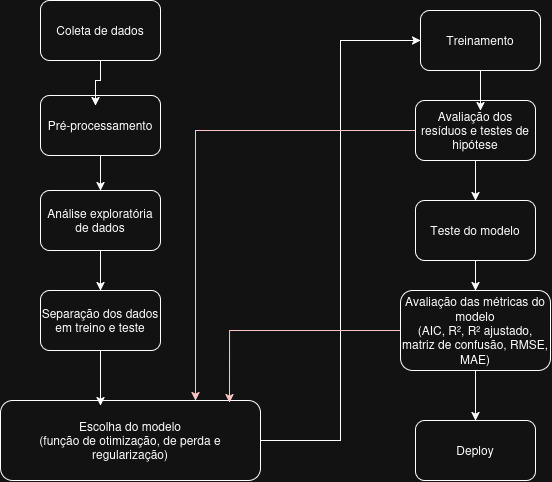
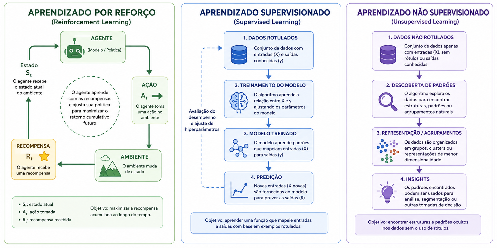
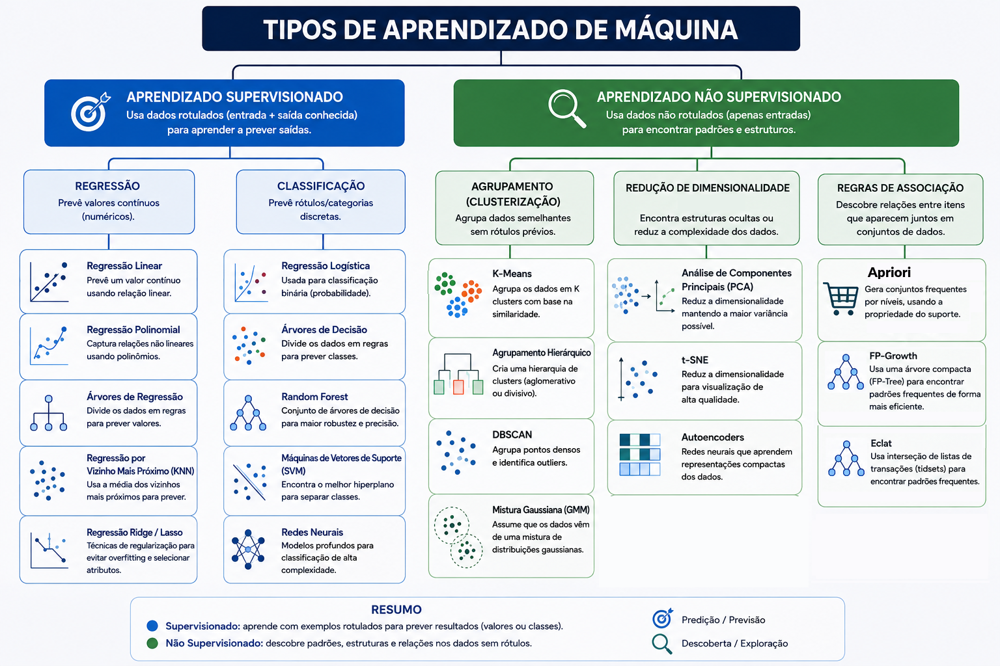

# Machine Learning (Aprendizado de Máquina)

Machine Learning (Aprendizado de Máquina) é um campo da inteligência artificial que desenvolve algoritmos e modelos capazes de aprender padrões a partir de dados e tomar decisões ou fazer previsões sem serem explicitamente programados para cada tarefa. Se diferencia da IA clássica por não ter algoritmos com grande conhecimento sobre o contexto e o programador ter de conhecer profundamente sobre a área. Nesse tipo de IA os **dados são o centro e a fonte de conhecimento** sobre o contexto. Ao coletar uma infinidade de dados sobre um assunto é possível descobrir suas regras, funcionamento e modus operandi só observando, sem ninguém informar explicitamente via código. A partir daí diversas técnicas para **encontrar os padrões escondidos nos dados** foram desenvolvidas.

Muito dos modelos de machine learning usam redes neurais, mas ela não é tudo. Há uma boa parcela da área que trabalha apenas com outros algoritmos e modelos. Nessa sessão iremos abordar os algoritmos e modelos sem redes neurais e deixaremos essa parte para as próximas sessões.

## Cronologia resumida

- 1957: Perceptron (Frank Rosenblatt).
- 1986: Redescoberta de redes neurais com backpropagation.
- 1995: Popularização de métodos de kernel e SVM (Máquina de Vetores de Suporte).
- 2006: Reavivamento do interesse por redes profundas.
- 2012: Avanço de deep learning em visão computacional (AlexNet).

## Como funciona (visão superficial)

- Coleta de dados: reunir exemplos relevantes.
- Pré-processamento: limpeza, normalização e engenharia de características.
- Escolha do modelo: encontra qual modelo melhor funciona para seu contexto e seus dados. As vezes vários podem ser testados. O modelo usa: 
  - Uma **função de perda** que calcula a **quantidade de erro das estimativas** (quão longe erramos nas previsões)
  - Um **método de otimização** que **encontra o menor valor da função de perda**
  - Opcional: um método de **regularização** para ajustar o modelo e **evitar ou overfitting ou acelerar seu processamento**
- Treinamento: ajustar parâmetros do modelo usando dados rotulados (quando aplicável) minimizando a função de perda do modelo. Ou seja, **encontra os parâmetros que erra menos**.
- Validação/teste: avaliar desempenho em dados não vistos.
- Deploy: integrar o modelo em aplicações e monitorar seu desempenho.

Arquitetonicamente, modelos aprendem transformações que mapeiam entradas para saídas. A aprendizagem é feita por uma **função de perda** (ou função de custo), **otimização** e **regularização**.

---

A função de perda é uma função ou algoritmo que mede o quão nossos dados de treino estão longe do que o modelo encontrou. Ele nos dá um norte para onde ir e uma métrica de quão bom ou ruim o modelo está durante o treinamento. Não confundir com o teste com os dados de teste. Aqui ainda estamos no meio do treinamento e buscando os coeficientes que definirão o modelo da IA. O modelo para quando essa função de perda estiver pequena o suficiente.

---

A otimização é o algoritmo usado para minimizar a função de perda (errar pelo mínimo possível). Algoritmos de função de perda mais famosos são o gradiente descendente, mínimos quadrados (usados em regressão linear) e árvores de decisão. Quando falamos de otimização falamos de definir o método de calcular o erro e minimizá-lo, ou seja, errar pelo menor valor possível. Aqui é importante entender que a função de perda nos diz o tamanho dos nossos erros e como queremos errar o mínimo, temos de encontrar um meio de minimizá-la. Existem diversas formas, algumas usam derivadas, algumas usam lógica, tudo depende do seu objetivo e dos dados com que estamos trabalhando.

Nomes comuns quando lidamos com otimização são:

- Regressão
- Mínimos Quadrados
- Gradiente Descendente
- Máxima Verossimilhança
- Árvores de decisão
- SVM

---

A regularização são técnicas usadas na otimização para evitar que um modelo se torne excessivamente complexo ou sofra *overfitting*. Formas de regularização são Ridge e Lasso, mas também pode ser análises manuais para descobrir variáveis ocultas e multicolinearidade. Métodos comuns de descobrir multicolinearidade são Matriz de correlação e VIF ou versões do algoritmos da função de perda adaptados para multicolinearidade.

Nomes comuns quando lidamos com regularização são:

- Ridge, Lasso e Elastic Net
- Matriz de confusão
- VIF
- Versões adaptadas dos algoritmos de otimização

## Passo-a-Passo Completo

No como funciona demos uma lista de ações gerais a serem feitas, mas ela está longe de ser completa. Lá demos uma visão geral com os pontos principais. A seguir listamos todo o passo-a-passo de como rodar um machine learning e explicamos brevemente seus passos. Eles podem ser dividimos em etapas como abaixo:

### Fase 1: análise dos dados

1. **Coleta**: Levantamento dos dados, preocupações com armazenamento de dados e engenharia de dados. Integração de bases de dados diferentes.

2.  **Pré-processamento**: Formatação, padronização dos dados e tratamento de outliers e de dados faltantes. Faz transformações nos dados caso necessário.

3. **Análise exploratória**: Compreender seus dados. Plotar gráficos, descobrir sua distribuição, tendências, medidas de centralidade (média, mediana e moda) e dispersão (variância, desvio, skewness e assimetria).

### Fase 2: Machine learning proriamente dito

É aqui que de fato começa o machine learning. Aqui é o material novo e exclusivo dessa área de conhecimento.

4. **Separação dos dados em treino e teste**: Divide os dados em 2 grupos, um que será usado para treinar a IA e outro para testá-la. Existem diversas técnicas para isso que serão melhor abordadas em uma sessão exclusiva.

5. **Escolha do modelo**: A partir da análise exploratória e dos objetivos é escolhido o algoritmo que melhor se encaixa. Aqui também define o algoritmo de otimização e o algoritmo de função de perda utilizada internamente, se usará alguma variação ou regularização do mesmo. Provavelmente será feito vários modelos que serão comparados para escolher o melhor e até mesmo testar o mesmo modelo com diversos parâmetros.

6. **Treinamento**: Execução dos modelos escolhidos com os dados separados. Se os dados foram separados com validação cruzada pode rodar o treinamento várias vezes com os vários grupos de treinamento definidos.

### Fase 3: Avaliação

7. **Avaliação dos resíduos e testes de hipótese**: Busca checar se os dados cumprem as premissas básicas. Verifica os p-valores e verifica os resíduos. Faz os testes nos resíduos e os plota em gráficos para checar premissas. Caso não cumpra nem precisa fazer as previsões, já aborta e volta para o passo de escolher um outro modelo.

8. **Teste do modelo**: Faz previsões com os dados de teste. Executa o modelo com dados inéditos para ele para ver se consegue acertar.

9. **Avaliação das métricas**: Verifica mais métricas retornado pelo treinamento e as métricas dos testes. Verifica quão bem os dados acertam, se os coeficientes encontrados fazem sentido e a margem de erro. Compara diferentes modelos com AIC/BIC, R² e R² ajustado, MAE e RMSE. Verifica se o R² é alto o suficiente e se o MAE e RMSE são baixos o suficiente. Verifica com a matriz de confusão se há algum tipo de dado que o modelo tem dificuldade em acertar. Escolhe o modelo com os melhores resultados e caso nenhum passe volta para o passo da escolha de um novo modelo para testar.

10. **Deploy**: Bota em produção o modelo. Podemos testar os modelos em dev com dados antigos ou mock só para ver se fazem sentido e depois rodar em staging com dados mais novos e reais. Se passar em staging então está pronto para ir para produção. Essa divisão de dados de dev e staging evita expor dados reais e sensíveis para a equipe, porém cria um novo trabalho para o engenheiro de dados: manter 2 bases, limpar dados sensíveis e PII e garantir que os dados de dev ainda sejam úteis para os testes. Pois não adianta usar dados mock aleatórios, eles precisam ter coerência entre si senão nenhum modelo funcionará e ter similaridade com os dados reais senão só escolherá modelo que não funciona na vida real. Pensando nisso o uso de dados antigos, filtrados e em menor escala é a melhor opção, mesmo que mais trabalhosa.

## Erro como parte do sistema

Importante ter em mente que por estar estimando algo a partir de dados passados sempre haverá uma taxa de erro. `Toda previsão e/ou generalização tem erros` e é isso que é o **aprendizado de máquina: encontrar padrões e generalizar um comportamento**. Essa generalização acontece por inferência estatística.

Portanto como o erro sempre estará lá, nosso objetivo ao fazer machine learning é buscar minimizar o erro. A função de perda calcula o quão errada foi nossa estimativa e, ao minimizar a função de perda, minimizamos o quão errado nossa previsão foi com os dados de treino. Com isso supomos que nossa taxa de erro com dados atuais seja a mesma dos dados de treino, porém devemos estar sempre fazendo essa medição para agir caso comece a errar demais.

---

Quando falamos em diminuir o erro não diminuir a quantidade de erro, mas **diminuir a qualidade dos erros**. Em outras palavras, não é diminuir quantas vezes erramos, mas **diminuir por quanto erramos**. O objetivo é deixar de errar por 50% e errar por 5%. Exemplo: se o valor real é 10, queremos parar de prever 50 e prever 15. Mas a quantidade de vezes que vamos errar o valor real não é a questão.

## Estatística

Toda a base teórica da análise de dados e ciência de dados é estatística. Para trabalhar com dados massivos é preciso entender de estatística bem, pois o dia-a-dia dos dados é aplicar fórmulas e métodos de probabilidade e estatística neles. Saber a tendência de dados, como se distribuem, quão dispersos são e em torno de qual valor são informações que a estatística nos dará. 

Além disso a estatística nos permite fazer inferências sobre o todo a partir de uma amostra e, do mesmo modo, sobre o futuro a partir do presente. A inferência nos permite testar se uma mudança é grande o suficiente para ser considerada mesmo uma mudança (ex: faz realmente diferença meu peso mudar de 70 para 70,001?), se um acontecimento foge do esperado consderando sua dispersão, se 2 amostras são iguais ou se os dados tem um determinado comportamento geral.

## Problemas dessa abordagem

Os problemas do machine learning são consequências de trabalhar com dados. Todos estão envolvidos com o uso deles de algum modo. Os principais problemas são:

- Overfitting e underfitting
- Multicolinearidade 
- Uso dos dados
- Atualização do modelo

### Overfitting e Underfitting

Importante esclarecer um conceito importante antes de começar a explicação: 

- **Ruído**: mudanças aleatórias nos dados ou **não explicados pelas variáveis** usadas. Desse modo parecem ruído ou erro, pois não conseguimos definir sua causa. Mas boa parte deles é só **variação natural dos dados**.

---

Overfitting (sobreajuste) ocorre quando um modelo aprende não apenas os padrões reais dos dados, mas também o ruído e/ou detalhes específicos dos dados de treino. Isso faz com que o modelo apresente desempenho muito bom nos dados de treinamento e ruim em dados novos. Ou seja, o modelo **não consegue generalizar** e só consegue resolver os dados usados no treino e nenhum outro a mais. **Ele não aprendeu, ele decorou como fazer a tarefa.**

O que costuma causar overfitting: 

- Modelos excessivamente complexos
- Poucos dados de treino
- Treinamento por tempo demais

Como identificar overfitting:

- Grande diferença entre a métrica de treino e a de validação/teste (treino muito melhor que validação)
- Curvas de aprendizagem: erro de treino baixo e erro de validação subindo
- Gráfico da regressão passando em cima dos dados

Como reduzir/evitar overfitting:

- Regularização (L1, L2, Elastic Net)
- Early stopping (parar o treinamento quando a validação piora)
- Cross-validation para estimar performance real
- Aumentar a quantidade de dados ou usar data augmentation
- Reduzir a complexidade do modelo (menos parâmetros, poda em árvores)
- Técnicas específicas: `dropout` em redes neurais, pruning em árvores

---

Underfitting (subajuste) ocorre quando o modelo é simples demais para capturar a complexidade dos dados. Nesse caso o desempenho é ruim tanto no treino quanto na validação. O modelo não aprende os padrões relevantes.

Como identificar underfitting:
- Erros altos e muito similares em treino e validação.
- Curvas de aprendizagem: ambos erros (treino e validação) permanecem altos.
- Gráfico de regressão passando muito longe dos dados

Como reduzir/evitar underfitting:

- Aumentar a complexidade do modelo (modelos mais flexíveis)
- Adicionar ou transformar features relevantes (feature engineering)
- Transformar os dados
- Diminuir a regularização excessiva
- Treinar por mais tempo ou usar algoritmos mais expressivos

Resumo prático: o objetivo é encontrar o equilíbrio entre viés e variância. Modelos que generalizam bem tem erro com os dados de teste próximo ao erro de treino. Técnicas como validação cruzada, regularização e ajuste de hiperparâmetros ajudam a localizar esse equilíbrio.

### Multicolinearidade

Isso ocorre quando mapeamos 2 ou mais variáveis/características que afetam a variável que estamos avaliando e ambas são relacionadas entre si. Isso pode ocorrer porque uma causa ou afeta a outra ou por ambas serem afetadas por uma terceira variável desconhecida. Isso faz com que uma variável/característica afete muito mais nossa saída do que o que o modelo é capaz de descobrir, pois parte da sua influência está mascarada pela outra variável. Também pode significar que existe variáveis ocultas, que não conhecemos e afetam as que conhecemos.

Ex: estamos medindo o que faz nossos gastos aumentarem no verão e vemos que a conta de luz e de lanches aumentam, dando peso alto para esses 2 fatores. Mas a verdade é que o calor (uma variável oculta) nos faz gastar mais com ar condicionado e comprando sorvetes e picolés.

Ex2: medimos o que faz uma ação subir ou descer e definimos que as variáveis "decisões da diretoria" e "opinião pública" tem pesos X e Y, mas a verdade é que a opinião pública é impactada, entre outras coisas, pelas decisões da diretoria. Ou seja, a influência da diretoria é muito maior que nosso modelo calculou.

### Uso dos dados

Encontrar e guardar os dados nem sempre é fácil. Coletar os dados pode ser um sufoco. Guardar terabytes de dados exige logística e até mesmo categorizar dados que devem ser facilmente acessados e aqueles que podem ir para um HD mais difícil de acessar só para quando for importante. Muitas vezes temos mais de um banco de dados e listá-los, integrá-los e formatar os dados para ficarem compatíveis é um trabalho.

O tratamento dos mesmos também se torna uma questão. Que tipo de variável usar para armazená-los (quando usar char, string, varchar10 ou varchar20...), o que fazer com dados faltantes, como resolver dados em escalas diferentes... Tudo isso é algo a ser discutido e resolvido para ter dados prontos para a IA.

Ok, nada disso é IA, porém é um pré-trabalho que a IA vai exigir, pois ela precisa de dados padronizados e na mesma escala para trabalhar.

Além de tudo isso é preciso continuar recebendo os dados após a implementação da IA. A constante atualização dos dados faz parte desse trabalho para atualizar o modelo é crucial para que o modelo não caduque e fique desatualizado.

### Atualização do modelo

Se a gente faz o modelo e nunca mais mexe nele uma hora ele ficará desatualizado e começará a "caducar". O sistema precisa continuar sempre recebendo dados novos e ser retreinado de tempos em tempos para mante-lo atualizado as mudanças do contexto. Senão o ambiente muda e a IA continua refletindo um comportamento antigo.

Além disso temos de estar **sempre vigiando a taxa de erro da IA**. Continuar guardando os dados mais recentes nos permite comparar a previsão da IA com os dados reais e ver o quão precisa ela está. Se sua precisão cair muito é sinal que precisamos retreiná-la.

## Subgrupos

- Aprendizado Supervisionado: aprende mapeamentos entrada-saída a partir de exemplos rotulados.
- Aprendizado Não Supervisionado: encontra estrutura (grupos, clusters, redução de dimensionalidade) em dados sem rótulos.
- Aprendizado por Reforço: agente aprende ações em um ambiente para maximizar recompensa.
- Aprendizado Semi-supervisionado: combina poucos rótulos com muitos exemplos não rotulados.
- Aprendizado por Transferência: aproveita conhecimento de uma tarefa/modelo para outra tarefa relacionada.
- Aprendizado Profundo: subcampo que usa redes neurais profundas para representar funções complexas.

De todas as mais comuns são a supervisionada, não supervisionada e por reforço. A profunda também é, mas será abordada em outra sessão pois envolve redes neurais. Cada abordagem tem características bem diferentes e usam métodos totalmente diferentes entre si.

### Aprendizado Supervisionado

Modelos recebem dados rotulados, ou seja, informamos o que o dado representa. Com isso a IA precisa generalizar as características dele para dar decidir se um novo objeto é igual aos anteriores ou não. Exemplo, receber mil fotos de gato e reconhecer o que é e o que não é um gato. 

Uma aprendizagem supervisionada pode ser de 2 tipos: regressão ou classificação. Regressão você quer encontrar um número, formar uam equação que represente aquele comportamento. Na classificação você quer categorizar algo, definir a qual grupo um dado pertence.

Algoritmos: regressão linear, regressão logística, árvores de decisão, random forest, SVM, redes neurais.

Aplicações: classificação de imagens, regressão de preços, detecção de fraudes.

### Aprendizado Não Supervisionado

Modelos não recebem nenhuma informação sobre o que o dado é. Seu dever é simplesmente encontrar padrões e descobrir novas informações sobre eles. Usamos quando não sabemos o que está causando um comportamento ou quais tipos existem e deixamos a IA descobrir para gente. Ela realiza técnicas como agrupamento (clustering) e redução de dimensionalidade.

Um aprendizad não supervisionado pode ser dos tipos

Algoritmos: k-means, DBSCAN, PCA, t-SNE, autoencoders (não supervisionados).

Aplicações: segmentação de clientes, detecção de anomalias, visualização.

### Aprendizado por Reforço

O modelo interage com um ambiente, observa estados, executa ações e recebe recompensas, aprendendo uma política que maximiza retorno esperado. Para tanto a saída precisa ser numérica ou pelo menos categorizada em grupos ordenáveis (bom, ruim, muito ruim...). Com a resposta podemos saber quão bom ou ruim foi o modelo, reajustar os pesos, comparar com a versão anterior e seguir melhorando. Podemos usar **algoritmos genéticos** para otimizar o aprendizado, dando preferência para modelos que se saem melhores que os demais.

Algoritmos: Q-learning, SARSA, métodos de política, deep RL (DQN, PPO, A3C).

Aplicações: jogos, robótica, controle e otimização sequencial.

### Aprendizado Semi-supervisionado

Modelo utiliza uma pequena quantidade de dados rotulados junto com muitos não rotulados para melhorar a generalização. 

Algoritmos: pseudo-labeling, co-training, graph-based methods.

Aplicações: situações com rótulos caros de obter (medicina, anotação manual).

### Aprendizado por Transferência

O modelo transfere conhecimento (pesos, representações) de uma tarefa fonte para uma tarefa alvo, reduzindo esforço e dados necessários. Com isso economizamos o tempo de ter de reaprender e retreinar tudo de novo. Modelos geracionais comuns em LLMs usam muito esse tipo de aprendizado. 

O modelo inicial é copiado e passa por uma etapa de ajuste fine (fine-tuning), aonde passa por um novo treinamento, muito menor que o anterior e com muito menos dados, apenas para se especializar na nova função. A nova função precisa ser similar a original, senão não consegue ser adaptado.

Exemplos: fine-tuning (ajuste fino) de redes pré-treinadas. RLHF - Aprendizado por Reforço com Feedback Humano.

Aplicações: transferência de representações em visão e NLP.

### Aprendizado Profundo

Usa arquiteturas de redes neurais profundas (CNNs, RNNs, Transformers) para aprender representações hierárquicas. Treinamento exige dados em larga escala, otimização cuidadosa e hardware especializado (GPUs/TPUs). Consomem muito mais energia e processador, pois as redes neurais tem muitas camadas internas (por isso chamadas de profundas).

Aplicações: visão computacional, processamento de linguagem natural, síntese de áudio.

# RELAÇÃO ENTRE OS TIPOS DE APRENDIZADO

A **regressão é algo único do aprendizado supervisionado**. Ele não faz sentido nos não supervisionado. A classificação também não faz sentido nos demais, pelo menos não do mesmo modo que é usado. A classificação no não supervisionado é chamadode agrupamento (clusterização) e usa outros métodos diferentes.

Por outro lado, ambos **podem ser usados de forma auxiliar no aprendizado por reforço**. O aprendizado por reforço tem seus próprios algoritmos, mas regressões podem ser úteis para ajudar o algoritmo principal a encontrar as melhores ações.

## DADOS DE TREINO E TESTE

Ao longo do ano foram inventadas várias formas de separar os dados de treino e teste. O mais comum é só separar em dois grupos (com uma proporção maior para os dados de treino), porém com o tempo formas mais elaboradas foram inventadas. Na pasta "dados-treino-e-teste" é explicado como cada um desses métodos funcionam e quando usar cada um.

# SOBRE OS PROJETOS PRESENTES

Muito da estatística usada não será explicada aqui, como distribuições e testes de hipótese. Para entender mais a parte matemática e teórica das inferências e testes de hipóteses, [acesse o repositório estatística e leia a explicação lá do assunto em questão.](https://github.com/rodrigorincon/statistics/tree/main)

A pasta "algoritmos-base" explica os algoritmos internos usados pelos algoritmos principais. Como eles são bastante complexos e é onde reside o segredo por trás do funcionamento dos algoritmos principais e as vezes exigem uma noção matemática maior, eles serão explicados primeiro num lugar exclusivo para depois na pasta devida o algoritmo principal ser explicado como os usa.

A pasta "dados-treino-e-teste" explica como separar seus dados entre esses dois grupos. Esse é um conhecimento essencial para trabalhar com machine learning e tem uma sessão exclusiva para ele.

A ordem recomendada de leitura é:

1. Algoritmos base
2. Dados de treino e teste
3. Supervisionado
4. Não supervisionado
5. Por reforço