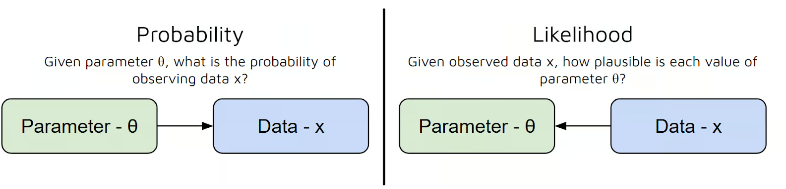

# MÁXIMA VEROSSIMILHANÇA (MLE)

A Estimativa de Máxima Verossimilhança (Maximum Likelihood Estimation - MLE) é considerado por muitos uma das ferramentas mais poderosas e úteis da estatística moderna. Ela pertence totalmente o universo estatístico, sendo usado posteriormente na computação.

O que faz é `encontrar os parâmetros de um modelo`. Ou seja, ela define os parâmetros mais prováveis para os dados observados. O sistema olha os dados, os analisa e define, segundo uma distribuição pré-definida, **quais parâmetros dariam aqueles resultados**.

A máxima verossimilhança tem esse nome pois ela busca encontrar os parâmetros que são mais verossímeis aos dados.

## Questões Importantes

### LIKELIHOOD

Em inglês tudo é traduzido como probabilidade, mas o melhor significado é verossimilhança. Significa se assemelhar a algo e é justamente o que essa parte da estatística faz, mede o quanto uma amostra se parece com uma distribuição hipotética e, com isso, encontrar sua distribuição.

### DIFERENÇA DA PROBABILIDADE

A probabilidade calcula a chance de obter certos dados a partir de uma amostra e parâmetros conhecidos. A verossimilhança é o contrário: **a partir da amostra e de uma distribuição, quais parâmetros melhor se encaixam**.

- Probabilidade: distribuição + parâmetros = dados
- Verossimilhança: distribuição + dados = parâmetros

## Diferenças do mínimos quadrados

Os dois tem o mesmo objetivo, mas o fazem de modos totalmente diferentes. Enquanto os Mínimos Quadrados (OLS, WLS, GLS) focam em encontrar a reta que minimiza o erro (a distância física entre o ponto e a reta), a Máxima Verossimilhança muda a pergunta: ela busca os parâmetros que tornam os dados que nós observamos os **mais prováveis de terem acontecido**.

O que torna a inferência complexa em muitos modelos (como prever "sim ou não", contagens ou categorias) é que a soma de erros ao quadrado dos mínimos quadrados simplesmente não faz sentido para dados que não formam uma linha reta contínua. Ou seja, mínimos quadrados não funcionam bem para problemas que envolvem dados categóricos.

Assim, ao invés de minimizar um erro geométrico, a MLE cria uma função de probabilidade e busca o "pico" dessa função (derivada igual a zero).

OBS: é possível mostrar que a OLS é só um um caso especial e simplificado da Máxima Verossimilhança. Partindo da premissa que os erros são normalmente distribuídos conseguimos usar a máxima verossimilhança no lugar do OLS e fazendo a prova matemática encontramos a exata mesma equação.

## Onde Usar

A MLE é utilizada praticamente em **todos os lugares onde o OLS não funciona** para fornecer parâmetros para uma função. Também é usado em diversos algoritmos modernos de **aprendizado de máquina**. 

- **Modelos de Classificação**: Regressão Logística.
- **Redes Neurais**: A famosa função de perda **Cross-Entropy** é apenas a MLE com outro nome.
- **Modelos de Contagem**: Regressão de Poisson (quantas vezes algo acontece).
- **Séries Temporais Complexas**: Modelos GARCH de volatilidade em finanças.

### Como Usar

Você diz ao algoritmo qual é o formato da distribuição (ex: "meus dados são binários", "meus dados seguem a distribuição normal"), e a MLE varre as opções até achar os coeficientes que melhor encaixam essa curva nos seus dados.

## PREMISSAS

- **Distribuição Conhecida**: Diferente do OLS (que é meio "cego" e só traça retas), a MLE exige que você assuma corretamente de qual distribuição seus dados vêm.
- **Independência**: Assume que as observações são independentes, para que possamos apenas multiplicar as probabilidades (se houver dependência, tem de usar a Verossimilhança Condicional).
- **Amostras Grandes (Assintótica)**: A MLE é imbatível em grandes volumes de dados. Em amostras muito pequenas, ela pode ser tendenciosa (viesada).

A **quantidade mínima de dados depende da quantidade de parâmetros** a serem estimados, mas além disso varia com o objetivo:

- Definir parâmetros da distribuição (ex: normal): 50 dados para cada parâmetro
- Regressão: 20 dados para cada parâmetro
- Modelos de Equações Estruturais (SEM): 200 dados para cada parâmetro

## MATEMÁTICA

Se você tem vários eventos (dados) independentes acontecendo, a probabilidade conjunta de todos eles acontecerem juntos é a **multiplicação** das probabilidades individuais (Probabilidade do dado 1 acontecer **E** a probabilidade do dado 2 acontecer **E** a probabilidade do dado 3 acontecer...). Essa é a função de Verossimilhança (Likelihood - L):

$$L(\theta) = P(x_1) * P(x_2) * ... * P(x_n) = \prod P(x_i)$$

Onde $\theta$ representa os parâmetros que queremos descobrir (pode ser a média, a variância, ou os coeficientes A de uma regressão).

Exemplo: Na distribuição normal os parâmetros são 2: a média e o desvio padrão. Na distribuição T é o grau de liberdade.

### O "Truque" do Logaritmo (Log-Verossimilhança)

Para cada dado temos 1 probabilidade. Como normalmente temos milhares de dados, multiplicar todos eles gera um número microscopicamente pequeno (a cada dado a probabilidade de todos coincidirem diminui). Para o computador uma multiplicação é muito mais trabalhoso que uma soma, então milhares dela demoram. Além disso, calcular a derivada de uma multiplicação gigante é um inferno algébrico. 

Para resolver isso, aplicamos o **Logaritmo Natural (ln)**. A regra mágica dos logaritmos é que o logaritmo de uma multiplicação vira a soma dos logaritmos! Chamamos isso de Log-Verossimilhança (l).

$$l(\theta) = \ln(L(\theta)) = \ln(P(x_1)) + \ln(P(x_2)) + ... + \ln(P(x_n)) = \sum \ln(P(x_i))$$

Com isso `trocamos o produtório pelo somatório dos logs`. Após isso derivamos a log-verossmilhança e igualamos a zero para encontrar o ponto máximo da equação. Queremos derivar porque queremos o ponto (valor) onde a verossimilhança é a maior possível, ou seja, que mais se encaixa nos dados.

> `O pulo do gato`: Como o logaritmo é uma função crescente, o parâmetro que maximiza a soma dos logs é o mesmo que maximiza a multiplicação original. Trocamos um problema pesado por uma soma simples.

### Atenção com a derivada

Ao usarmos a máxima verossimilhança para estimar 2 ou mais parâmetros temos de ter atenção com as derivadas. Primeiramente a gente roda a máxima verossimilhança para 1 dos parâmetros, considerando os outros constantes. Depois rodamos a máxima verossimilhança de novo para o segundo parâmetro com ele sendo variável e os demais constantes. E assim vai, sempre derivando a partir de 1 dos parâmetros só.

Perceba que ao fazer isso a gente deriva a função da distribuição em relação a variáveis diferentes, com isso a **equação retornada pela derivada é diferente para cada parâmetro**. 

> Não cometa o erro de usar a mesma equação para todos os parâmetros!

---

**Exemplo**: A distribuição normal tem 2 parâmetros: a média e o desvio padrão. 

Derivada da distribuição normal para média $\mu$:

$\frac{\delta N}{\delta \mu} = \frac{1}{\sigma} \sum (x_i - \mu)$

Derivada da distribuição normal para o desvio $\sigma$:

$\frac{\delta N}{\delta \sigma} = -\frac{n}{\sigma} +\frac{1}{\sigma^3} \sum (x_i - \mu)^2$

## PASSO-A-PASSO (COMO EXECUTAR)

A receita de bolo da Máxima Verossimilhança é sempre a mesma, não importa o algoritmo:

1. **Assuma uma distribuição**: Defina qual é a distribuição de probabilidade dos seus dados (Normal, Binomial, Poisson, etc).
2. **Monte a Equação (Likelihood)**: Escreva a multiplicação de todas as probabilidades.
3. **Aplique o Logaritmo (Log-Likelihood)**: Transforme as multiplicações em somas.
4. **Encontre o Máximo (Derivada)**: Faça a derivada dessa soma em relação ao parâmetro que você quer achar e iguale a zero.
5. **Isole a variável**: O resultado dessa álgebra será a fórmula final do seu coeficiente.
