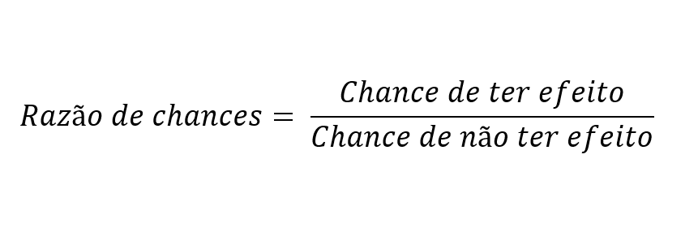

# RAZÃO DE CHANCES (ODDS RATIO)

É uma medida estatística que mostra a força da associação entre dois eventos. De forma simples, ela nos diz o quanto a ocorrência de um evento (como fumar) aumenta ou diminui a chance de outro evento acontecer (como ter uma doença). É a métrica oficial das casas de apostas e o coração da interpretação da Regressão Logística.

Enquanto a probabilidade tradicional olha para o todo (o número de vitórias em relação ao total de jogos), a "chance" (odds) olha para a proporção direta entre sucessos e fracassos (vitórias contra derrotas).

O que confunde muitas pessoas é que usamos a palavra "chance" como sinônimo de "probabilidade" no dia a dia. Mas na estatística, elas são frações fundamentalmente diferentes e medem coisas diferentes. Inclusive a probabilidade vai de 0 a 1 enquanto a chance pode ir de 0 a infinito. 

## Glossário

Chance em inglês é odd, por isso você verá muito esse termo ao ler sobre o assunto. Enquanto razão das chances é comumento referido pela sigla OR.

- **Chance: odd**
- **Razão das chances: OR**

## Probabilidade x Chance

O cérebro humano lida muito bem com probabilidades percentuais, mas a matemática da probabilidade é "presa" em um limite estreito entre 0 e 1 (ou 0% e 100%). Isso é péssimo para algoritmos tentarem traçar retas, pois uma reta vai de menos infinito a mais infinito.

- **Probabilidade (P)**: É o número de sucessos dividido pelo **TOTAL** de tentativas.

Exemplo: Qual a probabilidade de tirar o número 4 em um dado? Você tem 1 lado desejado e 6 lados no total.

$P = \frac{1}{6} \approx 0.166$ (ou 16,6%)

- **Chance**: É o número de sucessos dividido pelo número de **FRACASSOS**.

Exemplo: Qual a chance de tirar o número 4 no dado? Você tem 1 lado a favor e 5 lados contra.

$Odds = \frac{1}{5} = 0.20$ (Lê-se "1 para 5").

## Chance x Razão das Chances

A Razão de Chances (Odds Ratio - OR) surge como uma métrica para comparar diretamente as chances de dois grupos diferentes. Expande a escala presa de "0 a 1" para uma escala de "0 ao infinito", sendo útil quando o contexto vai de -infinito a +infinito (como em regressões).

Ela é a divisão de duas chances e diz o quanto o evento da chance A muda a chances de algo acontecer em comparação ao evento da chance B.

$OR = \frac{chance_a}{chance_b}$

> Razão das chances: É **QUANTAS VEZES um evento muda as chances de algo acontecer**.

Como cada chance tá ligada a um evento/ação, a OR diz o quanto o evento A muda a chance de algo acontecer. Esse algo precisa ser comum aos 2 eventos das chances.

No contexto de ciências e medicina a OR costuma ser interpretado como a imagem abaixo:

## Como Interpretar a OR

- Se OR = 1: O evento/variável não faz diferença nenhuma.
- Se OR > 1: O evento A aumenta a chance.
- Se OR < 1: O evento A diminui a chance.

Isso acontece porque estamos medindo se a chance A é maior que a de B. Portanto se a chance A for maior ela aumenta a chances do fator comum entre os 2 acontecer.

## QUANDO USAR

- **Estudos de Caso-Controle**: Muito comum na medicina. Quando você já tem pessoas doentes (casos) e saudáveis (controles) e quer olhar para o passado para ver se a exposição a algo (como amianto) causou a doença. 
- **Regressão Logística**: Sempre que você prevê um evento binário (ex: o cliente vai cancelar a assinatura ou não?) e precisa explicar para o negócio o quanto cada variável impacta essa decisão.

## A MATEMÁTICA

### CHANCE (odd)

A fórmula da **Chance** (Odds) pode ser reescrita usando a própria probabilidade:

$$Odds = \frac{P}{1 - P}$$

### RAZÃO DAS CHANCES

A **Razão de Chances (OR)** é simplesmente a divisão (razão) entre a chance do Grupo A e a chance do Grupo B:

$$OR = \frac{Odds_A}{Odds_B}$$

## Exemplos

### Fumar e câncer

Um estudo com 50 pessoas que possuem câncer de pulmão viu que 40 delas fumam e 10 não. 

Portanto a probabilidade de algum fumante ter câncer é de:

$P = \frac{40}{50} = 0,8$ (80%)

As chances de algum fumante ter câncer é de:

$Odds = \frac{40}{10} = 4$ tem 4x mais fumantes com câncer do que não fumantes.

A razão das chances de um fumante ter a doença sobre não ter é de:

$OR = \frac{Chance_A}{Chance_B} = \frac{40/10}{10/40} = \frac{4}{0,25} = 16$

Ou seja, a chance de um fumante desenvolver câncer é 16 vezes maior do que a de um não fumante.

> Perceba que ambas as chances (A = ter câncer e fumar. B = ter câncer e não fumar) tem algo em comum (ter câncer) e o evento/ação de A é fumar. Por isso a conclusão é que fumar (evento de A) aumenta 16x a chance de câncer (evento comum).

### Teste de remédio

Um estudo com 200 pessoas testou se um novo remédio cura uma doença.

- **Grupo A (Tomou remédio)**: 80 curados, 20 não curados. 
  - $Odds_A = \frac{80}{20} = 4$ (Ou seja, 4 curados para cada 1 não curado).
- **Grupo B (Tomou Placebo)**: 50 curados, 50 não curados.
  - $Odds_B = \frac{50}{50} = 1$ (Ou seja, 1 curado para cada 1 não curado).

Calculando o OR final:

$OR = \frac{4.0}{1.0} = 4.0$

Ou seja, quem tomou o remédio tem 4 vezes mais chances de se curar do que quem tomou o placebo.
