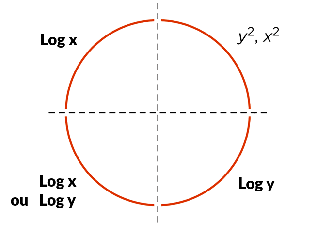
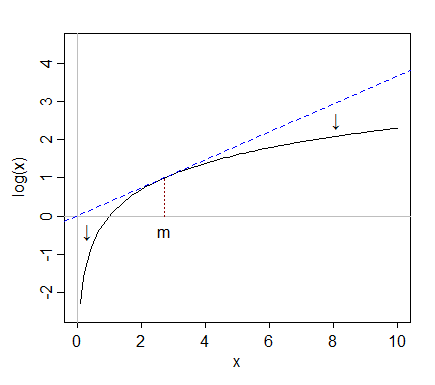

# TRANSFORMAÇÕES

Se seus dados não forem normais, não se encaixarem no modelo de ML desejado ou só tiverem proporções diferentes (ex: um indo de 0 a 10 e outro de 30 a mil), você pode realizar uma transformação neles para tentar fazê-los encaixar no formato desejado. Importante lembrar que ao final é preciso fazer a operação inversa.

OBS: também posso fazer transformação só dos resíduos.

## TIPOS DE TRANSFORMAÇÕES

- Logaritmo
  - Usa log na base 10 ou ln
  - **Quando usar**: cauda forte da direita
  - **Onde é usado**: finanças, população, salários, preço, contagem
- Padronização Z-score
  - Organiza os para ficarem com média 0 e desvio 1
  - **Quando usar**: Regressões e quando houver pressuposto de normalidade
  - **Onde é usado**: SVM, regressão linear e logística, redes neurais
- Box-Cox
  - Encontra o expoente que torna os dados mais próximos possível da normal
  - **Quando usar**:  Quando você não tem certeza de qual transformação utilizar. Só serve **se todos os valores forem positivos**
  - **Onde é usado**: Econometria
- Mini-Max
  - Bota em uma escala, geralmente de 0 a 1
  - **Quando usar**: Quando precisa de um limite máximo e mínimo fixo, algoritmos baseado em distâncias
  - **Onde é usado**: Jogos de tabuleiro por turnos, mapeamento de terreno, KNN
- Proporção
  - Apenas divide um dado pelo outro (Y/X ou o contrário)
  - **Dê preferência por esse**. 
  - Mais simples e mais fácil de interpretar seus resultados

## QUANDO USAR

- Dados não seguirem a normal
- Dados/resíduos não se encaixam no modelo desejado
- Variância heterogênea
- Dados em escalas diferentes
- Eliminar influência de outliers

## USO DO LOG

Quando duas ou mais variáveis tem uma relação de log ou de raíz (formando um gráfico semelhante aos deles) nenhuma das regressões anteriores irá se encaixar. Devemos então fazer uma transformação nos dados (seja nos dados de X ou de Y ou em ambos) para converter essa relação em uma linear.

`Uma relação logaritmica então sempre será convertida em uma linear convertendo um ou mais de seus lados em log`.

Ao converter em log um dos lados estamos trabalhando por porcentagens ao invés de valores brutos. Assim uma mudança na var loggeada causa uma mudança A% na outra, tornando a relação entre eles de porcentagem.

Sempre que aplicar um log nos dados deve-se aplicar a função inversa (exponencial, seja $e^y$ ou $10^y$) na resposta final da regressão, voltando assim à unidade de medida original.

### QUAL BASE USAR

O normal é usar ou log na **base 10 ou ln** (na base e). Para análises de **correlação ou testes de hipóteses tanto faz** qual usará, ambos funcionam igualmente bem. A diferença vem quando vai usar para análise descritiva e apresentações.

- Use log10:
  - Engenharia
  - Acústica
  - Química
  - Ciências da terra
  - Relatórios gerenciais
  - Apresentar para público leigo
- Use ln:
  - Análise de derivada
  - Economia e finanças
  - Biologia

### TIPOS DE LOG

- Log-linear: executa log em Y
- Linear-log: executa log em X
- Log-log: executa log em ambas

### QUANDO USAR CADA LOG

1. Usar Log-linear (log em Y) quando:

- Tiver dados exponenciais 
  - Quanto mais x aumenta, mais y cresce
- Variância dos resíduos/erros varia muito, usa então para termos variância constante
- Tiver assimetria positiva (maiores valores a esquerda)

Isso significa que se x aumentar 1 y aumenta A%.

ex: y = 3x + 5. Se x aumena 1 y aumenta 300% (3x).

2. Usar Linear-log (log em X) quando:

- Tiver dados em formato de log ou raíz
  - Quanto mais x aumenta, menos y cresce

3. Usar Log-log (log em ambos) quando:

- Quer medir o impacto proporcional entre as variáveis
  - Quantos % Y muda para cada % de mudança em X
- Usado para encontrar ponto ótimo de conversão (onde X mais influencia Y)
- Ex: medir a mudança de vendas quando muda o preço testando em diversas faixas

A imagem abaixo dá uma dica de em qual eixo usar o log de acordo com o formato dos seus dados.



### QUANDO NÃO USAR LOGS

- Tentar transformar dados ruins (amostra mal coletada) em dados bons para análise (isso é uma forma de como mentir com estatística)
- Eliminar outliers (eles são dados reais e válidos e você estaria tentando escondê-los)
- Quando os dados tiverem assimetria negativa (maiores valores a direita)
  - Nesse caso deve-se usar **transformações de potência**

### PROVA DO LOG EM RELAÇÃO A ASSIMETRIA

Quando aplicamos um log nos dados ele tende a empurrar todos os dados para a direita. Assim uma distribuição muito à esquerda fica menos a esquerda, uma um pouco à esquerda fica próxima a normal e uma normal fica mais assimétrica à direita. Aplicar log em dados que já são concentrados à direita só aumentaria ainda mais a assimetria, deixando ainda mais à direita que antes.


Esse fenômeno acontece porque o log tende a aproximar os valores mais altos para próximo da mediana e os valores mais baixos para longe da mediana. Isso é facilmente visível no gráfico abaixo, aonde ao pegar a linha contínua (curva) e executar o log ela vira a reta tracejada. Ou seja, ela levanta os valores abaixo e acima da mediana.



### POR QUE NÃO USAR RAÍZ NO LUGAR DO LOG

Os logaritmos apresentam razões constantes. A diferença de aumentar 2 unidades em x quando ele é pequeno é proporcional a aumentar 2 unidades quando x é grande. Isso torna os logaritmos fáceis de interpretar, pois mudanças percentuais constantes se tornam uma mudança constante. 

Ele também diminui a variância, aproximando os dados da reta. Muitas vezes dados com menos variâncias são até mais valiosos que dados normais, então o log ganha força por esse ponto também.

### TRANSFORMAÇÃO DE POTÊNCIA

É o inverso do log, elevando o valor das variáveis que quer transformar (X ou Y) ao quadrado. Eleva-se ao quadrado por é o número inteiro mais próximo da base de ln (log mais usado).

Essa transformação é usada quando os dados tem assimetria negativa (maiores valores a direita).

Essa transformação também reduz a variância, aproximando os dados.

## TRANSFORMAÇÃO MINI-MAX

Nessa transformação padronizamos os dados, deixando eles entre 0 e 1. Assim todos os dado ficam na mesma ordem de grandeza **sem alterar as diferenças relativas entre os dados**. 

Importante ressaltar que isso **NÃO resolve os problemas dos outliers**, pois eles elevam o limite mínimo e máximo e deixam todos os dados convertidos exprimidos juntos.

$$x_i = \frac{x_i - min(x)}{max(x) - min(x)}$$

### QUANDO USAR

- Quando algoritmo exige escalas padronizadas
- Quando algoritmo é baseado em distância (KNN e K-means)
- Quando conhecemos os limites máximos e mínimos que os dados podem alcançar
- Quando quiser acelerar a convergência da rede neural

### QUANDO NÃO USAR

- Quando tivermos outliers
- Quando usar algoritmos baseado em árvores (random forest e XG Boost)

## PADRONIZAÇÃO Z-SCORE

Também padroniza os dados, mas não precisa conhecer os limites máximo e mínimo dos seus dados. Muda seus valores de forma que a média dos novos valores seja 0 e o desvio padrão 1. Os dados podem ser maiores que 1 e menores que zero.

Ele sim **resolve os problemas dos outliers**, pois os deixa mais próxmios mas sem a obrigação de expremer num limite fixo. O outlier ainda pode ficar além de 1 e manter os dados normais mais folgados.

$$x_i = \frac{x_i - media_x}{desvio_x}$$

Aonde desvio é calculado com N-1.

### QUANDO USAR

- Quando tiver outliers
- Regressão linear e logística
- Análise de Componentes Principais (PCA)
- Onde houver pressuposição de normalidade

## TRANSFORMAÇÃO BOX-COX

**Converte dados não normais em uma distribuição próxima à normal**. Ela utiliza um parâmetro lambda ($\lambda$) para estabilizar a variância e corrigir assimetrias, tornando análises como regressões mais confiáveis. É testado vários lambdas (geralmente de -5 a 5) e o que der resultados mais próximos a normal é escolhido.

Usa algum teste de hipótese para verificar se os dados transformados estão próximos o suficiente da normal (Shapiro, Kolmogorov-Smirnov ou Jarque-Bera).

$$x_i = \frac{ x_i^{\lambda} - 1 }{\lambda}$$

Lambda pode assumir valores fracionados como 0.5 e negativos. **Lambda só não pode ser 0**. Defina de quanto em quanto os testes devem se incrementar além do ponto inicial e final. Caso nenhuma tentativa passe nos testes de normalidade, tente outra tranformação.

### QUANDO USAR

- Quando os dados não são normais
- Quando tem heterocedasticidade
- Regressão quando não cumpre a homocedasticidade
- Quando não quer usar testes não paramétricos

# TRANSFORMAÇÃO DE DADOS CATEGÓRICOS EM NUMÉRICOS

As vezes você precisará transformar dados categóricos em numéricos. Para que categorias independentes e não relacionadas (como cores, marcas ou cidades) possam virar números existem 2 formas principais. Mas apenas use isso se for estritamente necessário.

- **One-Hot encoding**: Define um valor binário (0 ou 1) para se o dada é da categoria X. Todas as outras categorias se tornam 1 e essa categoria específica se torna 0. A cateogria 0 é o nosso balizador (como se fosse um grupo controle ou H0). Usado quando as categorias são totalmente não relacionadas (como cores, marcas ou cidades). Cria 1 variável para cada categoria existente.
  - Ex: var1: é azul=0, não é azul=1. Var2: é verde=0, não é verde=1. Var3: é vermelho=0, não é vermelho=1
- **Ordinal encoding**: Atribui números inteiros sequenciais quando os dados tem alguma ordem natural (ruim, neutro, bom...). É ideal para dados com uma ordem lógica
  - Ex: Escolaridade: "Ensino Médio" = 1, "Graduação" = 2, "Mestrado" = 3


## One-Hot Encode

Para cada categoria existente nessa variável criamos uma variável binária dizendo "é valor tal?". Exemplo: Temos 2 vars categóricas: cor com os valores [branco, preto e azul] e cidade com os valores [Brasília, SP, RJ, BH]. Esse método irá criar 7 novas variáveis binárias: é_branco, é_preto, é_azul, é_brasília, é_SP, é_RJ, é_BH.

Para variáveis binárias usamos 0 e 1. **O 0 é sua base comparativa**, sua interpretação deve seguir o raciocínio que está avaliando a categoria 1 com comparação com 0. Você pode entender também como o **grupo 0 sendo seu grupo controle**.

```
Ex: comparação de salário por sexo.

1 = masculino e 0 = feminino: comparo se os homens ganham mais que mulheres

1 = feminino e 0 = masculino: comparo se as mulheres ganham mais que homens
```

Assim masculino será sua variável independente x. **Não usaremos na regressão os dados da categoria 0**. A diferença média entre as 2 categorias é capturada pelo coeficiente de x (a categoria igual a 1).

A forma de interpretar é: `a categoria usada em x é em média A unidades maior que a categoria 0`. 

```
Ex: a regressão deu 120 * x, ou seja, homens ganham 120 reais a mais que mulheres.
```

Caso o coeficiente seja negativo significa que a categoria 0 é maior que a primeira (no ex: mulheres ganham mais que homens).
