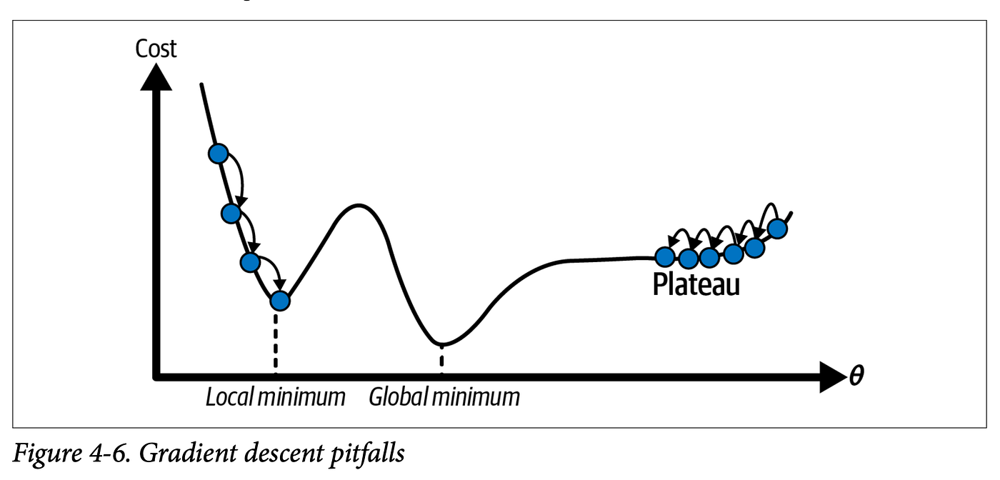

# GRADIENTE DESCENDENTE

É um algoritmo de otimização matemática iterativo usado para encontrar o mínimo de uma função. No contexto de Machine Learning, é usado para **minimizar a função de custo** (ou função de erro) de um modelo, encontrando os melhores pesos (parâmetros) que fazem com que as previsões do modelo se aproximem ao máximo dos valores reais. É importante entender que **ele não é o modelo em si, mas o "motor" que ajusta o modelo**. Como ele é iterativo não pode ser expresso como uma equação como os mínimos quadrados.

Para se ter em mente, o modelo de IA tem uma função de custo (mede quão errado ele tá) e um método de otimização (encontra o menor valor da função de custo) dentro dele.

## Função de custo e o Gradiente

### Função de Custo/Perda (Loss Function)

É a equação que mede o quão "ruim" o modelo está se saindo. Ela calcula a diferença entre o que o modelo previu e o que realmente aconteceu. Na regressão linear essa função é o erro quadrático médio (MSE). A função de custo é `O QUE` queremos minimizar.

**Objetivo**: Mensurar o erro total do modelo dado um conjunto específico de pesos.

### Gradiente Descendente

É o algoritmo de otimização matemática que **navega pela função de custo** para encontrar o **seu ponto mais baixo** (o menor erro). Para tanto, ele calcula a inclinação (derivada) da função de erro e dá pequenos passos na direção oposta à inclinação, atualizando os pesos repetidas vezes até estabilizar. Ele é o `COMO` minimizamos o erro.

**Objetivo**: Encontrar os pesos que levam a função de custo ao seu valor mínimo.

## O Gradiente (Derivada)

O gradiente nada mais é do que o vetor das derivadas parciais da função de custo em relação a cada um dos pesos. Ele aponta para a direção de MAIOR crescimento da função.

Portanto `usamos na equação a função que a derivada forma, não a função de custo original.`

Já que queremos minimizar o erro, nós pegamos o valor do gradiente e vamos na **direção oposta** (por isso "descendente"). Imagine que você está de olhos vendados no topo de uma montanha e quer chegar ao vale mais baixo. Você sente a inclinação do chão com os pés; se o chão sobe para a direita, você dá um passo para a esquerda. O gradiente é a "inclinação sentida", e o algoritmo dá passos contrários a ela.

Se a derivada é positiva, o erro está crescendo, então diminuímos o peso. Se a derivada é negativa, o erro está caindo, então aumentamos o peso. Quando a derivada é 0, chegamos no fundo do vale (mínimo local ou global).

### Vetor do Gradiente

Como temos várias variáveis independentes (ao menos 2 para formar um gŕafico 3D) ao derivarmos a equação de erro em relação a cada variável temos uma lista de novas equações, cada uma referente a uma variável.

Ex: a equação $f(x,y) = x^2 + 2y^2$ resulta em 2 derivadas. A derivada em relação a x fica $\frac{\delta f}{\delta x} = 2x$ e em relação a y fica $\frac{\delta f}{\delta y} = 4y$. Podemos descrever o gradiente como $\nabla f(x,y) = (2x, 4y)$

Podemos visualizar isso como um vetor, cada variável independente (ou cada coeficiente, no caso da regressão) terá uma derivada e, por consequência, uma equação própria. 

Se a gente pensa só em um coeficiente não consegue pegar a ideia, pois está com o pensamento limitado a 1 dimensão. Mas ao pensar em juntar todas as equações da derivada em uma só temos um vetor e, portanto, uma direção. 

Essa direção aponta sempre para o topo, o ponto mais alto da montanha. Isso acontece porque a derivada é a inclinação da reta tangente e, quanto mais íngreme, maior seu valor. Ou seja, o vetor aponta para o rumo onde a tangente fica mais íngreme(onde a derivada cresce mais rapidamente).

No exemplo acima, se eu estiver no ponto x=1 e y=2 e quero saber para que lado a subida é mais íngreme (onde a equação cresce mais rápido), basta usar usar as equações das derivadas. f(1,2) = (2x, 4y) = (2 * 1, 4 * 2) = (2,8). Ou seja, o ponto vizinho mais alto é o ponto (2,8).

## Mínimos Locais e Global

O gráfico pode ter diversas montanhas e vales, vários mínimos locais (onde ele é menor que todos os pontos vizinhos) e só 1 ponto onde ele é o menor de todo o gráfco (mínimo global). 

Chamamos de mínimo local o ponto em que qualquer mudança pequena fará o valor na equação original (não na derivada) aumentar. Todos os pontos ao redor são maiores. Também chamado de vale. Porém o mínimo local não é o menor ponto que existe, é o menor ponto daquela região só.

O mesmo vale para o máximo local. É o topo de uma montanha, aonde qualquer mínima mudança fará o valor original (não na derivada) diminuir.

Já o mínimo global é o vale mais profundo que existe. O máximo local é a maior montanha que existe no gráfico.

Por fim, o platô é uma região plana, aonde todos os valores em volta tem a mesma altura. Mudar para qualquer lado não altera em nada o valor e não há indicação para que lado ir. Esse é o pior cenário possível e é mostrado mais a frente como lidar com ele.

### O MÉTODO NÃO DÁ O MELHOR RESULTADO SEMPRE

Como sempre começamos de um ponto aleatório, o ponto de partida nunca é o mesmo lugar. Isso faz que cada vez encontremos um vale diferente. Podemos iniciar na mesma montanha porém em lados diferentes, assim caindo para regiões diferentes. Podemos começar em outra montanha. Assim Executar o gradiente várias vezes e guardar o melhor resultado pode ser interessante.

Além disso, o algoritmo irá parar ao encontrar um mínimo local. Talvez (e provavelmente) haja um mínimo ainda menor, mas o algoritmo para no primeiro vale que encontra, pois ao tentar mudar para qualquer lado dará um resultado pior. Por isso a repetição do algoritmo várias vezes se torna interessante.

Isso tudo mostra que o **gradiente descendente não dá o melhor valor possível** (mínimo global). Mesmo repetindo nada garante que irá encontrar o mínimo global. Além de que **não há como saber que aquele vale é o mínimo global sem testar todos os mínimos**, o que é impossível.

Para a repetição do gradiente várias vezes, é preciso não só guardar os coeficientes do menor vale encontrado até o momento como todos os coeficientes já testados para garantir que não irá testar nenhum próximo a nenhum deles.

**Uso de regularização remedia isso, fazendo o gradiente dar saltos para sair de vales locais e explorar uma área maior**.

## Como Lidar Com Platôs (OTIMIZAÇÃO)

Para não ficar preso numa região aonde todos os valores vizinhos são iguais ao atual e não há um apontamento para onde ir, usa-se uma dessas 3 técnicas.

### Importante: Essas técnicas NÃO SÃO regularização. Apesar dos 2 trablharem juntos para melhorar o modelo, otimização e regularização são coisas diferentes.

1. Otimizador do algoritmo

- Existem para **agilizar o algoritmo** (não atoa se chamam otimizadores), mas também servem para evitar platôs
- A equação passa por uma alteração (momentum) que continua movendo o algoritmo, mudando os coeficientes sempre um mínimo necessário para ele continuar andando
- É como se o modelo tivesse pego velocidade na descida e continua se movendo na inércia
- Algoritmos principais: estocástico (SGD) e Adam
  - Estocástico: adiciona um peso novo baseado no peso anterior
  - Adam: altera a taxa de aprendizado de acordo com o gradiente, tornando-o menor ou maior conforme a tangente muda
- O Adam é preferível, sendo mais rápido para convergir

O Adam usa a 1ª derivada para saber a direção em que deve empurrar o modelo e a segunda para saber a aceleração (o quão rápido a tangente está mudando), assim ajustar o valor da taxa de aprendizado para o melhor valor de acordo com a inclinação da região.

2. Redução da taxa de aprendizado

- Diminui a taxa de aprendizado a cada iteração, permitindo saltos grande no início e pequenos conforme o tempo passa para fazer ajuste fino
- Diminui a taxa de aprendizado somente quando o gradiente para de diminuir

3. Ruído

- Alterar levemente os valores originais de $X_i$ para "chacoalhar" o modelo e jogá-lo em outra região
- Faz o modelo dar saltos aleatórios, escapando de platôs
- Algoritmos principais: Dropout e Estocástico
  - Dropout: zera aleatoriamente alguns coeficientes para empurrar o modelo para algum lado
  - Estocástico: Ao invés de calcular todos os coeficientes toda iteração, calcula hora uns, hora outros, fazendo a descida ser em zigue-zague

Abordaremos melhor as otimizações na sua pasta específica.

## PREMISSAS

O Gradiente Descendente puro possui algumas exigências e comportamentos esperados em relação aos dados e à função:

1. **A Função de Custo deve ser Derivável:** O algoritmo depende de derivadas. Se a função não tiver derivada em algum ponto (ou for cheia de "degraus"), o método falha.
2. **Dados em Mesma Escala (Normalização/Padronização):** Se uma variável $X_1$ vai de 0 a 1 e $X_2$ vai de 0 a 1.000.000, o gradiente formará um "vale" muito estreito e alongado, fazendo o algoritmo oscilar e demorar muito para convergir. Os dados devem estar na mesma escala.
3. **Convexidade (Preferencialmente):** Se a função de custo for convexa (formato de uma tigela simples, como o MSE na regressão linear), há apenas um mínimo global e o gradiente sempre o encontrará. Se for não-convexa (como em Redes Neurais), o algoritmo pode ficar preso em um "mínimo local".

## ENTRADAS E SAÍDAS

Para que o Gradiente Descendente funcione, ele precisa ser alimentado com informações específicas.

O que ele recebe de entrada:
- **Dados de Treinamento (X e Y):** As variáveis independentes e a variável alvo para calcularmos o erro real.
- **Função de Custo:** A equação matemática derivável que calculará o erro (ex: MSE para regressão, Log-Loss para classificação).
- **Pesos Iniciais (W e B):** Valores de partida (podem ser zero, aleatórios ou inicializações específicas).
- **Taxa de Aprendizado ($\alpha$):** Um hiperparâmetro (tamanho do passo) que define o quão grandes serão os passos dados (atualizações nos pesos) a cada iteração.
- **Número de Iterações (Épocas):** Quantas vezes o algoritmo vai repetir o processo de descida
- **Variação Mínima**: Se o erro entre uma rodada e outra for menor que um valor específico, paramos. Isso significa que paramos de descer significativamente (chegamos a um platô ou mínimo).

O que ele dá como saída:
- **Pesos Otimizados:** O conjunto final de coeficientes (pesos W e intercepto) que geraram o menor erro possível na função de custo.

## COMO FUNCIONA

O algoritmo busca encontrar os coeficientes iterativamente, atualizando os valores passo a passo.

1. Inicializa os pesos com valores aleatórios (ou zeros).
2. Calcula a previsão do modelo com os pesos atuais.
3. Calcula o erro total usando a Função de Custo.
4. Calcula o Gradiente (derivada) da função de custo em relação a cada peso.
5. Atualiza os pesos movendo-os na direção oposta ao gradiente, multiplicados pela taxa de aprendizado ($\alpha$).
6. Repete os passos 2 a 5 até o erro parar de diminuir (convergência) ou atingir o limite de épocas.

## CRITÉRIOS DE PARADA

As iterações devem parar quando:

- Todos os coeficientes variarem menos que um limiar (chegou a um platô ou vale)
  - Isso também significa que o gradiente deu um resultado abaixo do limiar
- Quando atingir um limite máximo de iterações

Outro método de definir parada é no final de cada iteração executar os testes com os dados de teste e salvar a quantidade de acertos. Se a quantidade de acertos nos testes diminuir em relação a iteração anterior e o gradiente continua descendo significa que está tendo overfitting e deve parar.

## A MATEMÁTICA (Regra de Atualização)

O pilar do gradiente descendente é a regra de atualização dos pesos. Para um peso qualquer W, a atualização é dada por:

$$W_{novo} = W_{atual} - txAprendizado * \frac{\delta fnCusto}{\delta W}$$

Onde:
- W é o peso (coeficiente) que estamos ajustando
- txAprendizado é o tamanho do nosso passo. Quão grande será a diferença entre o peso novo e antigo. Representado peloa símbolo alfa ($\alpha$)
- fnCusto é a função de custo que deve ser derivada em função **daquela variável**. Lembrar que cada variável pode ter sua própria equação diferente após derivar

Por ser um método iterativo, ele sempre calcula sua nova posição a partir de onde você está agora (Estou aqui, para que lado irei dar o próximo passo?). Por isso ele usa o coeficiente anterior para incrementar a partir da posição atual (posição atual + passo em tal direção).

O fato de subtrair se deve a derivada parcial sempre apontar para a direção em que o valor cresce mais rápido. Como queremos diminuir então invertemos o sinal.

A função de custo mede quão longe estamos do mínimo local (valor ideal com menor erro quadrado possível) e para que direção devemos ir. **Ela é a nossa bússola**. Também influencia no tamanho do passo, pois quanto maior o erro, mais longe estamos do objetivo e portanto maior o passo. Quando estamos próximos do mínimo local o passo diminui, passamos a dar passinhos curtos para procurar o ponto ideal.

### Taxa de Aprendizado

A taxa de aprendizado (tamanho do passo) é a velocidade com que iremos nos aproximar/convergir para o resultado final. Porém uma taxa de aprendizado muito alta pode nos fazer não conseguir bater no valor ótimo, pois sendo muito grande nosso passo passará direto de um lado do vale para o outro, sem nunca entrar no vale em si. Como se fosse um gigante passando por cima de um buraco cavado por uma formiga. 

A taxa de aprendizado é uma constante e seu valor muitas vezes é descoberto por tentativa e erro ou algo empírico. Não há método para encontrar a melhor taxa. 

A taxa de aprendizado também tem o dever de trazer sua função de custo para a mesma escala de grandeza do coeficiente. Imagina que a derivada da função nos dá um valor na casa dos milhares e o coeficiente está na casa das dezenas. O peso W iria ficar mudando drasticamente sem nunca convergir, como se cada passo a gente atravessasse um país inteiro, passando reto por vales e montanhas. A taxa de aprendizado resolve isso colocando todo mundo na mesma escala de tamanho.

Uma forma de visualizar isso é com a imagem abaixo. Ela mostra o que acontece quando a taxa de aprendizado é muito alta ou muito baixa. Quando é muito alta ela dá saltos enormes, passando reto pelos vales e assim nunca encontrando o valor mínimo porque seu menor passo é muito grande para a escala do vale. Por outro lado quando ele é muito pequeno ele anda de forma extremamente lenta, dando passos minúsculos e demorando uma eternidade para convergir para o fundo do vale. Isso é especialmente demorado quando temos muitas variáveis, o que torna o tempo de cálculo grande.

## Onde é Usado

Por ser um método de otimização, ele atua "nos bastidores" de vários algoritmos de Machine Learning:

- **Regressão Linear e Logística:** Em datasets gigantes, onde a inversão de matriz do OLS se torna muito pesada/lenta computacionalmente, o Gradiente Descendente é usado para encontrar os coeficientes de forma iterativa e mais rápida.
- **Redes Neurais Artificiais (Deep Learning):** É o coração do algoritmo de **Backpropagation**. O gradiente calcula o erro na saída e vai propagando as derivadas de trás para frente, atualizando os pesos de todas as camadas ocultas.
- **Support Vector Machines (SVM):** Versões lineares de grandes margens frequentemente usam gradiente descendente para otimizar o hiperplano separador (minimizar o *Hinge Loss*).
- **Gradient Boosting Machines (GBM, XGBoost, LightGBM):** Usam a ideia do gradiente para treinar novas árvores de decisão. A cada passo, uma nova árvore é treinada para prever o resíduo (gradiente) da árvore anterior.

## MÉTODOS INTERCAMBIÁVEIS (Alternativas)

O Gradiente Descendente pode er substituído por outros algoritmos, dependendo do cenário:

- Mínimos Quadrados Ordinários (OLS): 
  - **Quando trocar: Poucos dados** (ex: menos de 10.000 ou 100.000), o OLS é melhor porque não exige afinar taxa de aprendizado e chega na resposta exata (mínimo global). Porém em big data a inversão de matriz do OLS estoura a memória, sendo melhor usar o Gradiente.

- Método de Newton-Raphson / Segunda Ordem:
  - Diferença: Usa a segunda derivada (Matriz Hessiana) da função para ir diretamente ao mínimo em menos passos, entendendo a curvatura do erro.
  - **Quando trocar: Regressão Logística com poucos dados**. É muito mais rápido em épocas, mas computar a segunda derivada é inviável em Redes Neurais pesadas.

- L-BFGS:
  - Diferença: Uma aproximação do método de Newton que usa menos memória. 
  - **Quando trocar: Regressão logística e SVM quando os dados cabem na memória**.

> Em resumo, o gradiente descendente é usado só quando temos muitos dados. Para poucos dados outras ferramentas são mais eficientes.

## VARIAÇÕES DO GRADIENTE DESCENDENTE

Para lidar com diferentes volumes de dados ou fugir de mínimos locais, o gradiente padrão tem variações.

- **Batch Gradient Descent (BGD)**
  - Calcula o erro usando **todos** os dados do dataset para dar um único passo.
  - **Quando usar:** Datasets pequenos que cabem na RAM. Convergência suave e garantida, mas muito lento por época.
- **Gradiente Descendente Estocástico (SGD)**
  - Calcula o erro e atualiza o peso usando apenas **uma única linha de dado** (amostra aleatória) por vez.
  - **Quando usar:** Datasets imensos. É extremamente rápido, mas a descida é ruidosa e caótica. Pode ajudar a "pular" fora de mínimos locais.
- **Gradiente Descendente com Mini-batch**
  - O meio termo perfeito. Divide os dados em pequenos lotes (ex: 32, 64, 256 linhas). Calcula o erro e atualiza baseado no lote.
  - **Quando usar:** O padrão ouro moderno. Usado em 99% das Redes Neurais. Aproveita operações matriciais rápidas das GPUs e estabiliza o ruído do estocástico.
- **Otimizadores Avançados (Adam, RMSProp, AdaGrad)**
  - São evoluções do algoritmo que adicionam "Momento" (inércia do passo passado) e ajustam a taxa de aprendizado $\alpha$ automaticamente para cada variável de forma independente.
  - **Quando usar:** Adam é hoje o estado-da-arte para treinar Deep Learning, pois converge muito mais rápido e lida bem com dados esparsos.

### Quando Usar Cada Um (Resumo Prático)

- Regressão Linear:
  - Poucos Dados: Mínimos Quadrados
  - Muitos Dados: Gradiente com Mini-batch
- Regressão Logística / SVM:
  - Poucos Dados: L-BFGS ou Newton-Raphson
  - Muitos Dados: Gradiente com Mini-batch
- Redes Neurais: Mini-batch com otimizador Adam.

