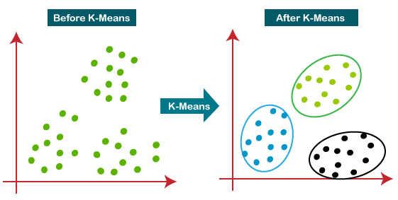
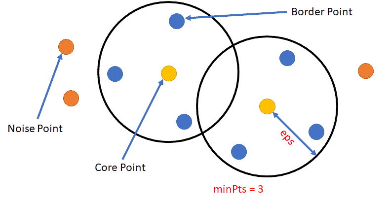
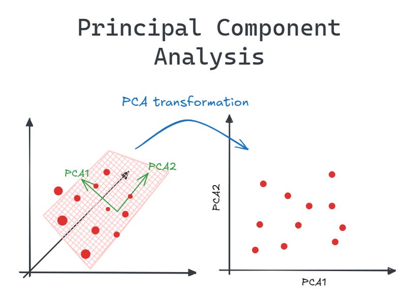

# APRENDIZADO NÃO SUPERVISIONADO

Aprendizado Não Supervisionado busca encontrar padrões ocultos em dados não rotulados. Diferente da classificação ou regressão, aqui não temos um "gabarito" (um Y) para prever. Queremos que o algoritmo olhe para os dados puros e descubra como eles se organizam naturalmente. Exemplos: agrupar clientes com perfis de compra semelhantes, detectar anomalias financeiras ou comprimir imagens sem perder a essência.

Se no aprendizado supervisionado nós somos um professor ensinando o algoritmo a partir de exemplos com respostas corretas, no não supervisionado nós jogamos o algoritmo em um quarto escuro cheio de objetos e pedimos: "organize isso da melhor forma que encontrar".

## O Problema

### O Mundo Não Tem Rótulos

A grande maioria dos dados gerados diariamente não vem com uma etiqueta dizendo o que eles são. Criar esses rótulos manualmente para todos eles é caro, demorado e exige trabalho humano exaustivo. Além disso muitas vezes nós mesmos não sabemos o que estamos procurando. Você tem uma base com 5 milhões de clientes e quer criar campanhas de marketing personalizadas. Quais são os "tipos" de clientes que você tem? Você não sabe de antemão. 

Tentar forçar categorias predefinidas pode esconder nichos extremamente lucrativos ou comportamentos novos. O que inviabiliza técnicas supervisionadas aqui é a **ausência de uma resposta correta pré-definida**.

**Objetivo**: Encontrar uma forma matemática de **medir a similaridade ou a importância das variáveis** para agrupar dados ou simplificá-los, revelando sua estrutura oculta.

## A Solução

### A Descoberta de Estruturas

Os algoritmos resolvem isso calculando distâncias entre os pontos ou encontrando os eixos de maior variação nos dados. Eles geralmente se dividem em três grandes subgrupos:

1. **Agrupamento (Clustering)**: Junta os dados em "panelinhas" (clusters) baseadas em semelhança.
2. **Redução de Dimensionalidade**: Amassa os dados, transformando milhares de colunas em poucas colunas essenciais, removendo o ruído.
3. **Regras de associação**: Descobre relação entre itens pela frequência que certas categorias aparecem juntas.

**Exemplos Práticos**:
- **Streaming**: Quais usuários têm gostos tão parecidos que podem ser agrupados para receber as mesmas recomendações?
- **Genética**: Como comprimir milhares de marcadores genéticos em apenas 2 ou 3 variáveis para visualização em um gráfico?
- **Compras**: Quais produtos são quase sempre comprados juntos?

## TIPOS PRINCIPAIS

### Agrupamento/Clustering

Junta dados parecidos em grupos chamados de clusters. O algoritmo acha semelhanças sem saber o significado de cada grupo. Geralmente agrupa dados próximos, então os dados X precisam ser numéricos ou no mínimo categóricos ordinais.

Um exemplo comum é a segmentação de clientes por comportamento de compra.

#### Tipos de agrupamento

- Completo: um dado só pode pertencer a um grupo. Cada grupo tem uma fronteira clara (normal).
- Parcial: o dado pode pertencer a mais de 1 grupo - grupos podem ter interssecção.
- Difuso: cada dado tem uma probabilidade de pertencer a cada grupo. É probabilístico, não determinístico, por isso não dá um grupo final para os dados.
- Hierarquico: cria uma árvore para definir grupos. Tem grupos e subgrupos como os reinos animais.
- Com ruído: quando alguns elementos ficam sem grupo. Nos demais todos os dados são colocados em um grupo, nos algoritmos desse tipo um dado pode ficar sem grupo nenhum.

### Redução de Dimensionalidade: 

Diminui o número de variáveis (colunas) em uma base de dados complexa. Isso simplifica a análise e remove dados repetidos sem perder a informação importante. Um exemplo é a Análise de Componentes Principais (PCA).

É muito usado quando:

- Precisa visualizar os dados em gráfico
- Pré-processar antes de usar os dados em outros modelos (dar um limpa na base de dados para treinar um outro algoritmo). **Usado para saber quais dados são realmente úteis** para serem usados num modelo mais robusto (encaixa bem com regressão, SVM e árvores de decisão).

### Regras de Associação: 

Acha regras que explicam conexões entre itens em grandes massas de dados. Um exemplo famoso é a análise de carrinho de compras em supermercados, que descobre quais produtos as pessoas costumam comprar juntas.

## Componentes Principais

Assim como no aprendizado supervisionado, cada algoritmo aqui foca em dois pilares, mas adaptados para a ausência de rótulos:

1. **Função de Custo / Métrica de Similaridade**: calcula o quanto os dados são parecidos ou o quanto de informação está sendo perdida.
2. **Otimização / Algoritmo de Busca**: ajusta os grupos ou eixos matemáticos para maximizar a similaridade ou minimizar a perda de informação.

## Mudanças no Fluxo de Trabalho

- Não precisa separar variáveis X e Y, pois só tem X
- **Não precisa separar os dados em treino e teste, usa tudo no treinamento**
- Quase sempre é preciso realizar alguma transformação nos dados para equilibrar a escala
- Comparar modelos e encontrar os melhores hiper-parâmetros são mais complexos aqui

## Principais Algoritmos de Agrupamento/Clustering

### K-Means (K-Médias)

É o modelo de agrupamento mais clássico. Você define um número K de grupos. O algoritmo define K centros aleatórios no meio dos dados e, repetidamente, puxa esses centros para o meio dos pontos mais próximos a eles, até que parem de se mover. Um chute inicial ruim pode fazer o algoritmo demorar demais para convergir.

- **Quando usar**: Quando você sabe (ou quer testar) um número específico de grupos e seus **dados têm formatos esféricos e tamanhos parecidos**. Excelente para segmentação de clientes.
- Tipo: É completo e sem ruído.
- **Pontos negativos**: 
  - Dificil de detectar grupos muito intrinsecos, cuja barreira não possa ser uma linha reta ou circulos
  - Dificil de detectar se os grupos tiverem tamanhos diferentes

---

- **Função de Custo**: Inércia ou WCSS (Soma dos Quadrados Intra-Cluster). O objetivo é minimizar a distância entre cada ponto $x_i$ e o centro do seu respectivo grupo $c_j$. Punições ocorrem se os pontos ficarem muito espalhados.

$$J = \sum_{j=1}^{k} \sum_{i=1}^{n} ||x_i^{(j)} - c_j||^2$$

- **Otimização**: Algoritmo de Expectativa-Maximização (Algoritmo de Lloyd). Ele não usa gradiente descendente, mas alterna entre duas etapas lógicas: atribuir pontos ao centro mais próximo e recalcular o centro com base na média dos pontos.

### K-medoid

Muito parecido com o K-means, mas ao invés de calcular um centro "virtual" baseado na distância euclidiana dos pontos (o centroide), ele escolhe um **dado real do próprio dataset para ser o centro** do grupo (chamado de medóide). Ou seja, le pega o dado mais ao centro para ser o centro daquele grupo. Como no medoid o ponto central do grupo é um dos pontos existentes, podemos vê-lo como se fosse um **k-means que usa mediana**.

Pense nisso como escolher a pessoa mais representativa de uma sala para ser o líder do grupo, em vez de criar um "frankenstein" com a média das características de todos. Isso **impede que ele sofra com outliers** puxando o centro para longe.

- **Quando usar**: Quando tiver **muitos outliers** ou se a **distância euclidiana não fizer sentido** (quando você tem apenas as distâncias entre os itens, não as coordenadas). Por ser mais pesado, só serve quando tem **poucos dados**.
- Tipo: É completo e sem ruído.
- **Pontos negativos**: 
  - Mais custoso e demorado que o K-means.

---

- **Função de Custo**: Soma das distâncias absolutas. Ele tenta minimizar a soma direta das distâncias entre cada ponto e seu medóide designado, em vez de usar o erro quadrático. Pode usar distância Manhattan ao invés da euclidiana.

$$J = \sum_{j=1}^{k} \sum_{i=1}^{n} d(x_i, m_j)$$

Aonde:
- $m_j$ é o ponto central.
- d é a função que calcula distância (ex: distância Manhattan)

- **Otimização**: Algoritmo PAM (Partitioning Around Medoids). Ele tenta trocar o medóide atual por um ponto não-medóide (que não seja nenhum dado) qualquer do grupo. Se essa troca diminuir o custo total (ou seja, se a soma das distâncias de todos os pontos para os novos centros ficar menor), a troca se torna definitiva. Ele repete isso de forma iterativa até que nenhuma troca consiga melhorar o custo.

### DBSCAN

Diferente do K-Means, o DBSCAN **NÃO precisa definir quantos grupos existem**. Ele agrupa baseando-se na **densidade dos dados**. Se houver muitos pontos amontoados, ele cria um grupo. Se houver espaços vazios, ele entende como fronteira. Com isso cada grupo pode ter um tamanho diferente. Também não precisa definir pontos iniciais. Pontos isolados (outliers) são rotulados como ruído, por isso ele sofre muito menos com outliers que o k-means.

- **Quando usar**: Quando seus grupos não tem formato esférico, você não sabe o número de clusters e precisa ignorar outliers.
- Tipo: É completo e com ruído.
- **Pontos negativos**: 
  - Difícil de agrupar bem quando as densidades são muito diferentes (por usar hiper-parâmetros fixos para todos os grupos)
  - Pequenas mudanças nos hiper-parâmetros dão resultados totalmente diferentes
  - É lento (O(n²)).

---

- **Função de Custo**: Não possui uma função de custo tradicional otimizada globalmente. Ele usa regras de vizinhança locais, baseadas em uma distância máxima (e) e um número mínimo de pontos (min_samples) para formar um "bairro" denso.

- **Otimização**: Busca em Grafo / Expansão de Vizinhança. Ele "caminha" de ponto em ponto verificando a densidade local.

### Mistura Gaussiana (GMM)

Enquanto o K-Means é categórico e "duro" (um ponto pertence ao grupo A e ponto final), o GMM introduz a ideia de probabilidades (soft clustering). Ele assume que os dados que você está analisando foram gerados por uma mistura de várias distribuições normais. Ao invés de desenhar "círculos" para cada grupo, o GMM desenha elipses que podem se esticar, encolher e rotacionar para se adaptar à densidade dos pontos. Com isso ela supera as limitações do K-means e do DBSCAN, porém dá outro tipo de resposta, muito menos assertiva.

O resultado não é apenas "a qual grupo o ponto pertence", mas sim "qual a probabilidade matemática de ele pertencer a cada um dos grupos".

- **Quando usar**: Quando seus grupos possuem formatos elípticos ou tamanhos muito diferentes ou quando há sobreposição entre os grupos. Quando você precisa quantificar a incerteza da resposta.
- Tipo: É difuso e com ruído.
- **Pontos negativos**: 
  - Não funcionam se os dados não seguem distribuição normal (exige essa verificação de antemão)
  - Pode cair em máximos locais (versões estocásticas ou rodar K-means para definir os valores iniciais é bem vindo)
  - Alto custo computacional (O(n³))

---

- **Função de Custo**: Máxima Log-Verossimilhança. O objetivo não é minimizar uma distância física (como no K-Means), mas sim maximizar a probabilidade de que os parâmetros das distribuições propostas tenham realmente gerado os dados observados. A função penaliza distribuições que dão baixa probabilidade aos pontos reais.

- **Otimização**: Algoritmo de Maximização da Expectativa (EM). Como é impossível resolver a equação de verossimilhança do GMM de forma direta, o algoritmo intercala dois passos iterativos. O passo E (Expectativa) calcula a probabilidade de cada ponto pertencer a cada curva normal com base nos parâmetros atuais. O passo M (Maximização) atualiza as médias, covariâncias e pesos das curvas normais focando em maximizar a verossimilhança, utilizando as probabilidades calculadas no passo anterior. Ele repete isso até que as elipses parem de se mover.

## Principais Algoritmos de Redução de Dimensionalidade

### PCA (Análise de Componentes Principais)

O PCA tenta resolver a "maldição da dimensionalidade". Se você tem 100 colunas (dimensões), o PCA cria colunas novas (Componentes Principais) que representam os valores, escalas e variância das originais. Ele meio que agrupa as colunas originais em algumas poucas (ex: 3 colunas), tentando preservar ao máximo a variância dos dados originais.

- **Quando usar**: Quando você tem variáveis muito correlacionadas, quer limpar o "ruído" dos dados antes de rodar um modelo de classificação, ou quer plotar dados multidimensionais em um gráfico 2D ou 3D.
- **Pontos negativos**: 
  - Perda do significado de cada variável/coluna (não é possível interpretar os coeficientes finais)
  - Não consegue pegar padrões curvos ou complexos nos dados, só relações lineares
  - Sensibilidade a escala (precisa padronizar os dados antes)
  - Sensibilidade a outliers
  - Perda de informação: ao descartar as colunas originais está assumindo algum grau de perda de informação
- **Função de Custo**: Minimizar o Erro de Reconstrução ou (de forma equivalente) Maximizar a Variância Projetada.
- **Otimização**: Decomposição em Valores Singulares (SVD) ou cálculo de Autovalores e Autovetores da matriz de covariância. É uma solução analítica (álgebra linear direta), sem precisar de loops de repetição.

### t-SNE (e UMAP)

Enquanto o PCA mantém as distâncias globais amplas, o t-SNE é focado em manter as distâncias locais. Ele garante que pontos que eram muito próximos nas 100 dimensões originais continuem vizinhos nas 2 dimensões do gráfico final. Ele cria visualizações belíssimas onde os clusters se separam visivelmente.

- **Quando usar**: **Exclusivamente para visualização de dados**. Não deve ser usado para pré-processar dados para outros modelos, pois ele **deforma as proporções globais**.
- **Função de Custo**: Divergência de Kullback-Leibler (Divergência KL). Ele calcula uma distribuição de probabilidade de vizinhança nas múltiplas dimensões e tenta fazer a distribuição de probabilidade no plano 2D ficar idêntica.
- **Otimização**: Gradiente Descendente.

## Principais Algoritmos de Regras de Associação

### Apriori

Mede o quanto dois itens (ou valores em uma variável) aparecem juntos e o quanto aparecem separados. É amplamente usado em compras online e mercado, analisando o carrinho de compras do cliente. Procura descobrir quais combinações mais aparecem e se elas não são fruto do acaso comparando com suas aparições sozinhas.

Tem 3 tipos de métrica:

- Suporte: conta todos os casos em q A e B aparecem juntos (A com B = B com A)
- Confiança: AB/A, porcentagem de casos que A e B aparecem juntos dividido pelo total de casos A (aqui A com B é diferente de B com A)
- Lift: o quanto a frequência de B aumenta com a ocorrência de A

- **Quando usar**: Quando quer saber se um dado aparece mais acompanhado de outro do que sozinho e se algum outro dado aumenta a chance dele acontecer. Análise de compras ou recomendações simples.
- **Pontos negativos**: 
  - Lentidão extrema
  - Não funciona quando a ordem de aparecimento dos dados importa

A vantagem é que ainda é possível paralelizar para compensar o peso.

### FP-Growth

Melhoria do Apriori, aonde substitui sua análise combinatória por uma estrutura de dados compacta chamada FP-Tree (Árvore de Padrões Frequentes). Ele roda a base de dados inteira apenas 2 vezes ao invés de $2^n$. Na primeira ele lista todos os produtos e joga fora todos que aparecem menos que o suporte mínimo. Na segunda ele ordena os itens do mais frequênte ao menos e os adiciona na árvore.

Com a árvore montada, Ele começa o loop subindo a partir das folhas para a raiz (bottom-up), cria Bases de Padrões Condicionais e gera árvores condicionais menores para extrair os padrões frequentes por `dividir para conquistar`.

- **Quando usar**: Quando a base de dados for muito grande e/ou com itens repetidos ou quando queremos um suporte baixo (que causaria uma explosão de combinações no Apriori).
- **Pontos negativos**: 
  - Exige muita memória RAM (árvore fica enorme)
  - Implementação mais complexa e incapaz de paralelizar

### GSP

Voltado para **padrões sequenciais**. O GSP busca sequências temporais ou ordenadas de compras/eventos feitas pelo mesmo indivíduo ao longo do tempo. Ele funciona de forma iterativa.

1. Encontra sequências de tamanho 1 frequentes.
2. Gera candidatos de tamanho k a partir das sequências de tamanho k-1.
3. Varre a base para testar se as sequências candidatas respeitam restrições de tempo configuradas (janelas de tempo, tempo mínimo/máximo entre eventos).
4. Aplica a poda de sequências infrequentes e repete o ciclo.

- **Quando usar**: Quando a ordem dos acontecimentos/eventos/compras importa. Navegação de páginas em sites, comportamento de pessoas, jornada do cliente. Progressão de tratamentos e sintomas com o passar do tempo.
- **Pontos negativos**: 
  - Lentidão extrema (mantém a demora do Apriori)
  - Explode se a janela de tempo for muito flexível

### Eclat

Enquanto o Apriori usa uma matriz aonde cada linha é uma transação e os itens são as colunas, no Eclat é o oposto. Isso nos permite saber quais transações/compras tem um certo produto olhando uma única linha. Assim para saber se 2 produtos são frequênte juntos basta olhar suas linhas. É muito mais rápido que o Apriori.

- **Quando usar**: Quando busca velocidade
- **Pontos negativos**: 
  - Exige muita memória RAM

> OBS: Eclat e FP-Growth são os mais rápidos e os que mais consomem RAM. Qual será mais rápido depende dos dados, se os dados forem ultra-densos FP-Growth costuma ser mais rápido. Para saber se sua base é densa divida total de itens comprados em todas as transações pelo total de itens * número de transações.
> Se a densidade for > 10 OU min_sup for muito pequeno (ex: 0.1), melhor usar o FP-Growth

$\text{densidade} = \frac{ \sum \text{item comprado} }{N_t * N_i} * 100$

Aonde

- $N_t$ é o número de transações (linhas do Apriori)
- $N_i$ é o número de itens (colunas do Apriori)

## Validação de Modelos

As métricas para o não supervisionado são totalmente diferentes das métricas usadas no supervisionado. Como não temos uma variável Y para comparar temos de usar outros métodos. As métricas de cluster e de redução de dimensionalidade também são diferentes entre si.

### Métricas de Agrupamento

- **Coeficiente de Silhueta**: Mede quão parecido um objeto é com o seu próprio grupo e com os outros grupos. O valor varia de -1 a 1, sendo quanto maior melhor (mais diferente são os grupos entre si e parecidos internamente).
- **Índice de Davies-Bouldin**: Avalia a distância média entre o centro de cada grupo e o centro do grupo mais próximo. Quanto menor melhor.
- **Índice de Calinski-Harabasz**: Calcula a razão entre a dispersão inter-clusters e a dispersão intra-cluster. Quanto maior melhor.

### Métricas de Redução de Dimensionalidade

- **Variância Explicada**: Mostra quanta informação do conjunto de dados original é mantida pelas novas dimensões reduzidas.
- **Erro de Reconstrução**: Mede a diferença entre os dados originais e os dados reconstruídos após passar pelo processo de compressão do modelo.
