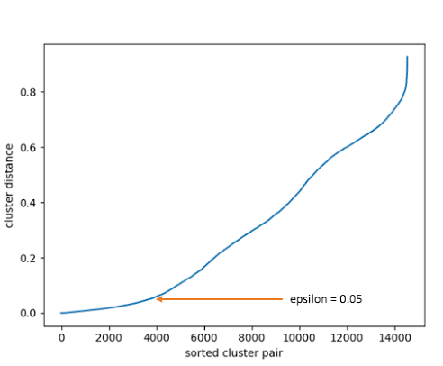

# DBSCAN

O **DBSCAN** é um algoritmo de agrupamento **baseado em densidade**. Ao contrário de algoritmos de partição como o K-Means e GMM, o DBSCAN **não exige que o número de clusters (K) seja definido previamente**. Significa Agrupamento Espacial Baseado em Densidade de Aplicações com Ruído. 

Além de definir K sozinho, ele traz duas grandes vantagens práticas: pode criar grupos com **formatos geométricos arbitrários** (como espirais, anéis ou curvas em "S") e consegue identificar e isolar **outliers, fazendo-os não pertencer a nenhum grupo**.

> O DBSCAN define clusters como regiões contínuas de **alta densidade de pontos**, separadas por regiões de **baixa densidade**. Ele percorre os dados avaliando a vizinhança de cada ponto dentro de um raio R: se uma região contiver uma quantidade mínima de pontos, um novo cluster é iniciado e expandido conectando todos os vizinhos densos.

## Estrutura e Conceitos Principais

O funcionamento do DBSCAN fundamenta-se em dois hiperparâmetros e na classificação dos pontos do dataset em três categorias:

### 1. Os Dois Hiperparâmetros Fundamentais

- **R:** O raio da vizinhança em torno de um ponto. Define a distância máxima para que dois pontos sejam considerados vizinhos.

- **MinPt:** A quantidade mínima de pontos que devem existir dentro da vizinhança R de um ponto (incluindo o próprio ponto) para que essa região seja considerada densa.

### 2. Classificação dos Pontos

Com base em R e MinPts, todo ponto P da base de dados é classificado em uma de três categorias:

1. **Ponto de Núcleo:**
   - Um ponto P é um núcleo se possui pelo menos MinPts pontos dentro de sua R-vizinhança $N_r(p)$:
     $$N_r(p) \ge MinPts$$
   - São os pontos centrais e mais densos dos clusters.
2. **Ponto de Borda:**
   - Um ponto P que não é um núcleo (ou seja, possui menos que MinPts vizinhos), mas está localizado dentro da R-vizinhança de algum núcleo. Ou seja, não tem MinPts perto dele mas está perto de quem tem.
   - Faz parte da periferia do cluster.
3. **Ponto de Ruído / Outlier:**
   - Um ponto P que não entra nos demais grupos.
   - É rotulado como ruído (geralmente representado pelo cluster -1).

### 3. Conceitos de Conectividade por Densidade

Para unir os pontos e formar clusters contínuos, o DBSCAN utiliza três definições de alcance:

- **Diretamente Alcançável por Densidade:** Um ponto Q é diretamente alcançável se estiver dentro do raio do núcleo.

- **Alcançável por Densidade:** Um ponto Q é alcançável pelo núcleo P se existe uma cadeia de pontos $p, p_2, p_3, ..., q$ onde cada $p_{i+1}$ esteja dentro do raio do $p_i$ anterior.

- **Conectado por Densidade:** Dois pontos P e Q são conectados por densidade se existe um ponto O tal que tanto P quanto Q são alcançáveis por densidade a partir de O.

   - É diferente do anterior pois essa regra diz que $p \rightarrow p_2 \rightarrow p_3 \rightarrow O \leftarrow q_3 \leftarrow q_2 \leftarrow q$

Um **cluster** no DBSCAN é definido simplesmente como o conjunto máximo de pontos densamente conectados entre si.

## Passo-a-Passo

O DBSCAN executa um fluxo iterativo de varredura e expansão:

1. **Inicialização:**
   - Todos os pontos da base de dados são inicialmente marcados como **não visitados**.

2. **Varredura dos Pontos:**
   - Para cada ponto P não visitado:
     1. Marca-se P como **visitado**.
     2. Identifica-se a sua R-vizinhança $N_r(p)$.
     3. **Se $N_r(p) < MinPts$:**
        - O ponto P é temporariamente marcado como **Ruído** (pode ser alterado para Borda posteriormente se for alcançado por outro núcleo).
     4. **Se $N_r(p) \ge MinPts$:**
        - O ponto P é um núcleo. Cria-se um **novo cluster** C e adiciona P em C.

3. **Expansão do Cluster:**
   - Para cada cluster C, pega-se todos os pontos da vizinhança $N_r(p)$ e os adiciona a uma fila de processamento.
   - Para cada ponto Q dessa fila:
     1. Se Q não foi visitado, marca-se como **visitado** e calcula-se $N_r(q)$.
     2. Se Q for um núcleo ($N_r(q) \ge MinPts$), todos os seus vizinhos $N_r(q)$ são adicionados à fila de expansão.
     3. Se Q ainda não pertence a nenhum cluster (ou estava marcado como Ruído), junta-se Q ao cluster C.

4. **Finalização do Cluster:**
   - Quando a fila do cluster C se esvaziar, a expansão encerra-se e o algoritmo passa para o próximo ponto não visitado da base para tentar formar um novo cluster.

5. **Encerramento:**
   - O algoritmo termina quando todos os pontos tiverem sido visitados e processados.

## Exemplo

Considere uma base de dados com tamanho N=5 dados e 2 variáveis X:

| Cliente | Coordenada $(X_1, X_2)$ |
| :--- | :--- |
| **P1** | $(1, 1)$ |
| **P2** | $(1, 2)$ |
| **P3** | $(2, 1)$ |
| **P4** | $(3, 1)$ |
| **P5** | $(9, 9)$ |

Usaremos a **Distância Euclidiana** com os seguintes hiperparâmetros:
- r = 1.5
- MinPts = 3

### Passo 1: Matriz de Distâncias e Vizinhanças ($N_{r=1.5}$)

Calculamos as distâncias entre todos os pares de pontos e verificamos quem está dentro do raio r = 1.5:

- $d(P_1, P_2) = 1.0 \le 1.5$
- $d(P_1, P_3) = 1.0 \le 1.5$
- $d(P_1, P_4) = 2.0 > 1.5$
- $d(P_2, P_3) = \sqrt{1^2 + 1^2} \approx 1.414 \le 1.5$
- $d(P_3, P_4) = 1.0 \le 1.5$

**Vizinhos de cada ponto dentro do raio $r = 1.5$:**

- $N_r(P_1)$ = {$P_1, P_2, P_3 $} $\rightarrow$ **3 pontos**
- $N_r(P_2)$ = {$P_2, P_1, P_3 $} $\rightarrow$ **3 pontos**
- $N_r(P_3)$ = {$P_3, P_1, P_2, P_4 $} $\rightarrow$ **4 pontos**
- $N_r(P_4)$ = {$P_4, P_3 $} $\rightarrow$ **2 pontos**
- $N_r(P_5)$ = {$P_5 $} $\rightarrow$ **1 ponto**

### Passo 2: Classificação dos Pontos

Como MinPts = 3:

- **P1:** $N_r(P_1) = 3 \ge 3 \rightarrow$ *núcleo*
- **P2:** $N_r(P_2) = 3 \ge 3 \rightarrow$ *núcleo*
- **P3:** $N_r(P_3) = 4 \ge 3 \rightarrow$ *núcleo*
- **P4:** $N_r(P_4) = 2 < 3$, mas é vizinho do núcleo P3 $\rightarrow$ **Borda**
- **P5:** $N_r(P_5) = 1 < 3$ e não possui nenhum núcleo na vizinhança $\rightarrow$ **Ruído**

### Passo 3: Formação dos Clusters

1. Inicia-se em **P1** (núcleo): cria-se o **Cluster 1** contendo {$P_1, P_2, P_3$}.
2. Expande-se para os vizinhos:
   - **P2** é núcleo, traz $P_3$ (já incluído).
   - **P3** é núcleo, traz $P_4$ para o grupo.
   - **P4** é Borda, é incluído no **Cluster 1**, mas não expande mais a busca.
3. **P5** permanece isolado como **Ruído (-1)**.

**Resultado Final:**
- **Cluster 1:** {$P_1, P_2, P_3, P_4 $}
- **Ruído:** {$ P_5 $}

## PREMISSAS

- **Existência de Variabilidade de Densidade no Espaço:** O algoritmo assume que os agrupamentos reais correspondem a áreas de maior densidade separadas por regiões esparsas.
- **Densidades Relativamente Homogêneas Entre os Clusters:** O DBSCAN pressupõe que um único par de parâmetros (r, MinPts) seja adequado para encontrar todos os grupos da base.

## QUANDO USAR

- **Clusters com formatos arbitrários:** Quando os dados formam desenhos não esféricos (espirais, anéis concêntricos, formatos geográficos ou em "S").

- **Bases de dados com muitos outliers:** Excelente para cenários onde existem medições incorretas ou pontos isolados que não devem contaminar os agrupamentos reais.

- **Número de clusters (K) desconhecido:** Não possui a menor ideia de quantos grupos podem existir.

## QUANDO NÃO USAR

- **Clusters com Densidades Variáveis:** Se a base contiver um grupo muito denso e outro grupo muito esparso, um único valor de R não conseguirá capturar ambos simultaneamente (se R for pequeno, o esparso vira ruído; se for grande, os densos fundem-se). Nesse caso, prefira **HDBSCAN**.

- **Alta Dimensionalidade ($p \gg 10$):** Devido à maldição da dimensionalidade, em espaços com muitas variáveis a distância entre quaisquer dois pontos tende a se igualar, tornando o raio R ineficaz.
   - Usar PCA antes pode resolver isso.

- **Grandes Volume de Dados Sem Indexação Espacial:** O cálculo da matriz de distâncias ingênuo possui complexidade $O(N^2)$. Sem estruturas como KD-Tree ou Ball-Tree, torna-se lento em grandes bases.

## COMO DETERMINAR OS HIPERPARÂMETROS (R E MinPts)

A escolha correta dos hiperparâmetros é vital para o desempenho do algoritmo:

### 1. Definindo o MinPts

Uma regra prática consagrada na literatura baseia-se no número de variáveis X (p) do dataset:

$$MinPts \ge P + 1 \quad \text{ou} \quad MinPts = 2 * p$$

> Para dados com **muito ruído ou bases grandes, aumente o MinPts** para tornar o algoritmo mais rigoroso.

### 2. Definindo o R com o Método do Cotovelo

Também chamado de método do gráfico das K-distâncias.

1. Define-se k = MinPts - 1.
2. Para cada ponto do dataset, calcula-se a distância até o seu k-ésimo vizinho mais próximo.
3. Ordenam-se essas distâncias em ordem crescente e plota-se o gráfico.
4. O valor ideal de R é o ponto de inflexão da curva (o **"cotovelo"** do gráfico).

