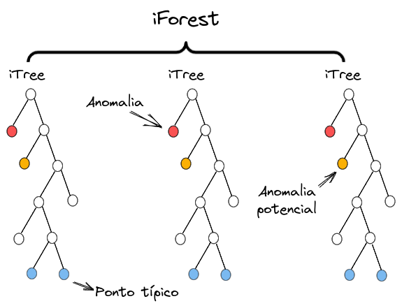

# ISOLATION FOREST

O Isolation Forest (iForest) é um algoritmo de aprendizado não supervisionado focado exclusivamente na **detecção de anomalias e outliers**.

A grande maioria dos algoritmos de detecção de anomalias (como One-Class SVM, K-Means ou LOF) tenta construir um perfil do que é normal para depois classificar como anomalia tudo o que foge desse perfil. O Isolation Forest faz exatamente o oposto: ele tenta **isolar ativamente as anomalias**.

O algoritmo parte de uma premissa simples e elegante: anomalias são **poucas** e possuem **atributos diferentes** dos dados normais. Por causa disso, elas são muito mais fáceis de serem isoladas do que os pontos normais.

Para isolar um ponto, o Isolation Forest realiza cortes aleatórios no espaço de dados. Como as anomalias ficam isoladas em regiões de baixa densidade, **outliers precisam de pouquíssimos cortes para ficarem separadas do restante**. Já os pontos normais, por estarem em regiões densas, exigem muitos cortes.



## O que Muda em Relação às Árvores de Decisão Tradicionais?

Embora utilize árvores binárias (chamadas aqui de iTrees ou Isolation Trees), o Isolation Forest não funciona como uma Random Forest ou uma Árvore de Decisão convencional:

| Característica | Árvores de Decisão e Random Forest | Isolation Forest (iForest) |
| :--- | :--- | :--- |
| **Objetivo do Corte** | Maximizar Ganho de Informação, Entropia ou Gini | **Aleatório** (sem métrica de impureza) |
| **Cálculo da Divisão** | Busca a melhor variável e o melhor ponto de corte | Escolhe uma variável aleatória e um valor aleatório entre o mín e max |
| **Interpretação das Folhas** | Definição da categoria | Comprimento do caminho h(x) do ponto até a raiz |
| **Treinamento** | Supervisionado | **Não Supervisionado** |
| **Processamento** | Requer dados limpos/balanceados | Incrivelmente rápido e imune a dados desbalanceados |

## A Representação e a Intuição Geométrica

Imagine uma folha de papel com um grande aglomerado de $1000$ pontos azuis concentrados no centro e apenas $1$ ponto vermelho isolado no canto superior direito.

1. Se você fechar os olhos e der tesouradas aleatórias na folha (cortes horizontais e verticais):
   - Com apenas 1 ou 2 cortes aleatórios, você provavelmente vai isolar o ponto vermelho sozinho em um pedaço de papel.
   - Para isolar um dos pontos azuis do centro do aglomerado, você precisará de dezenas de cortes, pois eles estão muito próximos uns dos outros.

Na prática, o Isolation Forest constrói uma floresta de iTrees realizando esses cortes aleatórios. O **comprimento do caminho** h(x) entre a raiz até o nó folha é a medida de quão anômalo ele é. Cada nó da árvore é um corte nos dado e todos os dados estão nas folhas, portanto as **folhas próximas da raíz são outliers** e quão mais profundo é o nó mais interno é o dado.

- **Caminho Curto** (h(x) pequeno) => Ponto isolado rapidamente => **Anomalia**.
- **Caminho Longo** (h(x) grande) => Ponto difícil de isolar => **Dado Normal (Inlier)**.

## A Matemática

Como o comprimento do caminho h(x) varia conforme o tamanho da amostra, o algoritmo normaliza essa medida para gerar um **Escore de Anomalia (s)** padronizado entre 0 e 1 aonde **quanto maior mais provável de ser uma anomalia**. Isso evita que uma árvore rasa seja considerada tudo outlier.

### 1. Comprimento Médio de Buscas Sem Sucesso

A estrutura de uma iTree é equivalente a uma Árvore Binária de Busca (BST). O comprimento médio do caminho para uma busca sem sucesso (não encontrar o valor) em uma BST construída com n pontos é dado por:

$$c(n) = 2 \ln(n - 1) + 0.5772156649 - \frac{2(n - 1)}{n}$$

Onde $0.5772156649$ é a constante de Euler-Mascheroni. O valor de c(n) é a **profundidade média de um nó segundo o tamanho da base de dados**.

### 2. A Função de Escore de Anomalia s(x, n)

O escore de anomalia s para um ponto x em uma amostra de tamanho n é definido como:

$$s(x, n) = 2^{-\frac{E(h(x))}{c(n)}}$$

Onde:
- h(x) é o comprimento do caminho do ponto x e a raíz.
- E(h(x)) é a média de h(x) calculada através de todas as iTrees da floresta.
- c(n) é o fator de normalização médio para a amostra de tamanho n (equação mostrada acima).

### Interpretação do Escore s(x, n):

- **Se E(h(x)) = 0 Então s = 1:** O ponto se isola quase imediatamente na raiz da árvore. **Forte indício de Anomalia**.
   - Isso acontece quando diversas vezes o ponto é facilmente isolado com cortes aleatórios, indicando que ele realmente é um outlier.
- **Se E(h(x)) = c(n) Então s = 0.5:** O ponto possui um comprimento médio idêntico a uma árvore aleatória padrão. **Dado Normal ou Indeterminado**.
   - As vezes era isolado com poucos cortes, as vezes com muito... Tá na média.
- **Se E(h(x)) = n - 1 Então s = 0:** O ponto exige a profundidade máxima para ser isolado. **Dado Normal e muito denso**.

```
  Escore (s)  | Interpretação
  -----------------------------------------------
  0.8 - 1.0   | Alta probabilidade de ser ANOMALIA
  0.5 - 0.7   | Zona cinzenta (avaliar contexto)
  0.0 - 0.5   | Alta probabilidade de ser NORMAL (Inlier)
```

## Árvores e Florestas

Já deve ter ficado claro, mas formalizando: uma árvore é uma série de cortes aleatórios nos dados. Cada nó da árvore é um corte. Esses cortes **não seguem nenhuma regra nem buscam otimizar nada**. No final acabamos tendo árvores menores ou maiores para os mesmos dados por conta dessa aleatoriedade. Podemos inclusive começar fazendo cortes no meio dos dados, fazendo que um corte que separe um outlier venha só no final da árvore.

Por isso a floresta é importante. Se uma árvore é totalmente aleatória, a repetição disso centenas de vezes garante que na média teremos a informação verdadeira. Ao repetir esse processo centenas de vezes é esperado que na maioria os outliers sejam separados cedo. Por isso a equação usa a média das árvores. 

Podemos entender essa repetição (floresta) como uma Simulação de Monte Carlo com uma distribuição uniforme (se os cortes são aleatórios, então todos os lugares tem a mesma chance de serem cortados).

## Falsos Positivos e Negativos

Dois problemas clássicos afetam a detecção de anomalias quando o volume de dados é grande:

1. **Swamping (Falso Positivo):** Ocorre quando pontos normais estão muito próximos de anomalias e acabam sendo rotulados como anomalias por tabela (ou por puro azar foram divididos cedo muitas vezes).
2. **Masking (Falso Negativo):** Ocorre quando há um cluster com várias anomalias juntas. Elas "mascaram" umas às outras, exigindo mais cortes para serem isoladas e parecendo dados normais.

### A Solução: Subamostragem ($\psi$)

Para resolver ambos os problemas o Isolation Forest **não utiliza todo o dataset em todas as árvores**. Ele retira amostras aleatórias de tamanho pequeno (por padrão $\psi = 256$ pontos). Assim cada árvore funciona com dados diferentes. Isso é semelhante ao conceito de Bootstrap do Random Forest, porém não é igual. O Bootstrap usa amostragem com repetição enquanto a amostragem do IForest é **sem repetição**.

O motivo de não usarmos Bootstrap é justamente porque não podemos repetir o mesmo dado em árvores diferentes (**precisa ser amotragem sem repetição**). Pois se repetirmos podemos pegar o mesmo dado duas vezes e seria impossível cortar o espaço para separá-los se estão exatamente no mesmo ponto, quebrando o algoritmo. Sem falar que isso aumentaria a chance de falsos positivos e negativos. Outra diferença é que o Bootstrap gera árvores com N dados (igual o tamanho do dataset) e no IForest as árvores tem tamanho $\psi$.

A amostragem reduz a densidade do dataset permitindo que os outliers se destaquem ainda mais no espaço reduzido. A chance de um ponto normal próximo de um outlier cair na mesma árvore do outlier diversas vezes é mínima (eliminando falso positivo). Assim como a chance de vários outliers próximos caírem juntos também é mínima (eliminando o falso negativo).

O motivo de usar $\psi = 256$ pontos é que com isso temos uma árvore com profundidade máxima de 8 níveis.

Essa solução ainda tem o efeito bônus de acelerar o processamento, pois são menos dados para processar em cada árvore.

## Hiperparâmetros Chave

* `n_estimators` (Número de Árvores): A quantidade de iTrees na floresta. Geralmente 100 a 200 árvores já garantem a convergência do escore médio E(h(x)).
* `max_samples` ($\psi$): O tamanho da subamostra usada para construir cada árvore. O padrão da literatura e das bibliotecas é 256.
* `contamination`: A proporção estimada de anomalias no dataset (ex: 0.01). Usado como limiar para converter o escore s(x, n) em uma decisão binária (+1 para Normal, -1 para Anomalia).

## PASSO-A-PASSO

### Fase 1: Treinamento (Construção da Floresta)

1. Recebe o dataset de entrada X com N amostras e M variáveis.
2. Para cada árvore t:
   a. Seleciona aleatoriamente uma subamostra de tamanho $\psi$ (ex: $256$ linhas) sem reposição.
   b. Constrói recursivamente a iTree:
      - Se o nó atual tem apenas 1 ponto ou atingiu a profundidade limite ($\log_2(\psi)$), torna-se um Nó Folha.
      - Senão, escolhe **uma variável (coluna) q aleatoriamente**.
      - Escolhe um **ponto de corte p aleatoriamente** dentro do intervalo [min(q), max(q)].
      - Divide os dados em dois nós filhos.

### Fase 2: Avaliação (Inferência de Novas Amostras)

1. Para cada novo ponto de teste $x_{\text{teste}}$:
2. Faz o ponto percorrer todas as iTrees geradas e registra a profundidade percorrida h(x) em cada uma.
3. Calcula a média dos comprimentos E(h(x)).
4. Aplica a fórmula do escore s(x, n) = $2^{-\frac{E(h(x))}{c(\psi)}}$.
5. Compara s(x, n) com o limiar definido por `contamination`. Se for superior ao limiar, classifica como **Anomalia (-1)**; caso contrário, **Normal (+1)**.

## Exemplo

Imagine monitorar requisições em uma API web:

| Requisição | Payload Size (KB) ($X_1$) | Tempo de Resposta (ms) ($X_2$) |
| :--- | :--- | :--- |
| **R1** | 2.1 | 45 |
| **R2** | 2.5 | 50 |
| **R3** | 1.9 | 40 |
| **R4 (Ataque DDoS)** | 850.0 | 9500 |

1. Ao construir a iTree, o algoritmo seleciona aleatoriamente a coluna `Payload Size`.
2. O intervalo é [1.9, 850.0].
3. O algoritmo sorteia um valor de corte aleatório, por exemplo p = 120.0.
4. **Resultado do primeiro corte:**
   - Lado esquerdo (< 120.0): R1, R2, R3 (ainda agrupados).
   - Lado direito ($\ge 120.0$): **R4 fica isolado imediatamente com apenas 1 corte!**

O ponto **R4** atinge profundidade h(R4) = 1, gerando um escore $s \approx 0.95$, marcando-o instantaneamente como anomalia.

## PREMISSAS E VANTAGENS

O Isolation Forest é um dos algoritmos com **menos pré-requisitos formais** em Machine Learning. Ao invés disso ele tem uma lista de vantagens importante de ressaltar:

1. **NÃO Exige Normalização/Escalonamento** 
2. **Resistente a Outliers no Treino**
3. **Pode Lidar com Colunas Irrelevantes:** Variáveis de ruído desaceleram o isolamento em uma árvore, mas o agregamento por ensemble (floresta) atenua esse impacto.

## QUANDO USAR

- **Grandes volumes de dados (N > 100.000 linhas):** Sua complexidade computacional é linear $O(n)$, tornando-o absurdamente mais rápido que One-Class SVM ou LOF.
- **Alta dimensionalidade:** Funciona muito bem em bases com centenas de colunas numéricas.
- **Detecção de fraudes e anomalias genéricas:** Quando você não tem rótulos prévios e quer disparar alertas sobre dados fora do padrão.
- **Precisa responder rápido:** Pela ausência de necessidade de escalonamento prévio de dados.

## QUANDO NÃO USAR

- **Dados categóricos ou numéricos com baixa variabilidade:** Se a base for composta por valores muito repetidos o algoritmo não consegue separá-los por serem iguais em quase todas as colunas.
- **Anomalias de Padrão Temporal:** Não foi feito para lidar com séries temporais.
- **Anomalias Alinhadas Diagonalmente (Limitação de Cortes Retos):** Como as iTrees tradicionais fazem cortes perpendiculares aos eixos (paralelos a uma variável), pontos em distribuições diagonais estreitas podem exigir mais cortes do que deveriam.

## VARIAÇÃO: Extended Isolation Forest (EIF)

Para resolver a limitação dos cortes alinhados aos eixos e evitar artefatos estruturais no espaço de decisão, foi criado o **Extended Isolation Forest (EIF)**. Ao invés de selecionar apenas uma coluna q e um corte p, o EIF seleciona um **hiperplano inclinado com uma direção aleatória**:

$$(x - p) * n \ge 0$$

Onde n é um vetor normal sorteado aleatoriamente de uma distribuição normal padronizada (média 0 e desvio 1). Isso permite que a floresta corte os dados em **qualquer ângulo**, criando fronteiras de isolamento muito mais suaves e precisas para distribuições complexas.

## COMPARATIVO MÉTODOS DE DETECÇÃO DE ANOMALIAS

| Algoritmo | Complexidade de Treino | Exige Escalonamento? | Sensível a Altas Dimensões? | Mecanismo Central |
| :--- | :--- | :--- | :--- | :--- |
| **Isolation Forest** | O(N) | **Não** | Pouco | Isolamento por partições aleatórias |
| **One-Class SVM** | $O(N^2)$ a $O(N^3)$ | **Sim** | Sim (exige Kernel adequado) | Fronteira de margem máxima em relação à origem |
| **LOF (Local Outlier Factor)** | $O(N^2)$ | **Sim** | Muito (sofre com a maldição da dimensionalidade) | Comparação de densidade local via $k$-vizinhos |
| **Elliptic Envelope** | $O(N \cdot M^2)$ | **Sim** | Sim | Suposição de Distribuição Normal Multivariada |
