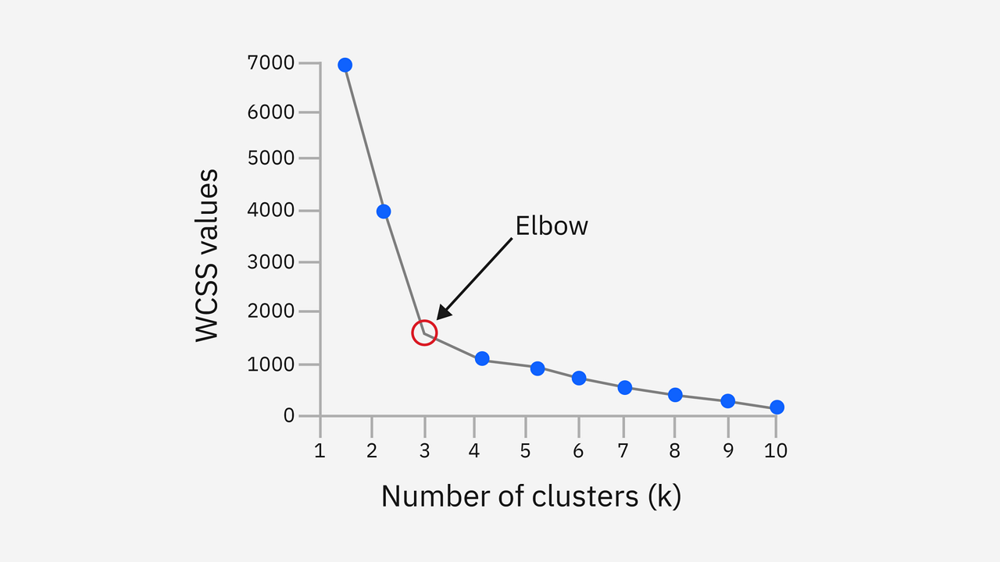

# K-MEANS

É um algoritmo de agrupamento que separa os dados em K grupos (clusters). Apesar do nome parecido, é totalmente diferente do KNN, pois o KNN é supervisionado e define o grupo de um novo dado a partir dos vizinhos. O K-means é **não supervisionado e define o grupo dos dados atuais definindo o centro desse grupo**. 

Cada grupo tem um ponto central (média) definido como a média dos pontos pertencentes a esse grupo. Ele agrupa dados não rotulados por similaridade. A ideia é que cada dado seja mais parecido com os demais dados do seu grupo do que os dados de outros grupos. 

> Para tanto ele faz um loop aonde **calcula a distância de todos os pontos até todos os centros NA PRIMEIRA RODADA**, atualiza os centros, bota cada ponto no grupo do centro mais próximo e repete, porém agora considerando **somente os pontos pertencentes aquele grupo**. Repete até o erro chegar em um **mínimo local**.
> Importante ter em mente que um ponto pode mudar de cluster nos loops caso algum centro se aproxime e seu centro atual se distancie.

## Estrutura e Conceitos Principais

O K-Means é um algoritmo de agrupamento baseado em partição. O seu funcionamento baseia-se em quatro pilares:

### 1. Centroide

O centroide é o centro geométrico de um cluster. Ele é um vetor contendo a **média matemática de cada variável** para todos os pontos atribuídos àquele grupo. 

Se um cluster $C_j$ possui $N_j$ pontos em p dimensões (variáveis X), a posição do seu centroide $c_j$ é dada por:

$$c_j = \frac{1}{N_j} \sum_{x_i \in C_j} x_i$$

### 2. Métrica de Distância

É preciso definir uma forma de medir a distância entre os dados. A métrica padrão utilizada é a **Distância Euclidiana**, mas a depender do contexto pode-se trocar para outras forma de medir distância como a Manhattan.

### 3. Função de Custo: Inércia ou WCSS

A **função de custo** é como o K-Means tenta minimizar o erro iterativamente. A inércia também é chamada de WCSS (Within-Cluster Sum of Squares). Ela mede a **soma dos quadrados das distâncias de todos os pontos** de cada cluster em relação ao seu respectivo centroide (a **variância interna dos grupos**):

$WCSS = \sum_{j=1}^{K} \sum_{x_i \in C_j} ||x_i - c_j||^2$

Quanto menor o valor da Inércia (WCSS), mais compactos e homogêneos são os clusters gerados.

### 4. A Escolha do Número K

O valor de K (número de grupos desejado) não é aprendido automaticamente e **precisa ser definido antes da execução**. A escolha do K ideal é feita com auxílio de técnicas como o **Método do Cotovelo (Elbow Method)** ou o **Coeficiente de Silhueta (Silhouette Score)**.

## Passo-a-Passo

O K-Means utiliza um algoritmo iterativo chamado **Algoritmo de Lloyd** que funciona como algoritmo de otimização:

1. **Inicialização dos Centróides:** Selecionam-se K pontos aleatórios do dataset para servirem como os centróides iniciais $c_1, c_2, ..., c_K$ (ou utiliza-se o método inteligente **K-Means++**).

2. **Passo de Atribuição:**
  - Para cada ponto $x_i$ da base de dados, calcula-se a distância até todos os K centróides.
    - **Calcula distância de todos os pontos até todos os centros**.
  - O ponto $x_i$ é atribuído ao cluster cujo centroide estiver mais próximo (menor distância Euclidiana).

3. **Passo de Atualização:**
  - Com os grupos redefinidos, recala-se a posição de cada centroide $c_j$ tirando a média das coordenadas de todos os pontos que agora pertencem àquele grupo.
    - Perceba que a primeira rodada é vital, pois as próximas atualizações dos centros só considerarão os pontos definidos daquele cluster. Se um ponto for jogado no grupo errado vai enviesar tudo.
    - Por mais que **um ponto possa mudar de cluster**, a primeira rodada já joga o resultado para um determinado lado.

4. **Verificação de Convergência (Condição de Parada):**
  - Repetem-se os passos 3 e 4 até atingir um dos critérios:
    - Os centróides não mudam mais de posição (ou a mudança é menor que uma tolerância e).
    - Os pontos não trocam mais de cluster (se ninguém muda de cluster então os pontos não tem como mudar).
    - O número máximo de iterações configurado é atingido.

## Exemplo

Imagine que um e-commerce deseja agrupar clientes com base em duas variáveis numéricas já padronizadas:

- X1: **Frequência mensal de compras**
- X2: **Valor médio gasto por compra (R)**

### Base de Dados dos Clientes

| Cliente | X1 (Frequência) | X2 (Valor Médio) | Coordenada (X1, X2) |
| :--- | :--- | :--- | :--- |
| **C1** | 1  | 2 | (1, 2) |
| **C2** | 2  | 3 | (2, 3) |
| **C3** | 8  | 8 | (8, 8) |
| **C4** | 10 | 9 | (10, 9) |

Queremos separar os clientes em K = 2 grupos.

### Passo 1: Inicialização dos Centróides

Suponha que o algoritmo escolha aleatoriamente o cliente **C1** e o cliente **C3** como os centróides iniciais:

- Centroide $c_1 = (1, 2)$
- Centroide $c_2 = (8, 8)$

### Passo 2: 1ª Iteração - Atribuição de Clusters

Calculamos a distância Euclidiana ao quadrado $d^2$ de cada cliente até os dois centróides:

- **Cliente C1 (1, 2):**
  - $d^2(C1, c_1) = (1-1)^2 + (2-2)^2 = 0$
  - $d^2(C1, c_2) = (1-8)^2 + (2-8)^2 = (-7)^2 + (-6)^2 = 49 + 36 = 85$
  - Mais próximo de $c_1$ $\rightarrow$ **Cluster 1**
- **Cliente C2 (2, 3):**
  - $d^2(C2, c_1) = (2-1)^2 + (3-2)^2 = 1^2 + 1^2 = 2$
  - $d^2(C2, c_2) = (2-8)^2 + (3-8)^2 = (-6)^2 + (-5)^2 = 36 + 25 = 61$
  - Mais próximo de $c_1$ $\rightarrow$ **Cluster 1**
- **Cliente C3 (8, 8):**
  - $d^2(C3, c_1) = (8-1)^2 + (8-2)^2 = 49 + 36 = 85$
  - $d^2(C3, c_2) = (8-8)^2 + (8-8)^2 = 0$
  - Mais próximo de $c_2$ $\rightarrow$ **Cluster 2**
- **Cliente C4 (10, 9):**
  - $d^2(C4, c_1) = (10-1)^2 + (9-2)^2 = 81 + 49 = 130$
  - $d^2(C4, c_2) = (10-8)^2 + (9-8)^2 = 2^2 + 1^2 = 5$
  - Mais próximo de $c_2$* $\rightarrow$ **Cluster 2**

**Agrupamento na 1ª Iteração:**
- **Cluster 1:** {C1, C2}
- **Cluster 2:** {C3, C4}

### Passo 3: 1ª Iteração - Recálculo dos Centróides

Calculamos a nova posição dos centróides tirando a média dos pontos de cada grupo:

**Novo $c_1$ (média de C1 e C2):**

$c_1^{novo} = ( \frac{1+2}{2}, \frac{2+3}{2} ) = (1.5, 2.5)$

**Novo $c_2$ (média de C3 e C4):**

$c_2^{novo} = \left( \frac{8+10}{2}, \frac{8+9}{2} \right) = (9.0, 8.5)$

### Passo 4: 2ª Iteração - Reatribuição

Testamos novamente as distâncias com os novos centróides $c_1 = (1.5, 2.5)$ e $c_2 = (9.0, 8.5)$:

- **C1 $(1, 2)$** permanece mais próximo de $c_1$.
- **C2 $(2, 3)$** permanece mais próximo de $c_1$.
- **C3 $(8, 8)$** permanece mais próximo de $c_2$.
- **C4 $(10, 9)$** permanece mais próximo de $c_2$.

Nenhum cliente mudou de grupo, portanto a posição dos centróides não se alterará na próxima atualização.

**O algoritmo convergiu e encerrou a execução!**

## PREMISSAS

- **Variáveis Numéricas/Contínuas:** A distância Euclidiana exige que os dados sejam estritamente quantitativos.
  - Caso seus dados sejam categóricos precisa transformar esses dados em numérico ou usar **distância de Hamming ou semelhança de Jaccard**.
  - Pode-se usar o algorimtmo K-modes no lugar do K-means.
- **Padronização de Escala (Obrigatória):** Como o algoritmo utiliza métricas de distância geométrica, variáveis com amplitudes maiores (ex: Renda de R$ 0 a 10.000) dominam totalmente variáveis com amplitudes menores (ex: Idade de 0 a 100). É essencial aplicar padronização (Z-score) ou normalização (Min-Max) antes de rodar o modelo.
- **Formatos Esféricos:** O K-Means pressupõe que os clusters têm formato arredondado/esférico no espaço vetorial.
  - **Plote os dados um gráfico ao início e ao fim para ver se faz sentido**.
- **Tamanhos e Densidades Semelhantes:** O algoritmo assume implicitamente que os grupos possuem densidade e volume parecidos.

## QUANDO USAR

- **Segmentação de Clientes (Análise RFM):** Agrupar clientes por frequência e valor monetário para estratégias de marketing personalizadas.
- **Bases de Dados Grandes:** O K-Means é extremamente veloz e computacionalmente leve (sua complexidade de tempo é aproximadamente linear O(N * K * I * P)).
  - **Só no primeiro loop que ele é muito pesado**.
- **Quantização de Cores e Compressão:** Reduzir o número de cores de uma imagem agrupando pixels com tonalidades semelhantes.
- **Pré-processamento:** Utilizar as distâncias até os K centróides como novas variáveis de entrada para modelos supervisionados.

## QUANDO NÃO USAR

- **Clusters com Formatos Arbitrários:** Se os dados formam padrões geométricos complexos (ex: círculos concêntricos, curvas em formato de "S"), o K-Means falhará (prefira **DBSCAN** ou **HDBSCAN**).
- **Presença Forte de Outliers:** Como a média é altamente sensível a valores extremos, pontos discrepantes puxam os centróides para longe da posição real do grupo (prefira **K-Medoids**).
- **Dados Predominantemente Categóricos:** Para bases com atributos como gênero, estado civil ou categoria de produto, a média aritmética e a distância Euclidiana não fazem sentido matemático (prefira **K-Modes** ou **K-Prototyping**).
- **Densidades Variáveis:** Quando os agrupamentos possuem densidades muito diferentes entre si.

## COMO DETERMINAR O K IDEAL

### 1. Método do Cotovelo (Elbow Method)

Testa-se vários valores de K e plota o valor da Inércia (WCSS) de cada um. A curva tende a cair rapidamente no início e estabilizar depois. O número ideal de clusters é o ponto de inflexão da curva (o **"cotovelo"**), onde adicionar mais um grupo traz pouco ganho de compactação.

### 2. Coeficiente de Silhueta (Silhouette Score)

Mede quão bem cada ponto está ajustado ao seu próprio cluster em comparação com o cluster vizinho mais próximo. O valor varia entre -1 e 1. Quanto maior melhor:

* **Próximo a 1:** Ponto mais pra dentro do grupo, mais próximo do centro.
* **Próximo a 0:** Ponto muito próximo da fronteira entre dois clusters.
* **Negativo:** Ponto provavelmente atribuído ao cluster errado.

Tire a média do valor de todos os pontos. Escolha o K com maior média.

## OTIMIZAÇÃO: K-MEANS++

A inicialização aleatória dos centróides pode fazer o algoritmo cair em mínimos locais ruins. Para resolver isso, o **K-Means++** melhora a inicialização:

1. Escolhe aleatoriamente um dos dados para ser o 1º centroide.
2. Para cada dado restante, calcula a distância D(x) até o centroide mais próximo já escolhido.
3. Escolhe o próximo centroide com probabilidade proporcional ao quadrado da distância $D(x)^2$.
4. Repete até ter K centróides.

Isso garante que os centróides iniciais fiquem o mais distantes possível uns dos outros, acelerando a convergência e garantindo resultados mais consistentes.

## VALIDAÇÃO DO MODELO

Como usamos todos os dados no treino e como os dados são não rotulados, não temos como testar o resultado pelos meios comuns. As técnicas para validar se o nosso modelo de um bom resultado e até comparar modelos diferente são:

1. **Coeficiente de Silhueta**: Mede quão parecido um objeto é com o seu próprio grupo e com os outros grupos. O valor varia de -1 a 1, sendo quanto maior melhor (mais diferente são os grupos entre si e parecidos internamente).

  - **Para validação**: Valores **acima de 0,5** indica bom resultado
  - **Para comparação**: Escolha modelos com **maior valor**

2. **Índice de Davies-Bouldin**: Avalia a distância média entre o centro de cada grupo e o centro do grupo mais próximo. Indicam o quão concentrados os dados estão perto do centro ou se estão dispersos. Um valor alto pode indicar sobreposição. Quanto menor melhor (varia de 0 a infinito).

  - **Para validação**: Não existe valor de corte, pois o valor depende da escala e da quantidade de dados
  - **Para comparação**: Escolha modelos com **menor valor**

3. **Índice de Calinski-Harabasz**: Calcula a razão entre a dispersão inter-clusters e a dispersão intra-cluster. Quanto maior melhor (varia de 0 a infinito). É muito parecido com o Davies-Bouldin no objetivo, mas calcula de modo muito diferente.

  - **Para validação**: Não existe valor de corte, pois o valor depende da escala e da quantidade de dados
  - **Para comparação**: Escolha modelos com **maior valor**

> Como os dois índices tem quase o mesmo objetivo e possuem o mesmo Big-O, a escolha fica se tem ou não muitos outliers:
> - Muitos outliers: **Calinski-Harabasz**, pois o outro é muito sensível a eles.
> - Poucos outliers: **Davies-Bouldin** pois o outro tem o viés de favorecer K maiores sempre, então melhor seguir esse.

# QUANDO OS DADOS SÃO CATEGÓRICOS

Se os dados forem categóricos você pode seguir por 3 caminhos:

- Transformar os dados em numéricos via one-hot enconding ou ordinal-enconding
- Usa métodos de calcular distâncias especiais para dados categóricos, como distância de Hamming ou semelhança de Jaccard
- Usar a versão do K-means para categorias (K-modes). **Essa é a versão recomendada**.

## Distância de Hamming

Mede em quantas posições um texto ou tripa de bits possuem valores diferentes. Por exemplo, as palavras `cat` e `hat` tem distância 1, pois tem apenas 1 letra diferente, enquanto `bolo` e `lobo` tem distância = 2. Com bits funciona do mesmo modo, conta quntas casas tem valores diferentes.

Perceba que quais valores são é indiferente, o importante é contar quantas vezes os valores mudam. A não é maior que B, o que importa é se são iguais ou não.

No contexto de dados, conta quantos atributos (colunas ou variáveis X, chame como quiser) são diferentes. Por exemplo, para as linhas da tabela abaixo:

|cor     | ano | modelo | batido|
|:--     |:--  |:--     | :--   |
|Branco  |2016 | Gol    | sim   |
|Vermelho|2020 | Palio  | sim   |
|Vermelho|2023 | Palio  | não   |

A distância do carro1 para o carro2 é de 3 pois tem 3 colunas com valores diferentes (cor, ano e modelo). Entre carro1 e carro3 a distância é de 4 e entre o carro2 e carro3 é de 2.

Para o recálculo dos centróides é usado a moda dos dados dentro do grupo. Enquanto nenhum dado entrar ou sair do grupo o centróide não se move.

### Limitações

Ele não funciona se os dados a serem analisados tiverem tamanhos diferentes (como as palavras `gato` e `árvore`) ou se houver dados faltantes em alguma linha.

## K-MODES

Enquanto K-means usa média e o K-medoid seria algo como a mediana, o **K-modes usa a moda** (valor que mais se repete) como medida de centralidade. **Essa é a opção recomendada a se seguir**, sendo melhor que adaptar o k-means mexendo em um monte de coisa para funcionar de um jeito que não foi planejado.

Como forma de calcular a distância ele usa **Dissimilaridade por Correspondência Simples**. A dissimilaridade é a **versão genérica de Hamming**. Enquanto Hamming só funciona quando o número de categorias a se avaliar é igual nos 2 objetos, a dissimilaridade funciona em qualquer cenário.

O centro de cada grupo será a moda de cada categoria. Pegue a moda de cada coluna e esse será o valor do centro para essa coluna, o centro portanto é a junção de todas as modas. Os centros iniciais serão algum ponto escolhido aleatório e só então eles serão alterados, podendo ficar onde não há nenhum dado. Eles continuam mudando (ou não) enquanto houver dados entrando ou saindo do grupo. 

Por se tratar da moda ele converge mais rápido, pois a chance de um dado que saia ou entre não mude a moda (possua um valor menos comum) é alta. Isso faz dele **ainda mais sensível aos valores iniciais que o K-means**. Para tratar isso aumentamos o valor de `n_init`, repetindo o algoritmo centenas ou milhares de vezes para cada K para convergirmos para centros melhores.