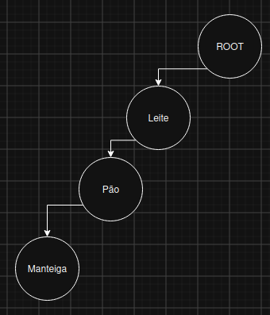
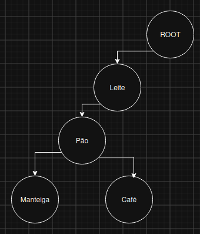
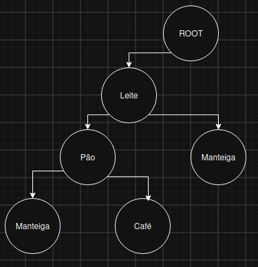
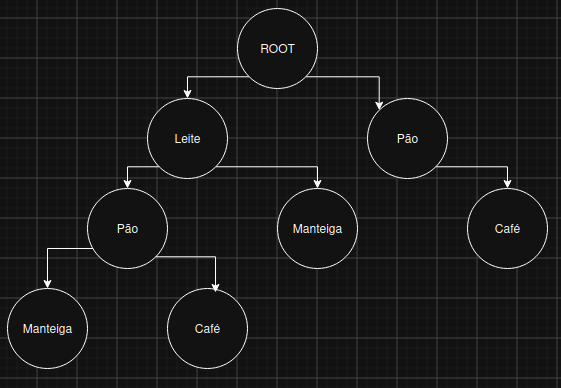
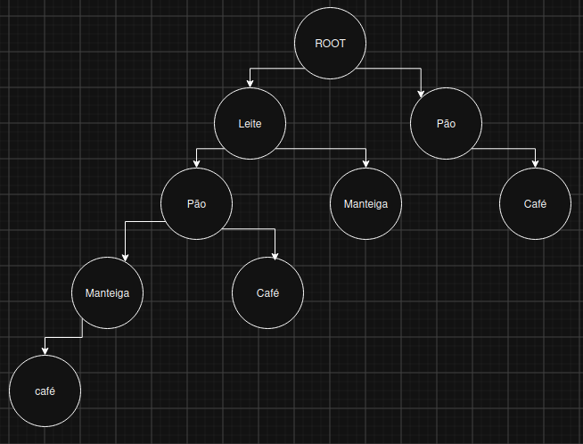

# FP-GROWTH (CRESCIMENTO DE PADRÕES FREQUENTES)

Recebe esse nome pois expande padrões frequentes (combinações mais comuns) através de uma estrutura de dados compacta baseada em árvore chamada **FP-Tree**. Ele serve para **encontrar conjuntos de itens frequentes em bases de dados transacionais** sem a necessidade de gerar candidatos explicitamente.

Ele é a evolução direta do algoritmo **Apriori**. Enquanto o Apriori precisa varrer a base de dados inteira múltiplas vezes para gerar e testar candidatos em cada nível (o que gera um custo computacional altíssimo), o FP-Growth **varre o banco de dados apenas duas vezes** e resolve a busca através de uma estratégia do tipo `dividir para conquistar`.

## Estrutura

O FP-Growth baseia-se em duas ideias centrais: comprimir o banco de dados em uma árvore prefixada (**FP-Tree**) e minerar essa árvore iterativamente usando **Padrões Condicionais**.

### 1. Suporte Mínimo (min_sup)

O suporte mínimo (min_sup) é igual o limite de suporte do Apriori. É visto qualquer item que apareça menos que o mínimo definido (na rodada K=1). Qualquer item que tenha frequência menor do que esse valor é considerado irrelevante e é descartado no início do processo, antes mesmo de entrar na árvore.

### 2. A Tabela de Cabeçalho (Header Table)

É uma tabela auxiliar que guarda todos os itens não eliminados ordenados do mais frequênte ao menos, acompanhados da quantidade de ocorrências.

Ela também possui um ponteiro inicial que conecta todos os nós de mesmo nome espalhados pela FP-Tree na forma de uma lista encadeada. Isso permite encontrar instantaneamente todas as ocorrências de um determinado item dentro da árvore sem precisar percorrer a árvore toda.

### 3. A FP-Tree (Frequent Pattern Tree)

É uma estrutura de árvore que armazena os caminhos das transações compartilhadas:

- A raiz é sempre um nó nulo (`root` / `null`).
- Cada nó da árvore armazena:
  - O **nome do item**
  - A **contagem** de vezes que aquele caminho foi percorrido
  - Um **ponteiro de nó** para o próximo nó do mesmo item na árvore (para a lista encadeada da Header Table).
- Transações que compartilham itens em comum compartilham os mesmos nós no topo da árvore, o que gera uma enorme compressão de memória.

### 4. Base de Padrões Condicionais

Para minerar a árvore, pegamos um item por vez (começando do menos frequente na Header Table) e subimos daquele nó até a raiz. Essa trajetória forma um **caminho prefixado**. 

O conjunto de todos os caminhos prefixados que levam a um item específico funciona como um "sub-banco de dados" exclusivo daquele item, chamado de **Base de Padrões Condicionais**.

## Como a Árvore é Construída

A construção ocorre com exatamente **duas varreduras** na base transacional:

### Primeira Varredura

1. Varre todo o banco de dados e conta quantas vezes cada item aparece.
2. Descarta os itens com frequência abaixo de min_sup.
3. Ordena os itens restantes em **ordem decrescente de frequência**. Essa ordem é fixa e será mantida até o final do processo.

> **Por que ordenar em ordem decrescente?**
> Colocar os itens mais comuns no topo da árvore maximiza o compartilhamento de prefixos entre transações diferentes, gerando uma árvore muito menor.

### Segunda Varredura

1. Para cada transação da base original:
   - Filtra os itens infrequentes.
   - Reordena os demais itens dessa transação seguindo a mesma ordem da 1ª varredura.
2. Insere a transação reordenada na FP-Tree:
   - Começa na raiz (`root`).
   - Avalia o primeiro item da transação: se já tiver um nó filho desse item, **incrementa o contador do nó em +1**. Se não for, cria um novo nó filho com **contador = 1** e nome = item.
   - Avança para o segundo item da transação e para o nó filho ligado ao item anterior. Repete a lógica.
3. Atualiza os ponteiros na **Header Table** para conectar o nó recém-criado à lista encadeada do respectivo item.

> Ou seja, a árvore mostra todas as transações existentes, com os itens mais comuns no topo e os mais raros nas folhas. **Enquanto 2 transações tiverem os mesmos itens elas descem pelo mesmo ramo e quando tiverem um item diferente elas bifurcam, formando 2 ramos novos**.

## Como é Feita a Iteração na Árvore (Mineração)

Depois que a FP-Tree é construída, **o banco de dados original nunca mais é lido**. A extração dos conjuntos frequentes é feita puramente navegando na árvore bottom-up (de baixo para cima na Header Table):

1. **Seleção do Item Alvo:** Começa do item mais ao fundo (menos frequente) da Header Table.
2. **Mapeamento dos Caminhos:** Segue a lista encadeada daquele item na FP-Tree para localizar todas as suas ocorrências. Para cada nó do item, sobe pela árvore até a raiz e registra a sequência de ancestrais e a contagem daquele nó.
3. **Criação do Banco Condicional:** Monta a Base de Padrões Condicionais para o item.
4. **Construção da FP-Tree Condicional:** Cria uma pequena FP-Tree considerando apenas a Base Condicional e recalcula o suporte dos itens ancestrais. Se algum item ancestral ficar abaixo de min_sup nesse contexto restrito, ele é removido.
5. **Geração de Padrões:** Combina o item alvo com todos os itens sobreviventes da FP-Tree Condicional para formar os conjuntos frequentes finais.
6. **Recursão:** Repete o processo para o próximo item da Header Table.

## Exemplo

Dado um dataset de 5 transações (N=5) e um suporte mínimo de min_sup = 2 (40%).

### Transações Brutas

| ID Transação | Itens Comprados |
| :--- | :--- |
| **T1** | Leite, Manteiga, Pão |
| **T2** | Leite, Café, Pão |
| **T3** | Leite, Manteiga |
| **T4** | Café, Pão |
| **T5** | Leite, Café, Pão, Manteiga |

### Passo 1: 1ª Varredura - Contagem e Filtragem

Contagem individual dos itens na base:
- **Leite:** 4
- **Pão:** 4
- **Manteiga:** 3
- **Café:** 3

Como min_sup = 2, **todos os itens são mantidos**.

**Ordem Global de Frequência:**
1. Leite (4)
2. Pão (4)
3. Manteiga (3)
4. Café (3)

(Em empates de frequência, mantemos a ordem lógica/alfabética definida no início).

### Passo 2: Reordenação das Transações

Filtrando e ordenando os itens em cada transação conforme a Ordem Global:

| ID | Itens Originais | Transação Reordenada |
| :--- | :--- | :--- |
| **T1** | Leite, Manteiga, Pão | `[Leite, Pão, Manteiga]` |
| **T2** | Leite, Café, Pão | `[Leite, Pão, Café]` |
| **T3** | Leite, Manteiga | `[Leite, Manteiga]` |
| **T4** | Café, Pão | `[Pão, Café]` |
| **T5** | Leite, Café, Pão, Manteiga | `[Leite, Pão, Manteiga, Café]` |

### Passo 3: 2ª Varredura - Construção da FP-Tree

Inserimos cada transação elemento por elemento a partir da raiz `root`:

1. **Inserir T1 `[Leite, Pão, Manteiga]`:**
   - `root` $\rightarrow$ `Leite:1` $\rightarrow$ `Pão:1` $\rightarrow$ `Manteiga:1`

2. **Inserir T2 `[Leite, Pão, Café]`:**
   - Passa por `Leite` (já existe $\rightarrow$ vira `Leite:2`).
   - Passa por `Pão` (já existe $\rightarrow$ vira `Pão:2`).
   - Insere `Café` abaixo de `Pão` $\rightarrow$ `Café:1`.

3. **Inserir T3 `[Leite, Manteiga]`:**
   - Passa por `Leite` (já existe $\rightarrow$ vira `Leite:3`).
   - Próximo item é `Manteiga`. Não existe nó `Manteiga` logo abaixo de `Leite`, então cria novo ramo $\rightarrow$ `Manteiga:1`.

4. **Inserir T4 `[Pão, Café]`:**
   - Não começa com `Leite`. Cria novo ramo direto da raiz $\rightarrow$ `Pão:1` $\rightarrow$ `Café:1`.

5. **Inserir T5 `[Leite, Pão, Manteiga, Café]`:**
   - Segue caminho `Leite` (`Leite:4`), `Pão` (`Pão:3`), `Manteiga` (`Manteiga:2`).
   - Insere novo nó `Café:1` abaixo desse `Manteiga`.

### Passo 4: Mineração na FP-Tree (Iteração)

Lemos a Header Table de baixo para cima (começando pelo item menos frequente: **Café**).

#### Analisando o item `Café`:

1. **Localizar nós `Café` e extrair caminhos prefixados:**
   - Nó 1 (`Café:1` abaixo de Manteiga): caminho `{Leite:1, Pão:1, Manteiga:1}`
   - Nó 2 (`Café:1` abaixo de Pão): caminho `{Leite:1, Pão:1}`
   - Nó 3 (`Café:1` abaixo do Pão da direita): caminho `{Pão:1}`

2. **Base de Padrões Condicionais do Café:**
   - `{Leite, Pão, Manteiga}: 1`
   - `{Leite, Pão}: 1`
   - `{Pão}: 1`

3. **Contagem dos elementos no contexto do Café:**
   - `Pão`: 1 + 1 + 1 = 3
   - `Leite`: 1 + 1 = 2
   - `Manteiga`: 1 (Descartado pois 1 < min_sup)

4. **Árvore Condicional do Café e Conjuntos Frequentes Gerados:**
   - Como `Pão:3` e `Leite:2` são $\ge$ min_sup, geramos os seguintes conjuntos frequentes associados ao `Café`:
     - **`{Café, Pão}`** (Suporte = 3)
     - **`{Café, Leite}`** (Suporte = 2)
     - **`{Café, Pão, Leite}`** (Suporte = 2)

O processo se repete de forma idêntica para os próximos itens da Header Table (**Manteiga**, **Pão** e **Leite**).

## PREMISSAS

- **Dados Categóricos Discretos:** Cada item deve representar uma entidade discreta (ex: ID do produto, tag, evento).
- **Estrutura Transacional:** Os dados precisam estar agrupados por ID de transação ou sessão.

## QUANDO USAR

- **Bases de dados massivas:** Quando o Apriori estourar o tempo de processamento fazendo dezenas de varreduras no disco.
- **Padrões longos e frequentes:** Quando as compras/sessões contiverem muitos itens parecidos repetidos ao longo de várias transações.
- **Análise de Cesta de Compras (Market Basket Analysis):** Descobrir quais produtos costumam ser comprados em conjunto no varejo ou e-commerce.

> Use-o quando a densidade (itens se repetindo muito) for alta ou min_sup for muito baixo.
> Se a densidade for > 10 OU min_sup for muito pequeno (ex: 0.1), use FP-Growth. Senão, use Eclat.

## QUANDO NÃO USAR

- **Pouco espaço em memória RAM:** Se os dados forem extremamente esparsos (muitos itens diferentes e raros compartilhando pouca sobreposição), a FP-Tree pode crescer tanto que não caberá na RAM.
- **Variáveis Numéricas Contínuas:** Se você tiver dados contínuos (ex: valor em dinheiro, temperatura, idade), precisará categorizá-los em faixas antes de aplicar o algoritmo.

## MÉTRICAS E REGRAS DE ASSOCIAÇÃO

Uma vez encontrados os **conjuntos de itens frequentes** pelo FP-Growth, podemos derivar as **regras de associação** do tipo $A \rightarrow B$ usando três métricas principais:

### 1. Suporte

Fração das transações contendo $A$ e $B$:

$$Suporte(A \rightarrow B) = P(A \cap B)$$

### 2. Confiança

Probabilidade de conter $B$ dado que $A$ está presente:

$$Confianca(A \rightarrow B) = \frac{Suporte(A \cap B)}{Suporte(A)}$$

### 3. Lift

Mede a força da regra comparada com a chance de $A$ e $B$ ocorrerem aleatoriamente de forma independente:

$$Lift(A \rightarrow B) = \frac{Confian\text{ç}a(A \rightarrow B)}{Suporte(B)} = \frac{P(A \cap B)}{P(A) \cdot P(B)}$$

- **Lift > 1:** Indica dependência positiva (comprar A aumenta a chance de comprar B).
- **Lift = 1:** Indica independência entre A e B.
- **Lift < 1:** Indica dependência negativa ou substituição (comprar A diminui a chance de comprar B).