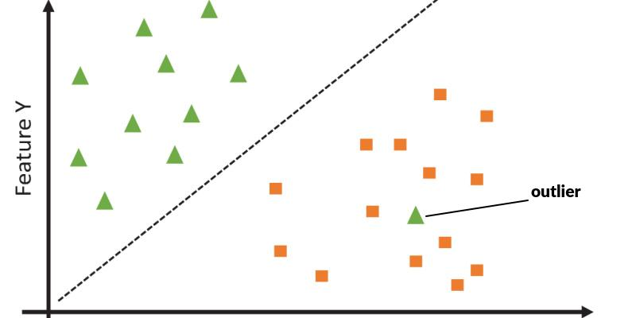
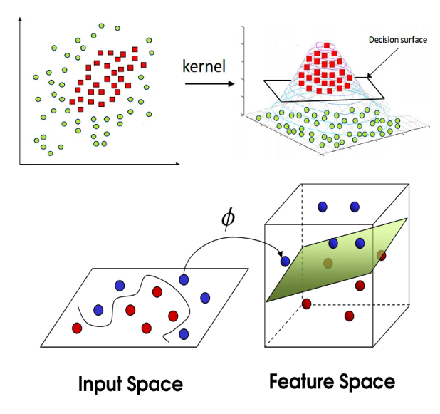
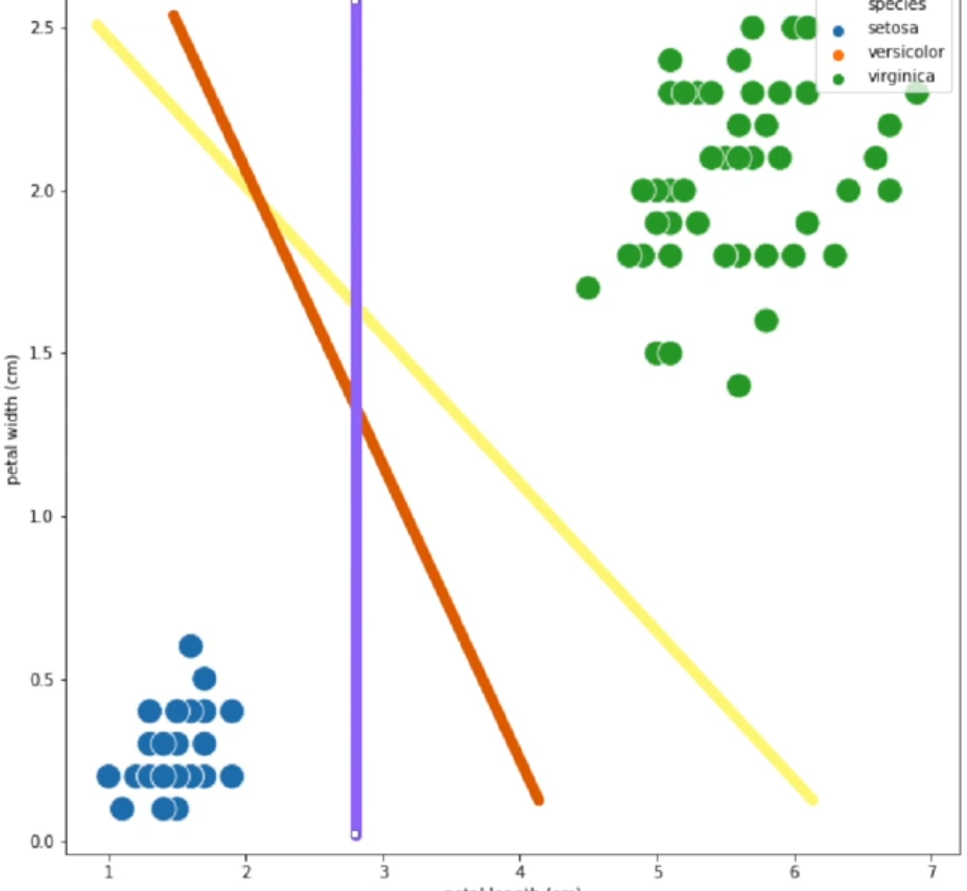

# SUPPORT VECTOR MACHINE (SVM)

É um algoritmo de aprendizado supervisionado utilizado tanto para classificação (embora também seja possível usá-lo em regressão). O objetivo do SVM é **encontrar a melhor linha de separação** (ou hiperplano) entre dados de diferentes classes. É importante entender que ele não busca apenas separar as classes, mas **separá-las com a maior margem de segurança possível**.

Para se ter em mente, o modelo tenta desenhar uma rua larga entre as classes. **Quanto mais larga for essa rua, mais confiável** é o modelo em classificar novos dados sem errar. A rua precisa ser larga para ter confiança que encontrou um lugar onde as diferenças são estatisticamente consideráveis. Uma rua curta pode ser só ruído ou aleatoriedade.

Também é importante saber que não necessariamente a linha que separa os grupos vai separar 100% (se for é sinal que a amostra pode ser mal feita ou overfitting). Como na imagem acima, outliers podem ficar no meio de dados de outra categoria, além de por ruído ao aleatoriedade um dado ficar do lado errado da linha. Afinal ela representa uma média de até onde os grupos vão.

### Importante: SVM é usado com poucos dados devido exigir muito processamento

## A Representação

Cada dado vira um ponto no gráfico (ou hiperplano). Para tanto, cada variável/característica vira um eixo. Com 2 características temos um gráfico 2D normal, com 3 cracterísticas temos um gráfico 3D e acima disso um hiperplano que já não dá pra desenhar.

Cada dado (linha do dataset) sendo um ponto conseguimos representar graficamente como cada característica é representada e se influenciam. Para isso as **variáveis X precisam ser numéricas**.

### A Fronteira

Fronteira (também chamada de linha, reta, hiperplano ou divisão) é a reta (ou plano, dependendo da dimensão) que separa os dados. Se temos apenas duas características/variáveis (um gráfico 2D), a divisão é uma linha. Se temos três, é um plano (como uma folha de papel). Para mais variáveis vira um hiperplano e não fica mais visível a representação.

**Objetivo**: Separar o melhor possível os pontos da categoria A dos pontos da categoria B.

### A Margem

A margem é a distância entre a fronteira e os pontos de dados mais próximos de cada categoria. O SVM quer que essa margem seja a maior possível. O algoritmo busca maximizamr essa separação.

Os pontos que estão exatamente no limite dessa margem são chamados de **Vetores de Suporte** (Support Vectors). Eles são os pontos mais difíceis de classificar e, incrivelmente, **são os únicos pontos que realmente importam para o modelo**. Se você apagar todos os outros pontos do dataset que estão longe da fronteira, a linha de decisão não mudará nada. Eles "suportam" a estrutura do modelo.

## O Problema da Não-Linearidade (O Truque do Kernel)

Na vida real, a maioria dos problemas não podem ser separadas por uma simples linha reta ou plano. E se tivermos um círculo de pontos azuis rodeado por um anel de pontos vermelhos? Uma reta nunca vai separar isso direito.

É aqui que o SVM brilha usando o **Kernel Trick** (Truque do Kernel). 

O Kernel é uma função matemática que pega os dados originais (em 2D, por exemplo) e os projeta em uma dimensão maior (como 3D), onde **se torna possível separá-los com um plano reto**. 

Imagine um lençol no chão com bolinhas de gude azuis no centro e vermelhas nas bordas. Você não consegue traçar uma linha reta no chão para separá-las. Mas, se você beliscar o centro do lençol e levantá-lo, as bolinhas azuis sobem. Agora, você pode passar uma tábua reta (plano 3D) cortando o lençol, separando as azuis em cima e as vermelhas embaixo. Isso é o que o Kernel faz matematicamente, sem precisar gastar poder computacional excessivo projetando ponto por ponto.

Essa adição de dimensão significa na prática uma **transformação não-linear nos dados**, alterando-os artificalmente para criar uma dimensão aonde eles estão separados e possamos criar uma reta dividindo. Isso só dá certo porque os dados são categorizados (treino supervisionado) e sabemos quais dados queremos colocar do mesmo lado e quais manter do outro.

> Existem diversos algoritmos de kernel, então o SVM além de ter a função de custo e a e otimização, também tem de escolher a função de kernel.

## Margem Rígida e Margem Suave (Regularização C)

O SVM não exige a perfeição absoluta se isso for causar overfitting.

- **Margem Rígida (Hard Margin):** Tenta não errar nenhum ponto no treino. Isso pode criar uma fronteira de decisão super complexa ou muito estreita, gerando overfitting. Só funciona bem se os dados não tiverem sobreposição (outliers).
- **Margem Suave (Soft Margin):** Permite que alguns pontos invadam a margem ou até atravessem o hiperplano para a classe errada, em troca de uma "rua" mais larga e simples. Isso generaliza muito melhor para novos dados.

O controle entre essas duas abordagens é feito pelo hiperparâmetro **C (Penalidade por erro)**:
- **C Alto:** Punição alta por errar. O modelo tenta acertar tudo, a margem fica estreita. Risco de Overfitting.
- **C Baixo:** Punição baixa por errar. O modelo prioriza uma margem larga, mesmo ignorando alguns pontos errados. Pode ser robusto, mas com risco de Underfitting se for baixo demais.

O segredo é um C baixo mas nem tanto. Encontrar o C ideal envolve testar diversos valores e escolher o melhor. Assim como a constante Lambda da regularização Ridge e Lasso, aqui a regularização C funciona do mesmo jeito. Cada valor a ser testado para C deve estar numa escala diferente (0.001, 0.01, 0.1, 1, 10, 100...). Assim não perde tempo testando valores próximos e o efeito será bem diferente entre cada um. A faixa de valores que você vai usar **depende muito da magnitude dos seus dados**.

## PREMISSAS

O SVM possui alguns comportamentos esperados em relação aos dados:

1. **Dados em Mesma Escala (Normalização/Padronização):** Como o SVM se baseia na distância entre os pontos (margem), variáveis com escalas muito diferentes vão distorcer essas distâncias. Assim como no Gradiente Descendente, os dados **devem** ser normalizados.
2. **Sensível a Outliers (se C for alto):** Um único ponto muito fora da curva pode puxar o hiperplano inteiro, destruindo a margem se o modelo for configurado de forma rígida.
3. **Variáveis X numéricas**: As variáveis independentes precisam ser numéricas. Caso não sejam você deve transformá-las em numéricas através de algum método de codificação (listado na sessão de transformações).

### Relação com Multicolinearidade

O SVM não tem problemas com multicolinearidade. Duas variáveis redundantes não mudam muito o local a divisão, afetará de forma sutil. Porém mesmo que o resultado final não seja afetado, o tempo de processamento sim será. A cada nova variável o tempo de processamento do SVM aumenta um pouco, causando o chamado **maldição da Dimensionalidade**. Se a variável não for trazer informação útil o melhor é removê-la para economizar tempo no treinamento. Rodar um VIF ou Matriz de Correlação antes para encontrar e remover essas variáveis pode ser bom.

## Testes de Hipótese

Como o SVM não se baseia em inferências estatísticas (diferente das regressões linear e logística) você não precisa fazer testes para validar premissas ou se os pesos finais são significativos. O que pode ser testável é comparar diferentes modelos de SVM. 

Para tanto podemos usar o teste de McNemar para ver qual modelo se sai melhor quando são apenas 2. Para 3 ou mais modelos usamos o teste de Friedman.

## Testes de Qualidade

- Acurácia
- Matriz de confusão
- Testar diferentes C
- Dividir os dados em K-folds e testar as métricas em todas

## ENTRADAS E SAÍDAS

Para que o SVM funcione, ele precisa ser alimentado com informações específicas.

O que ele recebe de entrada:
- **Dados de Treinamento (X e Y):** Variáveis independentes e a classe alvo (ou valor contínuo para regressão).
- **Função Kernel:** Como ele deve interpretar o espaço (Linear, Polinomial, RBF - Radial Basis Function).
- **Hiperparâmetro C:** A penalidade da margem suave.
- **Gama ($\gamma$):** (Usado no kernel RBF) Define o quão longe a influência de um único ponto de treinamento alcança. Gama alto significa que apenas pontos muito próximos importam; gama baixo considera pontos distantes.

O que ele dá como saída:
- **O Hiperplano (Pesos e Viés):** A equação da fronteira que separa as classes.
- **Os Vetores de Suporte:** A lista de pontos exatos que formam a margem.

## COMO FUNCIONA

1. Mapeia os dados originais para o espaço N-dimensional escolhido (aplicando o Kernel, se necessário).
2. Procura a linha (ou plano) que separa as classes.
3. Ajusta o plano para que a distância entre ele e os pontos mais próximos (Vetores de Suporte) de ambas as classes seja a máxima possível.
4. Penaliza pontos que cruzam a margem dependendo do fator C.
5. Fixa o hiperplano ideal. 

## COMO TRABALHAR COM ELE

- Analise a quantidade de linhas e colunas para ver se faz sentido usá-lo
- Plote os dados em gráficos (como temos N dimensões, selecione algumas e plote de 3 em 3)
  - Procure ver quão misturado são os dados e se existe muitas anomalias para ver se precisa usar Kernel 
- Escolha a versão do algoritmo a partir das análises

## FUNÇÃO DE CUSTO (Hinge Loss)

O SVM linear geralmente utiliza uma função de custo chamada **Hinge Loss** (Perda de Atriculação), muitas vezes otimizada usando métodos semelhantes ao Gradiente Descendente para minimizar esse erro.

A Hinge Loss não pune o modelo se a previsão estiver certa e o ponto estiver suficientemente longe do perigo (fora da margem e no lado certo). Ela **só pune se o ponto estiver do lado errado, ou perigosamente dentro da margem**.

$$Custo = max(0, 1 - y * f(x))$$

Aonde:

- y é a categoria verdadeira (com valor 1 ou -1 em categorias binárias)
- f(x) a categoria dada pelo modelo

Se $y * f(x)$ for maior ou igual a 1, significa que o ponto está classificado corretamente e seguro fora da margem. O custo é 0. O modelo ignora esse ponto para ajuste de pesos. 

Se for menor que 1, o ponto invadiu a margem ou foi classificado errado. O erro cresce linearmente, guiando o algoritmo a empurrar o hiperplano para longe dali.

Com isso vemos que o classificador é a função max, que define em qual categoria entra nosso dado. O **max ocupa portanto a função do sigmoide** na regressão logistica.

Portanto o desafio é como escrever f(x). Porém certas características são universais dessa função. Ela retorna um valor de -infinito a +infinito, aonde o sinal indica a qual categoria pertence e o valor em si (distância do 0) indica quanta certeza você tem que esse valor é dessa categoria.

Como (ao menos em classificadores binários) multiplicar por y é só adicionar um sinal, y*f(x) é basicamente $\pm f(x)$. Ou seja, remove o sinal da função f(x) original, nos dexando só com o tanto de certeza que a função achou a categoria certa. Por isso ao fazer 1 - yf(x) é basicamente perguntar se yf(x) > 1. Como vimos que y é basicamente remover o sinal e checar se encontramos a categoria certa o que estamos de fato testando é se |f(x)| > 1. Essa comparação para ser maior que 1 é a margem de segurança do algoritmo de que ele categorizou corretamente.

### Cálculo de f(x)

Como o SVM cria uma reta (ou plano ou hiperplano, que são retas com mais dimensões) essa função é a função da reta. 

$$f(x) = w^T x + b$$

Aonde

- w são os pesos que queremos descobrir
- x são nossos dados
- b é o intercepto

Porém caso use Kernel a equação muda, pois não estamos calculando mais uma simples reta. Nesse caso a função muda para

$$f(x) = \sum \alpha_i y_i K(x_i, x) + b$$

Aonde

- x são nossos dados
- $x_i$ são os vetores de suporte (dados que definem a margem)
- $y_i$ é a classe daquele vetor de suporte específico
- $\alpha_i$ é o peso que o modelo deu para aquele suporte
- $K(x_i, x)$ é a função de Kernel escolhida. Ela irá medir a similaridade entre o seu novo dado x e o dado de treino $x_i$.

### Calculando os pesos W

Os pesos são calculados através do gradiente descendente, podendo ser a versão descendente, estocástico ou com mini-batches. Utilizar regularização Lasso é indicado para garantir a maior margem possível.

O gradiente precisa fazer a derivada da função de custo, porém a função max tem uma quebra onde o erro é 0, ou seja, quando o erro é zero ela não é derivável. Para isso a derivada é dividida em 2 cenários, um quando está dentro da marge e outro quando está fora.

**Cenario A: fora da margem**

Se $f(x) \ge 1$ então

$\frac{\partial f}{\partial W} = w$

$\frac{\partial f}{\partial B} = 0$, lembrando que B é o intercepto. Ou seja, a derivada do intercepto é 0

**Cenario B: dentro da margem**

Se $f(x) < 1$ então a derivada inclui a penalidade do erro

$\frac{\partial f}{\partial W} = w - cyx$

$\frac{\partial f}{\partial B} = -cy$

Aonde C é o hiper-parâmetro da regularização C definida.

### Calculando os pesos $\alpha$

Os pesos alfa também são chamados de multiplicadores de Lagrange e possuem uma forma de calcular bem diferente dos pesos W. Quando introduzimos um Kernel, o espaço de dados ganha mais dimensões, tornando impossível calcular ou armazenar o vetor de pesos W de forma direta. Para resolver isso, transformamos o problema original (Chamado de Problema Primal) no seu Problema Dual, mudando a forma como o modelo é otimizado.

No caso com Kernel, o objetivo passa a ser maximizar a função dual obtida através dos Multiplicadores de Lagrange:

$\sum \alpha_i - 0,5 \sum_i \sum_j \alpha_i \alpha_j y_i y_j K(x_i, x_j)$

aonde todos os alfas tem de ser entre 0 e C e a soma dos alfas * suas categorias tem de ser 0. $\sum \alpha_i y_i = 0$

> Uma otimização não-linear com restrições (encontrar a derivada = 0 com restrições e onde uma reta não representa bem todo o espaço) é a descrição de um multiplicador de Lagrange com condição KKT. 

Nesse caso queremos derivar a função e ver o maior ponto entre **0 < alfa < C** e também onde $\sum \alpha_i y_i = 0$.

Como essa matemática exige resolver um sistema complexo de restrições para cada par de dados, usamos o SMO (Sequential Minimal Optimization) ao invés do gradiente descendente. Ele quebra esse grande problema em pequenos problemas analíticos, pegando dois alfa por vez, ajustando-os para obedecer às restrições e repetindo o processo até convergir.

## Função de Otimização (Programação Quadrática)

É o método de minimizar a norma dos pesos e com isso maximizar a margem. É através da otimização que encontramos a melhor reta (plano ou hiperplano) que separa as categorias. Ou seja, a reta que esteja mais longe dos vetores de suporte de ambos dos lados.

> Lembrando: a reta escolhida será aquela com maior margem. Então dentre todas as opções ficamos com a que der a maior margem.

A função de otimização tem a equação

$$SVM(w) = 0,5||w||^2 + C * fnCusto$$

Aonde

- custo é a função de custo (função max que vimos anteriormente).
- $0,5||w||^2$ é a regularização. Ela força o modelo a encontrar margens grandes e pesos menores.
- C é o hiper parâmetro.

Como a primeira parte é a regularização que vai diminuindo o valor de W para aumentar a margem a equação final fica

`SVM(w) = religarização + C * fnCusto`

Com isso nossa margem (a distância de cada lado da reta) é $\frac{2}{||w||}$.

### Por que ele é pesado?

A matemática do SVM com kernels (não-lineares) exige calcular a distância/produto interno de cada ponto de treinamento em relação a todos os outros pontos. Por isso, a complexidade computacional cresce de forma quadrática com o número de amostras (linhas) do dataset. Com muitos dados, o uso da memória RAM e o tempo de treinamento estouram.

## PASSO-A-PASSO

- Inicializa os pesos aleatoriamente (geralmente 0)
- Começa o gradiente descendente (loops de atualização dos pesos) e vai dado a dado analisando
- Calcula f(x) e a função de perda (hinge loss)
- Verifica se a função de perda acertou a categoria daquele ponto
- Calcula a derivada da função
- Usa a derivada na função do gradiente descendente para atualizar os pesos
- Repete até convergir o gradiente

## Onde é Usado

- **Classificação de Imagens e Texto:** Antes do boom das Redes Neurais (Deep Learning), era o estado-da-arte e o modelo preferido para categorização de texto, análise de sentimentos, detecção de spam e reconhecimento facial.
- **Bioinformática:** Classificação de proteínas e análise de dados genéticos de microarranjos (microarray), pois o SVM lida surpreendentemente bem com datasets onde há poucas linhas (amostras) mas altíssima dimensionalidade (milhares de genes).
- **Sistemas de detecção de anomalias:** Uma variação chamada *One-Class SVM* é excelente para identificar fraudes ou defeitos em peças, pois desenha uma margem englobando o que é "normal" e acusa como anomalia qualquer novo dado que caia fora dessa fronteira.

## MÉTODOS INTERCAMBIÁVEIS (Alternativas)

O SVM pode ser substituído por outros algoritmos dependendo do cenário:

- Regressão Logística:
  - **Quando trocar:** A regressão logística fornece probabilidades reais de pertencimento a uma classe, enquanto o SVM é puramente determinístico (diz a qual classe pertence, mas não a probabilidade disso). A Logística é mais eficiente com datasets imensos. No entanto, o SVM consegue desenhar fronteiras curvas e complexas muito melhor (usando kernels).
- Árvores de Decisão (Random Forest) / XGBoost:
  - **Quando trocar:** Se você tem dados brutos não normalizados ou dados em categorias variadas com muitos valores discrepantes (outliers). O SVM exige pré-processamento rigoroso (normalização), enquanto as árvores lidam com dados "sujos" quase que de forma nativa.
- Redes Neurais (Deep Learning):
  - **Quando trocar:** Para problemas altamente complexos de percepção (visão computacional avançada, áudio e linguagem natural) e com milhões de dados na base. 

## VARIAÇÕES DO SVM

Para lidar com diferentes tipos de problemas, o SVM possui derivações:

- **SVC (Support Vector Classification):** O modelo clássico para prever classes/categorias. É o que descrevemos até agora e o que geralmente se refere quando falam de SVM. Na prática SVC = SVM.
- **SVR (Support Vector Regression):** A versão para prever valores numéricos contínuos. A ideia se inverte: em vez de criar uma margem vazia no meio para separar os dados, ele cria um "tubo" e tenta acomodar o máximo de pontos possíveis *dentro* desse tubo limitador de erro, ignorando os resíduos pequenos (dentro do tubo) e punindo apenas os pontos que caem fora.
- **LinearSVC:** Quando sabemos que os dados são linearmente separáveis (não usa Kernel). Essa versão usa uma implementação diferente (liblinear) debaixo os panos, sendo incrivelmente mais rápida e capaz de suportar grandes volumes de dados.
- **One-Class SVM:** Usado para aprendizado não supervisionado focado em anomalias/outliers. O modelo aprende a topologia central da massa de dados. O que destoa dessa massa é ejetado da classe e tratado como anormal.

### Resumo Prático de Uso

- Poucas linhas e dezenas/centenas de colunas: **SVM com Kernel Linear.**
- Poucas colunas mas fronteiras complexas que se misturam: **SVM com Kernel RBF.**
- Milhões de linhas: **Evite o SVC padrão.** Use LinearSVC, Gradient Boosting ou mude para Redes Neurais.
