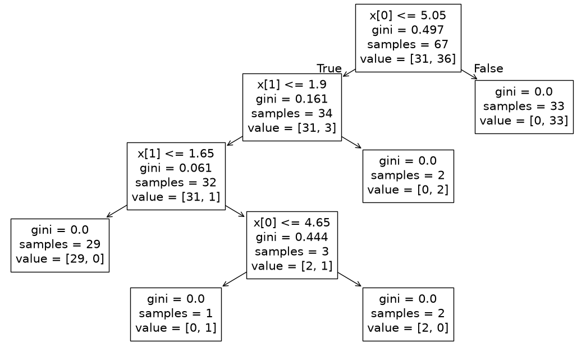
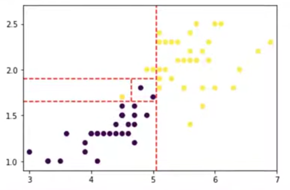

# ÁRVORES DE DECISÃO

Árvores de decisão são árvores binárias aonde cada nó faz uma pergunta booleana sobre alguma variável. Com isso todo nó tem apenas 2 filhos. As perguntas são tipo "a categoria é homem? Salário > 5000?".

O aprendizado de máquina entra ao descobrir quais perguntas fazer aos dados e quais colocar na raiz da árvore para ter a árvore com menor profundidade possível.

## Estrutura da Árvore

O nó raiz é decidido pela função de otimização, colocando aquele com maior ganho de informação no topo. Isso nos garante que a árvore será a menos profunda possível. A árvore é binária, portanto sempre dá origem a apenas 2 nós filhos. O nó é uma folha (a última e sem filhos) quando sua entropia é 0, ou seja, todos os dados são iguais. Isso garante que ao fazer todas as divisões até chegar nele todos os dados que restarem tem a mesma categoria.

## Premissas

As árovres não usam de inferência ou pressupostos estatísticos, portanto não precisam de testes de hipótese para validá-las. Porém é possível trocar a entropia de Gini por testes de hipótese como função de custo, mais especificamente CHAID (que usa o chi-quadrado para avaliar a associação entre variáveis categóricas e o alvo).

As variáveis X podem ser tanto categóricas como numéricas, porém Y precisa ser categórica.

## Função de Perda

O segredo por trás das árvores é a entropia. Os 2 métodos mais comuns de função de perda são a **entropia com ganho de informação e a impureza de Gini** (ou entropia de Gini). Ambas as soluções usam entropia, mudando só alguns detalhes da matemática.

Os cortes nas variáveis são definidos pela função de perda para separar classes diferentes da maneira mais homogênea possível. A idéia é que cada lado fique com só 1 tipo de variável Y e para medir isso entra a entropia. Quanto menor, melhor. Esses algoritmos são gulosos pois a cada passo (nó) ele escolhe o melhor para aquele momento, não olha para o melhor no todo.

Para isso eles calculam dividem os dados usando todas as variáveis X envolvidas e todos os valores presentes em cada um. O que der a menor entropia é o escolhido.

### Entropia de Gini

A diferença da Entropia de Gini para a entropia normal é que ao invés de multiplicar a probabilidade pelo seu log (P * log(P)) ele é o quadrado da probabilidade

$$G = 1 - \sum P_i^2$$

Ela é usada por ser mais rápida que calcular o log. Encontrar o log consome mais processamento que elevar ao quadrado e ao elevar chegamos a um valor próximo do log. Fazer 1 - somatório nos dá o complemento do que foi calculado (chance do evento ser corretamente categorizado), assim ao ter o complemento medidos a chance dele ser colocado no grupo errado. Quanto maior essa chance de erro, maior a entropia.

## A Grande Desvantagem

Árvores de decisão tendem a sofrer de overfitting se não houver alguma poda na otimização. Se deixar sem nenhuma restrição o algoritmo separa até o último ponto, desenhando perfeitamenteo os limites dos dados de treino. Esse overfitting também cria árvores muito maiores que o necessário.

> **Quanto mais nós, mais overfitting!**

Outro ponto negativo é quando se tem X numérico com valores muito diferentes ou X com valores únicos (ex: cpf, cep, altura...). Se cada valor é único ou difícil de repetir a árvore vai criar testar cada um desses valores únicos como ponto de corte. Além de tornar o aprendizado mais lento pode criar uma falsa entropia, onde cada folha contém somente 1 dado com entropia 0. Isso dará a impressão de um valor perfeito, mas pelo valor ser único não é realmente algo que se possa tirar informação (enganando o cálculo que achará que encontrou a melhor entropia). O ideal nesse caso é analisar previamente as variáveis X, ver o quanto elas se repetem e removar da análise variáveis com nenhuma ou pouca repetição.

Para encontrar o quanto os valores se repetem você pode checar via histograma e por desvios padrões muito altos.

## Passo-a-Passo

- Escolha da função de custo (entropia ou Gini)
- Para cada X, lista todos os valores diferentes
- Para cada valor de cada X calcula a entropia
  - Calcular a entropia de ser igual aquele valor e de se diferente dele
  - Faça a soma ponderada das 2 opções
- Define como raiz o grupo teve menor entropia
  - Em caso de empate escolha qualquer um aleatoriamente
- Divide o nó raiz em suas 2 opções
- Calcula a entropia para cada valor diferente de cada X nos 2 grupos
- Continua dividindo os grupos até chegar nas folhas

## Função de Otimização

A função de otimização é o **algoritmo recursivo que vai analisando os nós filhos e calculando a entropia de todas as opções** de todas as variáveis presentes nesse subgrupo. Um algoritmo comum é o CART que serve tanto para classificação como regressão.

## Poda da Árvore

A poda é o método de evitar overfitting removendo nós com baixa importância e agregam pouco na capacidade preditiva. Sabemos se um nó adiciona pouco valor preditivo pela entropia dele. Tem 2 tipos de poda: pré-poda e pós-poda.

- **Pré-poda**: vai cortando a árvore enquanto a cria. 
  - **Definir profundidade máxima**: impede da árvore crescer demais
  - **Número mínimo de dados em um nó**: impede de nós para analisar só 2 ou 3 dados. Se tem tão poucos dados parecidos querer separá-los ainda mais é overfitting.
- **Pós-poda**: cria a árvore inteira e só executa a poda no final depois de ter sido tudo calculado e montado.
  - **Custo-complexidade**: define um alfa ligado ao tamanho da árvore. Quanto maior o alfa, maior o corte. Alfa=0 não corta nada e alfa=1 corta tudo.
  - **Erro reduzido**: usa os dados de teste para comparar se remover um nó muda a precisão do modelo. Se não remover o ramo inteiro é removido. Ele vai subindo dos nós mais baixos até a raiz parando quando uma remoção mudar a precisão.

A pré-poda é mais rápida porém também causa mais underfitting. É difícil acertar nos parâmetros e acaba tirando demais. A pós poda é mais demorada porém dá resultados melhores.

## Exemplo

Temos a seguinte base de dados com os clientes do banco que tiveram aprovação de seus empréstimos:

| estado civil | renda mensal | aprovação |
| :--          | :--          | :--       |
| solteiro     | 1000         | não       |
| casado       | 2000         | sim       |
| solteiro     | 3500         | não       |
| casado       | 4000         | sim       |
| solteiro     | 5000         | sim       |

X1 = estado civil. X2 = renda mensal. Y = aprovação. N = 5

X1: opções
- Solteiro: $N_s = 3$
- Casado: $N_c = 2$

X2: Como é numérico a gente pula o menor valor e calcula a entropia para a pergunta "é menor que x?" para todos os outros valores (todos exceto o menor).
- 2000: $< N_{2000} = 1$
- 3500: $< N_{3500} = 2$
- 4000: $< N_{4000} = 3$
- 5000: $< N_{5000} = 4$
- +5000: $\ge N_{5000} = 1$ 

Verifica a entropia de Gini de todos:

### Entropia das opções de X1:

- Solteiro: N=3, Sim=1, Não=2. H(solteiro) = $1 - (\frac{2}{3}^2 + \frac{1}{3}^2) = 0.44$
- Casado: N=2, Sim=2, Não=0. H(solteiro) = $1 - (\frac{2}{2}^2 + \frac{0}{2}^2) = 0$

Entropia total de X1 (média ponderada de cada grupo dele):

$G = \frac{3}{5}*H_1 + \frac{2}{5}*H_2 = \frac{3}{5}*0.44 + \frac{2}{5}*0 = 0.264$

### Entropia das opções de X2:

Menor que 2000:

- Sim: N=1, Sim=0, Não=1. H(<2000) = $1 - (\frac{0}{1}^2 + \frac{1}{1}^2) = 0$
- Não: N=4, Sim=3, Não=1. H(>2000) = $1 - (\frac{3}{4}^2 + \frac{1}{4}^2) = 0.375$

Entropia total de <2000 (média ponderada de cada grupo dele):

$G = \frac{1}{5}*H_1 + \frac{4}{5}*H_2 = \frac{1}{5}*0 + \frac{1}{5}*0.375 = 0.3$

---

Menor que 3500:

- Sim: N=2, Sim=1, Não=1. H(<3500) = $1 - (\frac{1}{2}^2 + \frac{1}{2}^2) = 0.5$
- Não: N=3, Sim=2, Não=1. H(>3500) = $1 - (\frac{2}{3}^2 + \frac{1}{3}^2) = 0.444$

Entropia total de <3500 (média ponderada de cada grupo dele):

$G = \frac{2}{5}*H_1 + \frac{3}{5}*H_2 = \frac{2}{5}*0.5 + \frac{3}{5}*0.444 = 0.4664$

---

Menor que 4000:

- Sim: N=3, Sim=1, Não=2. H(<4000) = 0.444
- Não: N=2, Sim=2, Não=0. H(>4000) = 0

Entropia total de <4000 (média ponderada de cada grupo dele):

$G = \frac{3}{5}*H_1 + \frac{2}{5}*H_2 = \frac{3}{5}*0.444 + \frac{2}{5}*0 = 0.264$

---

Menor que 5000:

- Sim: N=4, Sim=2, Não=2. H(<5000) = 0.5
- Não: N=1, Sim=1, Não=0. H(>5000) = 0

Entropia total de <5000 (média ponderada de cada grupo dele):

$G = \frac{4}{5}*H_1 + \frac{1}{5}*H_2 = \frac{4}{5}*0.5 + \frac{1}{5}*0 = 0.4$

---

De todos quem tem a menor entropia é "<4000" e "é solteiro". Como são iguais tanto faz, então vamos escolher como nó raiz "<4000".

Os 2 nós filhos serão os grupos de menores que 4000 (3) e maiores ou iguais que 4000 (2) conforme calculado acima. Um deles já tem entropia 0 então ele já é uma folha e paramos o loop. Para o outro filho temos de calcular a entropia de todas as combinações possíveis desse subgrupo.

Temos no nosso subgrupo os seguintes valores em cada variável:

X1: opções
- Solteiro: $N_s = 2$
- Casado: $N_c = 1$

X2: Como é numérico a gente pula o menor valor e calcula a entropia para a pergunta "é menor que x?" para todos os outros valores (todos exceto o menor).
- 2000: $< N_{2000} = 1$
- 3500: $< N_{3500} = 2$
- +3500: $\ge N_{3500} = 1$ 

#### Entropia da variável X1 no subgrupo

- Solteiro: N=2, Sim=0, Não=2. H(solteiro) = 0
- Casado: N=1, Sim=1, Não=0. H(solteiro) = 0

Entropia total de X1 (média ponderada de cada grupo dele):

$G = 0$

#### Entropia da variável X2 no subgrupo

Menor que 2000:

- Sim: N=1, Sim=0, Não=1. H(<2000) = 0
- Não: N=2, Sim=1, Não=1. H(>2000) = 0.5

Entropia total de <2000 (média ponderada de cada grupo dele):

$G = 0.33$

---

Menor que 3500:

- Sim: N=2, Sim=1, Não=1. H(<3500) = 0.5
- Não: N=1, Sim=0, Não=1. H(>3500) = 0

Entropia total de <3500 (média ponderada de cada grupo dele):

$G = 0.33$

---

A menor entropia que tivemos foi "é solteiro", então escolhemos esse como nosso próximo nó. Os 2 nós filhos dele tem entropia 0 então ambos são folha, concluindo o algoritmo.