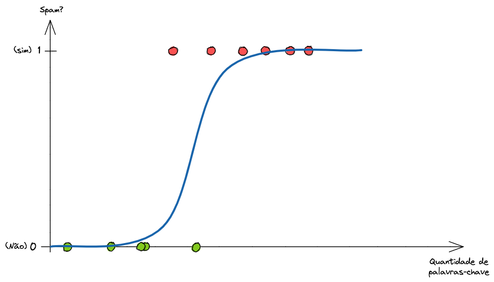
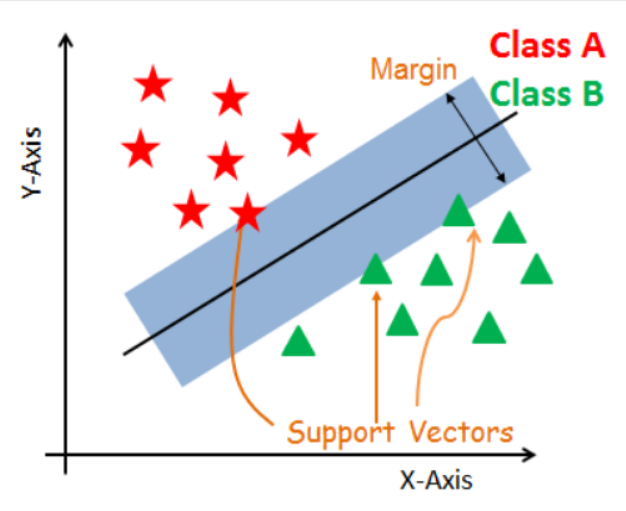
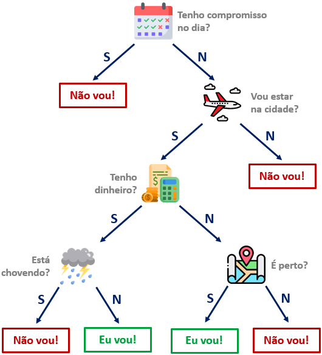

# CLASSIFICAÇÃO

Classificação é uma divisão do aprendizado supervisionado onde buscamos prever variáveis categóricas. Queremos descobrir qual a categoria, rótulo ou classe de um dado. Exemplos: gato, cachorro ou cavalo, sim ou não, aprovado ou reprovado, ótimo, bom, neutro, ruim ou péssimo...

Se a regressão tenta traçar uma reta que passe o mais perto possível dos pontos, a classificação tenta traçar uma **fronteira** (um muro) que separe os pontos de grupos diferentes da melhor forma possível.

## O Problema

### O Mundo Não é Contínuo

Muitas perguntas de negócio não têm respostas numéricas contínuas. Você não quer prever se um e-mail é "4.5 spam", você quer prever se ele é spam (1) ou NÃO é spam (0). Igualmente com uma foto, você não quer saber se o ser na foto é 35% gato, quer saber qual bicho é (gato, cachorro, rato, cavalo...).

Tentar usar algoritmos de regressão para problemas de classificação gera aberrações matemáticas: a reta pode prever valores menores que 0 ou maiores que 100%, o que não faz sentido nenhum ao falarmos de categorias. O que inviabiliza as técnicas tradicionais aqui é a **natureza discreta do resultado**.

**Objetivo**: Encontrar uma forma matemática de transformar dados numéricos em uma probabilidade ou em uma decisão entre um grupo de opções (Sim/Não, Gato/Cachorro/Pássaro).

## A Solução

### As Fronteiras de Decisão

Os algoritmos de classificação resolvem isso mapeando os dados e aprendendo regras ou probabilidades que dividem o espaço. 

**Exemplos Práticos**:
- **Bancos**: Transação é `Fraude` ou `Legítima`?
- **Saúde**: O tumor é `Maligno` ou `Benigno`?

## Componentes Principais

Cada algoritmo tem dois componentes principais:

1. **Função de Custo**: Como ele calcula o tamanho do erro que cometeu.
2. **Otimização**: Como ele ajusta seus engrenagens para diminuir esse erro.

## Principais Algoritmos

### Regressão Logística

É o modelo de classificação mais clássico. Carrega o nome regressão porque internamente ele faz uma regressão linear e depois faz uma transformação matemática (via função sigmoide) para "espremer" a reta dentro de uma escala entre 0 e 1, interpretada como probabilidade.

- **Quando usar**: Quando seu problema for binário ou onde você precisa explicar o motivo da decisão para humanos (via Razão de Chances).

- **Função de Custo**: Máxima log-verossimilhança. Ela pune severamente o modelo se ele prever 99% de certeza de algo que estava errado.

- **Otimização**: Gradiente Descendente, L-BFGS ou Newton-CG.

### Máquinas de Vetores de Suporte (SVM)

O SVM tenta encontrar a "rua mais larga possível" que separe as classes. Ele não se importa muito com os pontos que estão no fundo da classe, ele olha apenas para os pontos que estão mais perto da fronteira (os vetores de suporte). Ele também usa o "Kernel Trick" para fazer mais linhas separatórias e separar dados que não poderiam ser separados por uma linha reta.

É especialmente usado quando temos muitas variáveis X que afetam nosso Y (muitas colunas ou dimensões). Não é tão visual pois cada variável é uma dimensão, portanto trabalha em cenários com dezenas de dimensões, deixando impossível plotar gráficos.

- **Quando usar**: Bases de dados com muitas colunas (várias variáveis) e margens de separação bem claras, mas que não sejam gigantescas em número de linhas.

- **Função de Custo**: Hinge Loss. Ela pune pontos que caem no lado errado da margem.
  
$$J(w) = \frac{1}{2}||w||^2 + C \sum_{i=1}^{m} \max(0, 1 - y_i(w^T x_i + b))$$

- **Otimização**: Otimização Sequencial Mínima (SMO) ou Programação Quadrática.

### Árvores de Decisão

Ao invés de equações e retas, a árvore cria um fluxograma de regras lógicas estilo "SE isso, ENTÃO aquilo". Ex: "SE idade > 30 E renda < 5000, ENTÃO não aprovar crédito".

- **Quando usar**: Quando você precisa de uma regra clara e interpretável visualmente. Porém, árvores sozinhas sofrem muito overfitting.

- **Função de Custo**: Critérios de Impureza, como a Impureza de Gini ou Entropia (Information Gain). O algoritmo testa onde "cortar" os dados para que os grupos resultantes sejam o mais "puros" possível (só classe 1 de um lado, só classe 0 do outro).

$$Gini = 1 - \sum_{i=1}^{C} p_i^2$$

- **Otimização**: Busca Gulosa (CART). Ele olha todas as variáveis e escolhe a que diminui a impureza imediatamente naquele nó. Não usa derivadas.

### Florestas Aleatórias (Random Forest)

É a evolução das árvores de decisão, usando várias delas internamente. Ao invés de treinar 1 árvore de decisão, treinamos 500 árvores levemente diferentes usando pedaços aleatórios dos dados. A predição final é feita por votação (a classe que receber mais votos vence). Ele é muito versátil e serve para muitos cenários.

Ela também tem a vantagem de trabalhar bem com dados faltantes, não precisar fazer transformações nos dados e ser naturalmente resistente a overfitting.

- **Quando usar**: Tabelas ou muitos dados faltantes.

- **Função de Custo**: A mesma das Árvores de Decisão (Gini ou Entropia), aplicada a cada árvore individual.

- **Otimização**: Agregação de Bootstrap. A otimização não é feita num loop global reduzindo um erro único, mas sim treinando centenas de modelos ótimos localmente e tirando a média/votação.

### Redes Neurais

Simulam camadas de neurônios. Cada camada extrai representações mais complexas dos dados, permitindo achar fronteiras de decisão tortas, circulares e em múltiplas dimensões.

- **Quando usar**: Dados ultra complexos (imagens, textos, áudio) ou tabelas onde a relação entre as variáveis seja extremamente não-linear e oculta. Requer muitos dados.
- **Função de Custo**: Entropia Cruzada (seja Binária para duas classes ou Categórica para múltiplas classes).
- **Otimização**: Backpropagation acoplado a um algoritmo de descida (Gradiente Descendente Estocástico ou Adam).

## RESUMO E DIFERENÇAS

| Algoritmo | Foco Principal | Interpretabilidade | Otimizador | Função de Custo |
| :--- | :--- | :--- | :--- | :--- |
| **Regressão Logística** | Probabilidades puras via sigmoide | Altíssima (Dita o impacto exato de cada variável) | Gradiente Descendente | Máxima Verossimilhança / Entropia Cruzada |
| **SVM** | Margem de separação máxima (rua mais larga) | Baixa (Vira uma "caixa preta" se usar Kernels) | Programação Quadrática | Hinge Loss |
| **Árvore de Decisão** | Regras lógicas (If/Else) | Extrema (É um fluxograma legível) | Busca Gulosa (CART) | Impureza Gini / Entropia |
| **Random Forest** | Votação de centenas de árvores | Média (Sabemos as colunas importantes, mas perdemos a regra visual) | Bagging (Votação) | Impureza Gini / Entropia |
| **Redes Neurais** | Padrões altamente não-lineares | Nula (Caixa Preta total) | Backpropagation + Adam/SGD | Entropia Cruzada |
