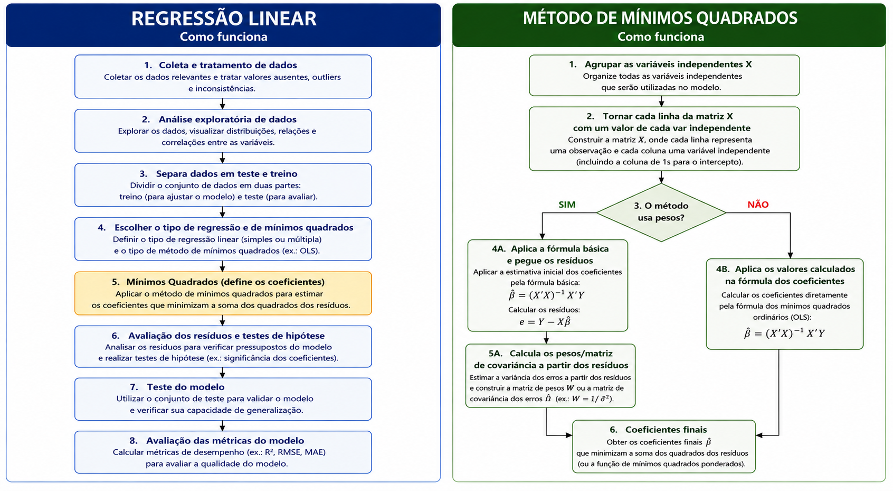

# REGRESSÃO LINEAR

Regressão é o método de IA aonde encontramos a melhor equação linear que descreva nossos dados. Com isso ela traça uma reta (para 1 única variável) ou plano (para 2 ou mais variáveis) que passa por entre os dados. Essa equação definida será aquela com o menor erro médio (ou seja, a que mais se aproxima dos dados reais).

Como os dados não vão tá todos perfeitamente enfileirados na vida real, a linha nunca conseguirá passar em cima de todos os dados. O objetivo não é passar em cima do máximo de dados (isso seria overfitting), mas sim que a soma dos erros seja a menor possível.

## Estrutura

A estrutura de todo modelo de machine learning é composto por **preparar (e transformar) os dados**, separar dados de **treino e teste**, **escolher os parâmetros** do modelo, escolher uma **função de otimização** e uma **função de perda**. Adicionalmente pode ser usar regularização caso prefira.

A regressão linear é indissociável do método dos mínimos quadrados, porém é importante deixar claro o que exatamente é cada um. A regressão é o modelo completo, com todas as etapas listadas acima. Os mínimos quadrados é o modelo de otimização usado na regressão, podendo inclusive até ser trocado por outro (como gradiente descendente).

- **Regressão Linear**: É a equação ou o objetivo final. Ela descreve como uma variável Y muda se outra variável X for alterada.
- **Mínimos Quadrados**: É a forma de encontrar a reta da regressão. Ele define os coeficientes que formam a reta e compõem a equação da regressão.

Como os `mínimos quadrados é a função de otimização` da regressão, ele é a parte principal do modelo, sendo seu coração.

## Função de Otimização (Mínimos Quadrados)

É o método usado pela regressão para encontrar os coeficientes/parâmetros do modelo. Tem uma série de variações para diferentes casos. Como eles já foram explicados anteriormente não me estenderei aqui. Uma outra opção aos mínimos quadrados é o gradiente descendente.

> O mínimos quadrados é responsável por toda a parte complicada do modelo.

## Função de Perda

A função de perda é usada internamente pela função de otimização. Ela diz o quanto a otimização tá longe de seu objetivo. A função de perda dos mínimos quadrados é o **Erro Quadrático Médio (MSE)**, também chamado de **média da soma do quadrado dos erros**.

Como ele já está incluso na equação dos mínimos quadrados ele acaba não sendo tão visível por tá tudo embutido em uma única equação. Quando se faz a prova da fórmula dos mínimos quadrados você encontra a função de custo no processo e sua derivada está lá presente formando a equação. A derivada do erro quadrático é facilmente encontrada na prova via derivada. Consulte a pasta de mínimos quadrados na sessão "algoritmos-base".

O erro quadrático médio é: $\frac{\sum (y_i - ŷ)^2}{N}$

E sua derivada é: $\frac{2 \sum (y_i - ŷ)}{N}$

Nós vemos ess somatória na fórmula final dos mínimos, porém o 2 e o N se cancelam com outros fatores que compõem o resto da equação.

A função de perda do gradiente descendente é a máxima log-verossimilhança.

## Métricas de Qualidade

Além dos métodos tradicionais de medir o sucesso de um modelo de IA (AIC/BIC, R² e R² ajustado), para a regressão linear temos alguns a mais.

- **MAE, RMSE, MAPE e MSE**: São métricas que medem o tamanho dos erros das nossas previsões. Calcule eles a partir dos **dados de TESTE**. Nunca use essas métricas nos dados de treino, pois não faz sentido.
- **Desvio padrão dos erros**: Mede o quão longe nossos erros costumam estar da realidade. Como os erros seguem uma curva normal, sabemos que 66% dos erros estatão a 1 desvio padrão dos erros de distância.

## Detectando multicolineariedade

Além dos testes de hipótese, uma outra forma de encontrar autocorrelação e multicolineariedade nos dados é usando 2 técnicas: **Matriz de correlação** e o **VIF**.

Eles não são métricas de qualidade, mas sim técnicas para serem usadas na avaliação do treino (ou seja, verificamos antes de fazer os testes). Eles não são usados nos dados de teste nem em seus retornos.

Ele testa se as variáveis usadas no treino são correlacionadas e assim podemos decidir se removemos alguma delas ou usamos regularização para diminuir essa influência cruzada.