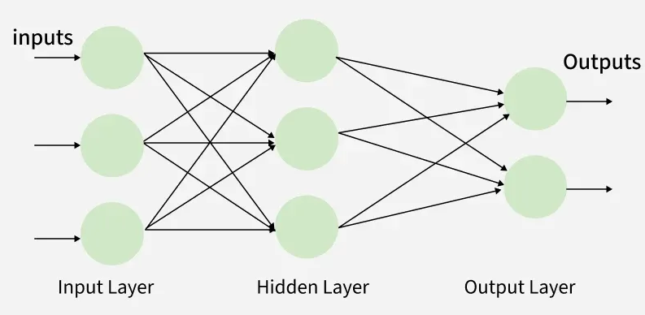
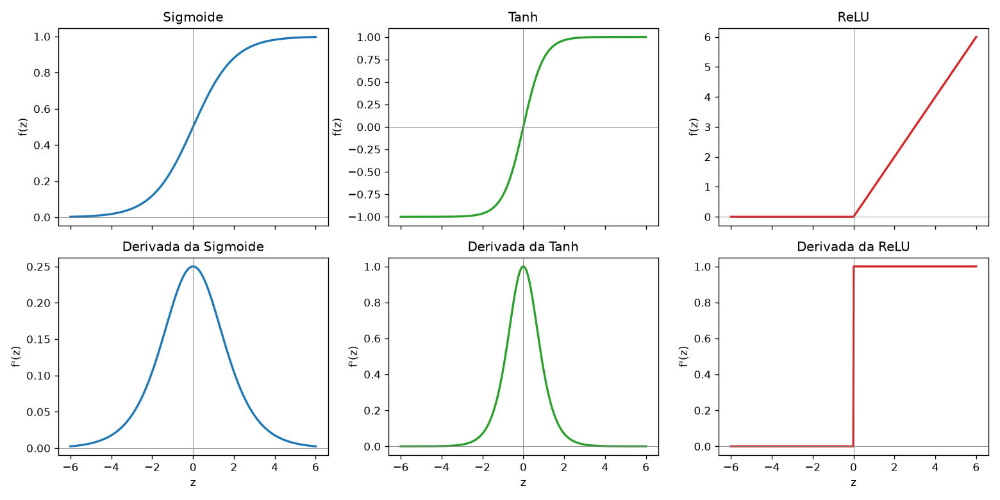
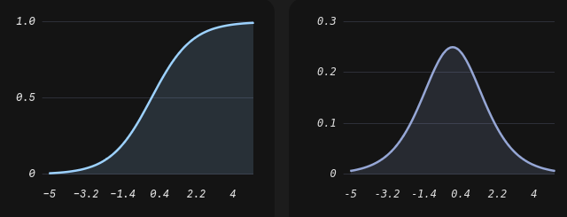

# PERCEPTRON MULTICAMADAS (MLP) E BACKPROPAGATION

O **Perceptron Multicamadas** (MLP, de *Multi-Layer Perceptron*) é uma rede neural artificial formada por camadas de neurônios enfileiradas: uma camada de entrada, uma ou mais **camadas ocultas** e uma camada de saída. 

Ele é a evolução direta do perceptron simples, colocando vários deles em enfileirados para resolver problemas que ele não conseguia. Essa evolução do perceptron simples retirou um modelo que havia caído em descrédito e o colocou como o modelo de ponta da área inteira. Um único neurônio só desenha uma reta e, por isso, não resolve problemas complexos. 

Cada neurônio do MLP continua sendo um perceptron (soma ponderada + bias + ativação), mas com duas mudanças. A primeira é enfileirar neurônios em camadas, de modo que a camada oculta transforma o espaço dos dados e a camada de saída separa o resultado dessa transformação. A segunda é trocar a função degrau por uma ativação suave e diferenciável (a sigmoide), o que permite treinar a rede inteira com **backpropagation** (retropropagação do erro) e gradiente descendente.

Ele é um modelo de **aprendizado supervisionado** que serve tanto para **classificação quanto para regressão**. Neste tópico usamos **uma** camada oculta e classificação binária.

> Ele **já é considerado uma rede neural**, sendo a versão padrão de uma rede neural. O Perceptron é só 1 neurônio sozinho, mas com várias camadas temos uma rede e temos capacidade de fazer tarefas complexas, podendo finalmente entrar na definição de rede neural.

## Nomenclarura

Além de Perceptron Multicamada, também podem ser chamadas de MLP, redes feedfoward, redes densas ou redes vanila. São amplamente usadas em deep learning, sendo o modelo padrão de rede neural (Sem nenhuma adaptação para cenários específicos).

O nome feedfoward se deve ao fato da informação fluir apenas para um lado, indo apenas para frente (ela não faz ciclos nem loops). Um dado usado não volta para re-treino nem resultados de rodadas anteriores voltam para alterar os pesos num loop futuro.

## Pontos de Mudança

1. **Adição de camadas ocultas**: permite encontrar características escondidas nos dados. Cada camada destrincha um pedaço do dado (ex: em reconhecimento facial uma camada encontra contornos, a outra faz um filtro passa-baixa...).

   - Porém só adicionar mais camadas sem alterar mais nada não dá grande poder para o perceptron. Ele continua se comportando como apenas 1 grande neurônio incapaz de resolver problemas reais.

2. **Backpropagation**: adicionar o backpropagation como método de atualizar os pesos é o grande divisor de águas e que transformou a inteligência artificial. Graças a ele existe redes neurais.

   - Ele usa gradiente descendente (derivadas) para atualizar os pesos de acordo com os erros. Isso exige uma mudança a mais na estrutura do perceptron.

3. **Alterar função de ativação**: a função degrau (padrão do perceptron) tem derivada 0, impedindo o backpropagation de funcionar. Além disso ela não tem derivada no ponto z=0, impedindo ainda mais o uso do backpropagation. Trocá-la por outra função que seja derivável permite o uso do backpropagation e levar a rede para outro nível de inteligência.

4. **Pesos iniciais aleatórios**: no perceptron normal o valor inicial não afetava tanto, por isso por padrão começava em 0. No MLP os pesos precisam ser diferentes uns dos outros e preferencialmente pequenos para que a rede não se comporte como um único neurônio.

## Arquitetura

### Número de Neurônios por Camada

Enquanto o Perceptron simples só possui 2 camadas (de entrada e de saíd), o MLP já possui no mínimo 3 camadas (1 ou mais camadas ocultas). O **número de neurônios na camada de entrada é igual ao número de features** (atributos ou colunas). 

O número de neurônios na camada de saída depende da função de ativação e se ele é para regressão ou classificação. **Para classificação o normal é ter 1 neurônio nasa saída para cada categoria** (só 1 deles será valor 1 e todos os demais será 0). A exceção é se for classificação binária com sigmoide, que aí pode ser só 1 saída mesmo.

**Para regressão o número de neurônios é 1 para cada número que deseja prever** (se você que descobrir a temperatura e a umidade, são 2 saídas). Importante entender que não é um neurônio para cada peso a ser descoberto, mas sim **um neurônio para cada Y que quer prever**.

### Ligação Entre Neurônios

Outra característica crucial da arquitetura desse tipo de rede neural é que **todos os neurônios da camada anterior se conectam com todos da camada seguinte**. Outros tipos de rede neural podem não ter essa ligação densa, portanto esse é mais um ponto de diferenciação entre os modelos.



### Função de Ativação

Todos os neurônios tem a mesma função de ativação (exceto as de saída). A função padrão é a ReLU, mas existem outras que podem substituí-la (a escolha da função de ativação é discutido mais afrente). As funções mais comuns são:

- Sigmoide (mais didática e usada na camada de saída)
- Tangente Hiperbólica (tanh)
- ReLu (mais potente)
- Softmax (para camada de saída)
- Função Linear (para regressão na camada de saída)

Cada uma tem uma finalidade diferente e a grosso modo cada uma é usada nos seguintes casos:

- Camada oculta:
   - Poucas camadas: Sigmoide ou tanh
   - Muitas camadas: ReLu
- Camada de saída:
   - Para regressão: Função Linear
   - Para classificação:
      - Binária: Sigmoide
      - 3 ou mais categorias: Softmax

### Característica Especial da Camada de Entrada

Os **neurônios da camada de entrada não possuem função de ativação nem pesos!** isso acontece pois a **camada de entrada não processa dados**, apenas os recebe e passa adiante para a primeira camada oculta. Tecnicamente a primeira camada não existe, mas é mantido com esse nome para facilitar ilustração e explicação.

### Função de Perda

A função de perda altera de acordo com a finalidade da rede neural. 

- Para regressão:
   - Com poucos outliers: MSE
   - Com médios outliers: Huber
   - Com muitos outliers: MAE
- Para classificação:
   - Binária: Entropia cruzada
   - 3 ou mais categorias: Entropia cruzada categórica

## Atributos

Neste tópico a rede tem 3 camadas, com n entradas, h neurônios ocultos e 1 neurônio de saída (arquitetura "n-h-1"). O XOR usa a rede 2-2-1.

```text
 entrada            camada oculta           saída
 (X)                (h neurônios)           (1 neurônio)

 x1 ───────┬──────►  (a1_1) ────┐
           │  ╲   ╱             │
           │   ╲ ╱              ├──────►  (ŷ)
           │   ╱ ╲              │
 x2 ───────┴──────►  (a1_2) ────┘

        W[1], b[1]  σ         W[2], b[2]  σ
```

Os dados chegam em uma matriz X com uma amostra por linha (formato MxN, com M amostras). Os parâmetros de cada camada são uma matriz de pesos W e um vetor de bias b. O índice entre colchetes indica a camada. 

| Símbolo | Significado | Formato |
|---|---|---|
| X | entradas | MxN |
| W[1], b[1] | pesos e bias da camada oculta | NxH e 1xH |
| Z[1] | soma ponderada da camada oculta | MxH |
| A[1] | ativação da camada oculta | MxH |
| W[2], b[2] | pesos e bias da camada de saída | Hx1 e 1x1 |
| Z[2] | soma ponderada da saída | Mx1 |
| ŷ | previsão da rede (probabilidade da classe 1) | Mx1 |

Cada coluna de W[1] é o vetor de pesos de um neurônio oculto, exatamente o w do perceptron simples. W é uma tabela pois cada linha guarda os pesos para cada entrada (coluna). Assim, **a linha 3 coluna 2 de W nos dá o peso para a entrada 3 no neurônio 2**. Da mesma forma o bias tem formato 1xH pois cada neurônio tem um bias diferente (e é só 1 por neurônio).

A matriz Z e A tem esse tamanho pois cada coluna representa a saída de uma camada e cada linha é a saída para um dado de treino (linha do dataset original). Ou seja, a linha 3 coluna 2 de Z nos dá o resultado para o 3º dado de treino na 2ª camada oculta.

> Os rótulos aqui são **0 e 1**, não -1 e +1 como no perceptron simples. A sigmoide devolve valores entre 0 e 1 e a entropia cruzada trabalha com probabilidades, então $y \in \{0, 1\}$ é o formato natural.

## Porquê das Mudanças

### Por que enfileirar camadas lineares não basta

Se não houver função de ativação (ou se tiver mas ela for linear) entre as camadas, a rede inteira vira uma única transformação linear:

$$(X W^{[1]} + b^{[1]}) W^{[2]} + b^{[2]} = X \underbrace{(W^{[1]} W^{[2]})}_{W'} + \underbrace{(b^{[1]} W^{[2]} + b^{[2]})}_{b'}$$

O resultado é $XW' + b'$, ou seja, um único neurônio linear. Não importa quantas camadas sejam enfileiradas, a fronteira de decisão continua sendo uma reta e o comportamento continua sendo igual ao de um único neurônio. **A não linearidade entre as camadas é o que dá poder à rede**.

### Por que trocar o degrau pela sigmoide

A função degrau do perceptron simples tem **derivada zero** (exceto em z = 0, onde é indefinida). O backpropagation precisa propagar o erro da saída para as camadas anteriores multiplicando derivadas. Se uma delas vale zero, o produto vale zero e nenhum gradiente chega à camada oculta: os pesos dela nunca mudam.

A **sigmoide** resolve isso porque é suave e tem derivada em todo ponto:

$$\sigma(z) = \frac{1}{1 + e^{-z}} \qquad\qquad \sigma'(z) = \sigma(z)\,(1 - \sigma(z))$$

Ela devolve um valor em $(0, 1)$, que pode ser lido como probabilidade da classe 1, e carrega a informação de "quão perto do limiar" o neurônio está, algo que o degrau descarta.

## Função de Perda e Função de Otimização

A função de perda padrão é a **entropia cruzada (máxima verossimilhança)**. Porém **podemos trocar a função de perda** por alguma outra que faça mais sentido para o contexto. Mais afrente será listado todas as funções de custo e quando usar cada uma.

Já a **função de otimização é o gradiente descendente**, porém aqui ele é ligeiramente diferente do gradiente usado na regressão logística. O gradiente normal usa a derivada da função de custo para calcular a mudança dos pesos, porém nas redes neurais trocamos a derivada da função de custo pelo backpropagation.

O backpropagation usa internamente a derivada da função de custo, porém a incrementa com mais coisas, permitindo calcular a mudança dos pesos para cada camada. O backpropagation usa a regra da cadeia ao invés de derivadas parciais, mas no fim é tudo derivada de 1ª ordem, então o fluxo não é tão diferente. Inclusive o gradiente descendente em si continua igual, podendo até mesmo usar o estocástico, adicionar regularização e otimizadores como Adam.

## Backpropagation

O backpropagation é um algoritmo que calcula as derivadas parciais (gradiente) da função de custo em relação a cada peso. Ela substitui a derivada da função de custo, trocando a derivada simples pela regra da cadeia. A matemática será melhor explicada mais a frente, mas sua importância e como se encaixa já será explicada aqui.

O objetivo do backpropagation é responder à pergunta: `Se eu alterar ligeiramente este peso, quanto o erro global da rede muda?`. Ele responde isso calculando o erro total da rede via regra da cadeia. Isso permite saber o quanto cada peso de cada camada influenciou no erro total. Isso ocorre pois a regra da cadeia destrincha a função de custo em relação a cada um dos pesos e deriva em relação a cada um deles.

Porém é importante entender que **o backpropagation não atualiza peso nenhum!** Quem atualiza peso é o gradiente descendente (que usa o backpropagation internamente). O **backpropagation é um método de cálculo de derivadas**. Também é importante entender que o backpropagation **não é um algoritmo de otimização**. Ele é usado pelo algoritmo de otimização, mas não o é por si mesmo. Ele fica no meio termo entre otimização e função de custo, pois ele usa a função de custo e a melhora ao mesmo tempo que é usado pela função de otimização.

Portanto, se precisar defini-la, defina o backpropagation como um método de cálculo de derivadas.

## Matemática do Backpropagation

### Forward pass e função de perda

O **forward pass** (passo para frente) é o cálculo da previsão, da entrada até a saída:

$$Z^{[1]} = X W^{[1]} + b^{[1]} \qquad A^{[1]} = \sigma(Z^{[1]})$$
$$Z^{[2]} = A^{[1]} W^{[2]} + b^{[2]} \qquad \hat{y} = \sigma(Z^{[2]})$$

Para medir o erro usamos a **entropia cruzada binária** média (a função de perda da regressão logística) sobre as M amostras:

$$L = -\frac{1}{m} \sum_{i=1}^{m} \Big[ y_i \ln \hat{y}_i + (1 - y_i) \ln (1 - \hat{y}_i) \Big]$$

Ela pune pesadamente a rede quando está confiante e errada (ex: $\hat{y} \approx 0$ quando $y = 1$). Outras funções de perda e quando escolhê-las são discutidas mais afrente.

### Regra da cadeia

O backpropagation é a **regra da cadeia** aplicada camada por camada. Ela é levemente diferente do gradiente descendente, pois o gradiente descendente só usa derivada normal (deriva em relação a só uma coisa) enquanto a regra da cadeia deriva em relação a todos os pesos para saber o quanto cada um afetou no erro.

Se Y depende de U e U depende de X, ou seja, $y = f(u)$ e $u = g(x)$, então a derivada de Y em relação a X é o produto das derivadas de cada elo da corrente:

$$\frac{dy}{dx} = \frac{dy}{du} * \frac{du}{dx}$$

Exemplo: $y = (3x + 1)^2$. Chamando $u = 3x + 1$, temos $y = u^2$. Então $\frac{dy}{du} = 2u$ e $\frac{du}{dx} = 3$, logo $\frac{dy}{dx} = 2u * 3 = 6(3x + 1)$.

Com várias variáveis o raciocínio é o mesmo, com derivadas parciais. Se L depende de $\hat{y}$, que depende de z[2], que depende de um peso w, então:

$$\frac{\partial L}{\partial w} = \frac{\partial L}{\partial \hat{y}} * \frac{\partial \hat{y}}{\partial z[2]} * \frac{\partial z[2]}{\partial w}$$

Em uma rede neural, o peso de uma camada afeta a perda por uma corrente de várias etapas (peso → soma → ativação → próxima camada → ... → perda). Basta multiplicar a derivada de cada etapa, da última para a primeira. 

Ele calcula o erro referente a última camada e corrige os pesos. Vai para a penúltima camada e calcula o erro restante (descontando o da camada que já passou) e corrige os pesos. Ele continua assim levando apenas o erro restante para as camadas iniciais. O nome back propagation vem daí, dele ir corrigindo os pesos (calculando a derivada da perda que ) de trás para frente.

### Backpropagation: derivação dos gradientes

Para facilitar, derivamos primeiro para **uma amostra** (o termo da perda é $l = -[y \ln \hat{y} + (1-y)\ln(1-\hat{y})]$). A média sobre as M amostras entra no final.

**Camada de saída.** O que queremos é $\partial l / \partial z[2]$, o "erro" do neurônio de saída, que chamamos de $\delta[2]$. Pela regra da cadeia:

$$\delta[2] = \frac{\partial l}{\partial z[2]} = \frac{\partial l}{\partial \hat{y}} \cdot \frac{\partial \hat{y}}{\partial z[2]}$$

As duas derivadas são:

$$\frac{\partial l}{\partial \hat{y}} = -\frac{y}{\hat{y}} + \frac{1-y}{1-\hat{y}} = \frac{\hat{y} - y}{\hat{y}(1-\hat{y})} \qquad\qquad \frac{\partial \hat{y}}{\partial z[2]} = \sigma'(z[2]) = \hat{y}(1-\hat{y})$$

O termo $\hat{y}(1-\hat{y})$ aparece no denominador de uma e no numerador da outra e **se cancela**:

$$\boxed{\delta[2] = \hat{y} - y}$$

Esse é o motivo de a entropia cruzada ser casada com a sigmoide: **o erro da saída é simplesmente "previsão menos resposta certa"**. Como $z[2] = A[1] W[2] + b[2]$, o gradiente dos parâmetros da saída sai direto (agora na versão com as M amostras, pela média):

$$\frac{\partial L}{\partial W[2]} = \frac{1}{m} A[1]^{T} \delta[2]$$

$$\frac{\partial L}{\partial b[2]} = \frac{1}{m} \sum_{i} \delta[2]_i$$

**Camada oculta.** Agora precisamos do erro de cada neurônio oculto, $\delta[1] = \partial l / \partial z[1]$. O caminho do erro passa pela saída: $z[1] \to a[1] \to z[2] \to \hat{y} \to l$. A corrente é:

$$\delta[1]_j = \underbrace{\frac{\partial l}{\partial z[2]}}_{\delta[2]} \cdot \underbrace{\frac{\partial z[2]}{\partial a[1]_j}}_{W[2]_j} \cdot \underbrace{\frac{\partial a[1]_j}{\partial z[1]_j}}_{\sigma'(z[1]_j)}$$

Ou seja, o erro da saída é **devolvido** para cada neurônio oculto, ponderado pelo peso que os liga ($W[2]_j$), e depois multiplicado pela derivada da ativação do próprio neurônio. Em forma matricial (com $\odot$ sendo a multiplicação elemento a elemento):

$$\boxed{\delta[1] = \left(\delta[2] W^{[2]T}\right) \odot \sigma'(Z[1]) = \left(\delta[2] W^{[2]T}\right) \odot A[1] \odot (1 - A[1])}$$

Como $z[1] = X W[1] + b[1]$, os gradientes da camada oculta são:

$$\frac{\partial L}{\partial W[1]} = \frac{1}{m} X^T \delta[1]$$

$$\frac{\partial L}{\partial b[1]} = \frac{1}{m} \sum_{i} \delta[1]_i$$

> Compare com o perceptron simples: lá o "erro" era binário (acertou ou errou) e a regra de atualização só disparava ao errar. Aqui o erro $\hat{y} - y$ é contínuo, então **todo ponto contribui um pouco para cada atualização, proporcionalmente ao quanto errou**.

Se não houvesse a sigmoide no meio (degrau), $\sigma'$ seria 0 e $\delta^{[1]}$ seria sempre 0, que é exatamente o problema descrito antes.

### Atualização dos pesos

O backpropagation **só calcula os gradientes**. Quem atualiza os pesos é o gradiente descendente, dando um passo contra o gradiente, com taxa de aprendizado $\alpha$:

$$W^{[l]} = W^{[l]} - \alpha \frac{\partial L}{\partial W^{[l]}}$$

$$b^{[l]} = b^{[l]} - \alpha \frac{\partial L}{\partial b^{[l]}}$$

Pode-se usar o dataset inteiro a cada passo (batch) ou fatias dele (mini-batches, como no gradiente descendente estocástico). Otimizadores mais sofisticados (momentum, Adam) também só mudam esta etapa, e o cálculo dos gradientes continua o mesmo.

## Inicialização aleatória e simetria

No perceptron simples começar com pesos zero funcionava. Em um MLP, **não funciona**. Se todos os pesos da camada oculta começam iguais (zero ou qualquer outro valor repetido), todos os neurônios ocultos calculam exatamente a mesma saída, recebem exatamente o mesmo gradiente e são atualizados igualmente. Eles continuam idênticos para sempre, e uma camada com h neurônios vira, na prática, uma camada com 1 neurônio. Isso é a **quebra de simetria** que a inicialização aleatória resolve.

Por isso os pesos começam com valores pequenos e aleatórios. Valores pequenos evitam que a sigmoide comece saturada (nas pontas, onde a derivada é quase 0 e o aprendizado é lento). Os bias podem começar em zero, pois a simetria já é quebrada pelos pesos.

## Funções de ativação

Podemos usar diferentes funções de ativação para os neurônios. As mais comuns são a sigmoide, tangente hiperbólica e ReLu. Em todas, o que importa para o backpropagation é a derivada: ela entra multiplicada em $\delta[1]$. Quando a derivada é próxima de zero, o erro quase não passa por aquele neurônio e o aprendizado emperra. Esse efeito se chama **saturação**.

A saturação nada mais é que a derivada ser 0 ou muito próxima. Como já comentado, quando a derivada é próxima de zero o backpropagation quebra daquela camada em diante, pois ele faz o produtório das derivadas (regra da cadeia). Se a derivada se aproximar de zero **não conseguiremos atualizar os pesos das camadas iniciais paralisando o aprendizado**. Isso é chamado de Problema do Gradiente Desaparecidente (Vanishing Gradient).

A solução para evitar esse problema é:

- Usar função de ativação onde a derivada só se aproxime de 0 nas pontas (e quanto mais demorar melhor).
- Iniciar com pesos adequadas (valores pequenos como falado anteriormente).
   - Inicialização de Xavier/Glorot ou He.
- Normalização dos dados.



### Sigmoide

$$\sigma(z) = \frac{1}{1 + e^{-z}} \qquad\qquad \sigma'(z) = \sigma(z)\,(1 - \sigma(z))$$

- **Saída:** entre 0 e 1. 
- **Derivada:** máximo de 0,25, em z = 0.
- **Prós:** 
   - Interpretável como probabilidade.
   - Suave.
   - Derivada barata de calcular a partir da própria saída.
- **Contras:** 
   - Satura nas pontas (derivada quase zero para |z| grande). 
   - Não é centrada em zero (saída sempre positiva, média 0,5), o que **deixa o treino mais zigue-zague**. 
   - A exponencial é mais cara de calcular que um `max`.
- **Gradiente que desaparece:** como a derivada vale no máximo 0,25, multiplicá-la camada após camada em redes profundas faz o gradiente encolher exponencialmente e as primeiras camadas quase não aprendem. Esse problema é a principal motivação para ela perder espaço para o ReLU.
- **Quando usar:** 
   - Na **camada de saída** de classificação binária (para obter probabilidade).
   - Em redes pequenas e rasas. 
   
**Não a use nas camadas ocultas de redes profundas!!**

### Tanh (tangente hiperbólica)

É extremamente parecida com a sigmoide, com a diferença de que vai de -1 a 1 ao invés de 0 a 1. Seu formato e o da derivada são iguais ao da sigmoide, o que a faz ter a mesma utilidade da sigmoide, podendo ser usado onde ela é aplicada. Porém como seus valores mudam (máximo da derivada e variar entre -1 e 1) isso a torna mais eficiente.

$$\tanh(z) = \frac{e^{z} - e^{-z}}{e^{z} + e^{-z}} \qquad\qquad \tanh'(z) = 1 - \tanh^2(z)$$

- **Saída:** entre -1 e 1.
- **Derivada:** Máximo de 1, em z = 0. É uma sigmoide reescalada: $\tanh(z) = 2\sigma(2z) - 1$.
- **Prós:** 
   - **centrada em zero**, então as saídas das camadas ocultas têm média perto de 0 e o treino costuma ser mais estável que com a sigmoide. 
   - Gradiente maior (máximo 1 contra 0,25). Isso a torna mais difícil de saturar.
- **Contras:** 
   - Também satura nas pontas e sofre do gradiente que desaparece, apesar de menos que a sigmoide.
   - Não serve como saída de probabilidade (pelo intervalo ser de -1 a 1).
- **Quando usar:** 
   - Camadas ocultas de redes pequenas ou médias
   - Redes recorrentes. 

### ReLU (Unidade Linear Retificada)

É uma função extremamente simples: se X é negativo Y = 0. Se X é positivo Y = X. Isso significa que para todo valor negativo ele é zero (igual, para de cair, formando um fundo) e que seu crescimento é constante, linear e com coeficiente angular = 1. Na sua parte positiva ele é a reta Y = X (a = 1 e b = 0).

$$\text{ReLU}(z) = \max(0, z) \qquad\qquad \text{ReLU}'(z) = \begin{cases} 1, & z > 0 \\ 0, & z < 0 \end{cases}$$

Em z = 0 a derivada não existe, e por convenção adota-se 0 (ou 1).

- **Saída:** de 0 até infinito. 
- **Derivada:** 1 quando o neurônio está ativo e 0 quando está inativo.
- **Prós:** 
   - Muito barata de calcular (só uma comparação).
   - **Não satura** no lado positivo, então o gradiente passa intacto e redes profundas treinam bem. 
   - Produz ativações **esparsas** (muitos neurônios com saída zero).
- **Contras:** 
   - **Neurônio morto**: se um neurônio cair na região z < 0 para todos os dados, a derivada vira 0 e ele nunca mais se atualiza 
      - não consegue usar aquela coluna para treinar, mas não por não influenciar, mas por incompetência da rede.
   - Não é centrada em zero e é ilimitada. 
   - Variantes (Leaky ReLU, entre outras) tentam corrigir o neurônio morto.
- **Quando usar:** 
   - É o **padrão atual para camadas ocultas** de redes profundas. 
   - Não usar na saída de classificação binária (não gera probabilidade).

### Softmax

$$\text{softmax}(z_i) = \frac{e^z_i}{\sum_j^k e^{z_j}}$$

É a equação para definir qual categoria um dado pertence quando tem mais de 2 opções. A sigmoide e a tanh tem um problema de só conseguir refletir 2 estado (0 ou 1 na sigmoide e -1 ou 1 na tanh). O softmax funciona para qualquer número K de categorias, além de retornar a probabilidade para cada uma das categorias. Isso significa que podemos ter como resposta a probabilidade de cada categoria (ex: 30% de ser gato, 10% de ser cachorro e 60% de ser pássaro). 

O numerador $e^z$ amplifica as diferenças entre os valores de entrada. O neurônio que recebeu a maior pontuação bruta ganha um peso desproporcionalmente maior, fazendo com que a Softmax "aponte" com muita confiança para a classe mais provável.

Ele exige a troca da função de custo para entropia cruzada categórica, uma variação da entropia cruzada normal para mais de 2 categorias.

A derivada possui resultados diferentes quando i=j e i $\ne$ j. Entenda i como a linha do dataset e j a categoria.

$$\underbrace{\frac{\delta S_i}{\delta z_i} = S_i(1 - S_i)}_{i = j} \qquad\qquad \underbrace{\frac{\delta S_i}{\delta z_i} = -S_iS_j}_{i \ne j}$$

- **Saída:** entre 0 e 1. 
- **Derivada:** entre -0,25 a +0,25.
- **Prós:** 
   - Interpretável como probabilidade.
   - Amplifica as diferenças entre as classes, facilitando a decisão do modelo pela classe mais provável.
   - Suave.
- **Contras:** 
   - Sensível a outliers
   - Não identifica múltiplos labels (quando um dado pode pertencer a várias categorias)
- **Quando usar:** 
   - Na **camada de saída** de classificação com 3 ou mais categorias.



### Função Linear

$$f(x) = x$$

Significa simplesmente responder o valor que recebeu. Nenhum cálculo precisa ser feito, afinal como se trata de uma regressão, o valor calculado já é a resposta. Como é uma função contínua que vai de -infinito a +infinito, ela serve para qualquer caso e por não transformar a resposta não limita a resposta a uma faixa.

Não se deve usar nas camadas ocultas pois significa não existir função de ativação na rede, o que mata qualquer aprendizado. **Não existe aprendizado em uma função de ativação!** Por isso seu único uso é na camada de saída de redes neurais de regressão.

---

> Como escolher: camadas ocultas de redes profundas, comece pela ReLU. Em redes rasas, a sigmoide ou a tanh funcionam bem. Para a **saída**, a escolha segue o problema: sigmoide para classificação binária, softmax para multiclasse, ativação linear (nenhuma) para regressão.

### Teorema da Aproximação Universal

Um resultado teórico importante: uma rede com **uma única camada oculta**, com neurônios suficientes e função de ativação não linear consegue o comportamento de qualquer função contínua definida em um conjunto limitado e fechado. O resultado foi demonstrado em 1989 para a sigmoide e generalizado em 1989 para uma classe maior de ativações.

> Cuidado com a interpretação: é um resultado de **existência**. Ele não diz quantos neurônios são necessários, não diz como encontrar os pesos (o treino pode ficar preso em um mínimo local) e não garante que o modelo generalize para dados novos. A prova não está neste tópico.

## Funções de perda

Usamos a entropia cruzada binária, mas existem outras funções de perda. Em todas a derivada (erro) é $r = \hat{y} - y$, portanto **podemos trocá-los pela entropia cruzada sem afetar em nada o cálculo do backpropagation**. E em todos M é o número de amostras. 

A escolha depende do tipo de problema (regressão ou classificação) e da presença de outliers (pontos muito fora do padrão).

### MSE (erro quadrático médio)

$$\text{MSE} = \frac{1}{m} \sum_{i=1}^{m} (\hat{y}_i - y_i)^2$$

- **Prós:** 
   - Suave e diferenciável em todo ponto.
   - Gradiente cresce com o erro, então erros grandes são corrigidos rápido.
- **Contras:** 
   - Muito sensível a outliers (o erro é elevado ao quadrado). 
   - Não funciona com classificação.
- **Quando usar:** 
   - **Regressão sem outliers**.

### MAE (erro absoluto médio)

$$\text{MAE} = \frac{1}{m} \sum_{i=1}^{m} |\hat{y}_i - y_i|$$

- **Prós:** 
   - **Robusta a outliers**, pois o erro cresce linearmente.
- **Contras:** 
   - Gradiente tem módulo constante, independente do tamanho do erro (o passo não diminui perto do mínimo, é preciso reduzir a taxa de aprendizado).
   - Não é diferenciável em $r = 0$.
- **Quando usar:** 
   - **Regressão com muitos outliers**.

### Huber

$$L_\delta(r) = \begin{cases} \frac{r^2}{2}, & |r| \leq \delta \\ \delta \left(|r| - \frac{\delta}{2}\right), & |r| > \delta \end{cases}$$

- **Prós:** 
   - Meio-termo entre as duas anteriores: quadrática (suave) para erros pequenos e linear (robusta) para erros grandes.
- **Contras:** 
   - Tem um hiperparâmetro $\delta$ para ajustar, dizendo a partir de onde é considerado erro grande.
- **Quando usar:** 
   - **Regressão com alguns outliers**, quando se quer a suavidade do MSE perto do mínimo.

### Entropia cruzada binária

$$L = -\frac{1}{m} \sum_{i=1}^{m} \Big[ y_i \ln \hat{y}_i + (1 - y_i) \ln (1 - \hat{y}_i) \Big]$$

- **Prós:** 
   - Feita para probabilidades
   - Pune com força a rede confiante e errada
- **Contras:** 
   - Só serve para 2 classes. 
   - Sensível a rótulos errados, pois um erro muito confiante gera perda enorme.
- **Quando usar:** 
   - **Classificação binária**.

### Entropia cruzada categórica

$$L = -\frac{1}{m} \sum_{i=1}^{m} \sum_{k=1}^{K} y_{ik} \ln \hat{y}_{ik}$$

Aqui K é o número de categorias, $y_{ik}$ é 1 se a amostra i pertence à categoria k (codificação one-hot) e $\hat{y}_{ik}$ é a probabilidade prevista, normalmente vinda de uma **softmax**.

- **Prós:** 
   - Generalização natural da binária para várias classes
   - Com softmax na saída o gradiente também é $\hat{y} - y$.
- **Contras:** 
   - Exige rótulos one-hot e uma saída com K neurônios
   - Probabilidades de redes mal calibradas podem ser excessivamente confiantes.
- **Quando usar:** 
   - **Classificação com 3 ou mais classes**.

### Hinge

$$L = \frac{1}{m} \sum_{i=1}^{m} \max\big(0,\; 1 - y_i \, s_i\big)$$

Aqui os rótulos são $y_i \in \{-1, +1\}$ e $s_i$ é o escore bruto do modelo (sem sigmoide). A perda é zero quando o ponto está do lado certo com margem de pelo menos 1.

- **Prós:** 
   - Foca nos pontos difíceis (os que estão perto da fronteira ou errados) e ignora os já bem classificados com folga.
   - É a perda do **SVM**.
- **Contras:** 
   - Não gera probabilidades 
   - Não é diferenciável em $y s = 1$ (usa-se subgradiente).
- **Quando usar:** 
   - Classificação com margem, principalmente em SVMs. 
   - Raramente é a primeira escolha em redes neurais.

## Passo-a-Passo

1. **Preparar os dados** e separar em treino e teste.
2. **Escolher a arquitetura** quantos camadas ocultas e quantos neurônios em cada camada, função de ativação e de perda, a taxa de aprendizado $\alpha$, o número máximo de épocas e, se for usar mini-batches, o tamanho do lote.
3. **Inicializar os pesos** com valores pequenos e aleatórios (nunca iguais, para quebrar a simetria) e os bias com zero.
4. **Para cada época** (e para cada mini-batch, se houver):
   - **Forward pass:** calcular a saída da rede ŷ.
   - **Calcular a perda** L (função de perda).
   - **Backpropagation:** calcular $\delta[h] = \hat{y} - y$, depois $\delta[h-1] = (\delta[h] W[h]) \odot \sigma'(Z[h-1])$ e assim por diante. A partir deles calcular os gradientes de W e B.
   - **Atualizar os pesos** com gradiente descendente: $W = W - \alpha \, \partial L / \partial W$ (idem para os bias).
5. **Verificar a condição de parada:** terminar ao atingir o número máximo de épocas ou quando a perda parar de cair. Diferente do perceptron simples, não há garantia de convergência para o mínimo global (a perda do MLP não é convexa), então vale acompanhar a curva de perda.
6. **Prever:** rodar só a rede, sem o backpropagation (forward pass) para prever valores novos.

## Quando Usar

- **Dados não linearmente separáveis**, quando uma reta ou um hiperplano não separa as classes (XOR, luas, círculos).
- **Quando há muitos dados** e não se sabe de antemão a transformação certa das variáveis: a camada oculta aprende a transformação, em vez de ela ser escolhida à mão (como o kernel do SVM).
- **Quando se quer uma probabilidade** como saída, com sigmoide ou softmax.

## Quando Não Usar

- **Dados linearmente separáveis ou quase.** A regressão logística resolve com menos parâmetros e é mais fácil de interpretar.
- **Poucos dados.** Uma rede com muitos parâmetros decora o treino (overfitting). Prefira modelos mais simples ou com regularização.
- **Quando a interpretabilidade é obrigatória.** Os pesos da camada oculta não têm um significado direto. Árvores de decisão ou regressão logística explicam melhor.
- **Dados tabulares pequenos e médios.** Modelos baseados em árvores (random forest, XGBoost) costumam ser mais rápidos e igualmente bons.
- **Imagens, texto, sequências.** Um MLP simples ignora a estrutura dos dados. Arquiteturas especializadas (CNN, RNN, Transformers) são mais indicadas.

## Premissas

- **Variáveis numéricas.** Variáveis categóricas precisam ser convertidas (ex: one-hot enconding).
- **Escala das variáveis importa.** Entradas em escalas muito diferentes fazem a sigmoide saturar e deixam o treino lento. Padronizar costuma ajudar.

## Relação com Modelos de Machine Learning

### Regrssão Logística

A regressão logística pode ser visto como o avô das redes neurais ou até como uma simplificação de uma rede padrão, por remover os neurônios e deixar só a matemática pura. A base matemática dos 2 é a mesma e a lógica é quase idêntica ao MLP de classificação binária (tanto que usa a mesma função de perda e de otimização). O que muda mesmo entre a regressão e o MLP é o backpropagation (forma de calular a derivada da função de custo).

A regressão logística funciona de forma idêntica a uma **rede neural sem camada oculta** (por isso não precisa do backpropagation). Sem a camada oculta, a **regressão logística não é capaz de resolver problemas não lineares**. Também devido a essa simplificação a regressão é muito mais interpretável enquanto a rede neural é uma caixa preta e também é menos custosa computacionalmente. 

A **rede neural também é mais customizável e genérica**, podendo servir para mais de 2 categorias e para regressão.

### SVM

Ambos conseguem resolver problemas não lineares, porém enquanto o SVM resolve através da adição do kernel (dimensão extra), a rede neural faz isso automático ao usar camadas ocultas. Ambos geram uma fronteira complexa que separa as categorias e consegue desenhar fronteiras curvas.

Porém o método para resolver não linearidade é totalmente diferente, apesar de chegarem no mesmo lugar. O SVM exige que o programador defina explicitamente o kernel (escolhendo hiper-parâmetros do kernel), enquanto a rede neural vai transformando o espaço gradualmente com as camadas ocultas.

Outra diferença curcial é que o **SVM sempre encontra o mínimo global**, enquanto a rede neural não. Porém a rede neural funciona muito bem para grande volume de dados enquanto o SVM funciona bem para poucos dados.

## Problemas com Overfitting

Redes neurais são mais propensas a overfitting que técnicas mais tradicionais. O backpropagation modela cada peso para se encaixar nos dados de treino. Portanto para redes neurais muitas técnicas para evitar overfitting se tornam obrigatórias:

- Regularização
- Divisão de dados por validação cruzada (separar em N grupos e trocar quais serão usados em cada rodada)
- Dropout (deligar aleatoriamente alguns neurônios durante um pedaço do treino)
- Early Stop (parar o treino antes da hora)

## Hiper-Parâmetros da Rede Neural

- Número de camadas
- Número de neurônios em cada camada oculta
- Ligações entre as camadas
- Função de ativação
- Função de custo
- Taxa de aprendizado
- Número máximo de épocas
- Tamanho dos mini-batches

