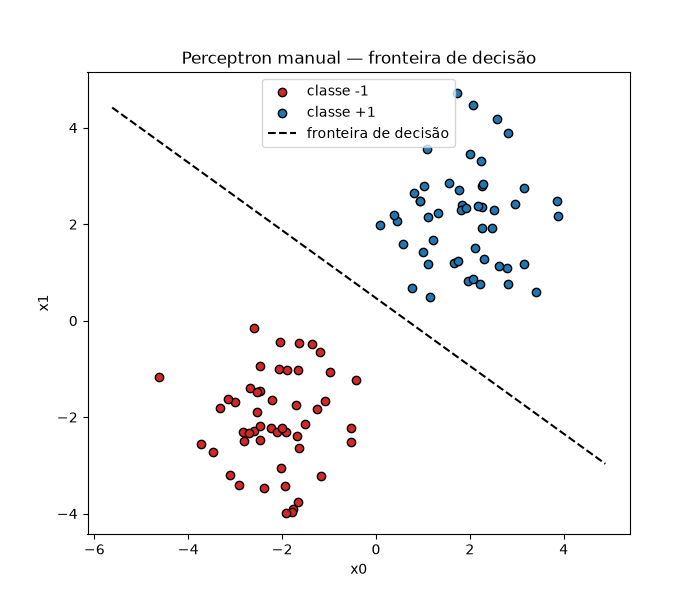

# PERCEPTRON SIMPLES

É um modelo que usa apenas 1 único neurônio. Ele não chega a formar uma rede neural, sendo a forma mais básica e simples de se usar esse modelo.

## Estrutura

O perceptron refletia diretamente o funcionamento de um neurônio real. Por isso ele era dividido em 4 partes:

### Sinais de Entrada (Dendritos)

Na biologia os dendritos são as ramificações que recebem os impulsos elétricos vindos de outros neurônios. No perceptron são as entradas X. Cada linha X é uma entrada e recebem um peso exclusivo. O peso serve para dizer o quanto aquela entrada deve ser levada em consideração.

### Corpo do neurônio

Faz a soma ponderada de todas as entradas. É aonde Z é calculado. 

$$z = w_1x_1 + w_2x_2 + ... + w_nx_n + b$$

O termo b é o intercepto (viés).

Podemos reescrever essa equação em forma de matriz da seguinte forma:

$$z = w^T x + b$$

O corpo tem esse comportamento pois é onde todos os dentritos se encontram e o processamento é feito, portanto toda a lógica pesada fica nele. Ele representa a voltagem total no neurônio.

> Repare que z é exatamente a mesma equação linear usada na regressão logística. A diferença entre os dois modelos não está em como calculam z, e sim no que fazem com ele depois.

A terceira parte também faz parte do corpo: a função de ativação.

### Função de Ativação

A segunda metade do corpo, **verifica se a soma das entradas (voltagem total) ultrapassa um certo limiar biológico (threshold). Se ultrapassar um certo valor o neurônio é ativado. Caso contrário, permanece em repouso.**

Isso significa que se a voltagem for alta o suficiente ele passa o sinal para frente e se for baixa não passa sinal nenhum adiante.

No perceptron original essa função de ativação é a função degrau. Enquanto a regressão logística passa z pela sigmoide (gerando uma probabilidade entre 0 e 1), o perceptron usa a **função degrau**: um corte seco que devolve apenas duas saídas possíveis, sem meio-termo. O threshold da função degrau é 0: tudo abaixo dele é uma categoria e tudo acima dele é outra.

$$\hat{y} = \begin{cases} +1, & \text{se } z \geq 0 \\ -1, & \text{se } z < 0 \end{cases}$$

Ainde +1 significa "classificou corretamente" e -1 significa "classificou errado". Repare que a **resposta não tem um significado como "1 é categoria X e -1 é categoria Y"**. Eles **significam "acertou" e "errou"**. Na literatura a função de atvação é chamada de f(z).

Não existe "70% de chance de ser da classe 1" no perceptron. Ou o ponto está de um lado do hiperplano, ou está do outro. Essa é a limitação que motivaram a substituição da degrau por funções suaves (sigmoide, ReLU) no futuro: uma **função de ativação diferenciável é obrigatória para o backpropagation funcionar**. A degrau tem derivada zero em quase todo ponto (e indefinida em z=0), então não dá para fazer o gradiente descendente através dela.

### Saída do Neurônio (Axônio)

Na biologia, o axônio é a fibra longa que transmite o sinal elétrico do neurônio para fora do corpo celular, enviando a informação para os próximos neurônios ou órgãos efetores. No perceptron ele é simplesmente o resultado final da função de ativação.

Aqui nenhuma conta é feita, só retorna a saída final do corpo.

## Regra de atualização de pesos

Os pesos começam em 0 e são atualizados a cada loop de treino. **A atualização dos pesos é o aprendizado e a inteligência do modelo**.

Aqui está a maior diferença em relação a regressão logística: a regressão usa **gradiente descendente** sobre uma função de perda diferenciável (entropia cruzada) para atualizar os pesos gradualmente.

O perceptron é mais simples e mais bruto: **só atualiza os pesos quando erra** a classificação de um ponto. Se o ponto $x_i$ com rótulo real $y_i$ (sempre 1 ou -1) foi classificado errado, a regra de atualização é:

$$w = w + \alpha \cdot y_i \cdot x_i$$
$$b = b + \alpha \cdot y_i$$

Aonde $\alpha$ é a **taxa de aprendizado**, um número pequeno (ex: 0.1) que controla o tamanho do passo de correção.

> Como saber se o ponto foi classificado errado sem chamar a função degrau? Basta checar o sinal de $y_i * z$. Se $y_i$ e z têm o mesmo sinal então o resultado é > 0 (acertou). Se os sinais são diferentes, então classificou errado, $y_i * z < 0$.

Diferente do gradiente descendente, que sempre dá um passo (mesmo que pequeno) na direção de menor erro, o perceptron **não muda nada quando já acerta**. Isso faz sentido porque a função de perda dele, na prática, é **"quantos pontos estão do lado errado da reta"**. Um ponto já classificado certo não contribui em nada para esse erro.

## Passo-a-Passo

1. **Inicializar os pesos** w e o intercepto b com zero ou valores pequenos aleatórios.
2. **Escolher uma taxa de aprendizado** $\alpha$ e um número máximo de épocas (voltas completas pelo dataset).
3. **Para cada época**, percorrer todos os dados de treino um a um:
   - Calcular $z = w \cdot x_i + b$ **para cada dado**.
   - Checar se o ponto foi classificado errado (se $y_i * z \leq 0$).
   - Se errou, atualizar w e b pela regra de atualização acima. Se acertou, não fazer nada.
   - Os pesos corrigidos já são usados no próximo dado dessa época.
4. **Verificar convergência (condição de parada):** se uma época inteira passou sem nenhum erro, todos os pontos foram classificados corretamente. O algoritmo convergiu e pode parar.
5. **Repetir os passos 3 e 4** até convergir ou até atingir o número máximo de épocas.

## Limitação dos Dados Linearmente Separáveis

O **Teorema de Convergência do Perceptron** garante que, **se os dados forem linearmente separáveis**, esse loop converge em um número finito de atualizações não importa a ordem em que os pontos são percorridos. Se os dados não forem linearmente separáveis, fica em loop infinito. Essa limitação de só conseguir separar dados linearmente separáveis **se deve a derivada da função degrau ser 0 (linha reta)**.

Um exemplo clássico de dados não linearmente separáveis é a porta lógica **XOR**. Ele tem 2 entradas X booleanas e retorna 1 quando as entradas são diferentes (`0,1` ou `1,0`) e 0 quando são iguais (`0,0` ou `1,1`). Não existe **nenhuma** reta em 2D capaz de separar os pontos `(0,1)` e `(1,0)` (classe 1) dos pontos `(0,0)` e `(1,1)` (classe 0), eles ficam intercalados nos quatro cantos do quadrado unitário. 

Essa limitação desacreditou o perceptron por mais de uma década, até o desenvolvimento do perceptron multicamadas com backpropagation resolver o problema.

## Quando Usar

- **Fins didáticos:** entender a ideia de "neurônio artificial treinável" antes de estudar redes neurais completas.
- **Dados linearmente separáveis e baratos computacionalmente:** quando existe de fato uma reta/hiperplano que separa as classes perfeitamente (ou quase), o perceptron converge rápido e usa pouquíssima memória (só o vetor de pesos).

## Quando Não Usar

- **Dados não linearmente separáveis.** 
- **Mais de 2 categorias.**
- **Quando você precisa de uma probabilidade, não só uma classe.** A saída do perceptron é só a categoria, sem noção de "confiança". Se o problema exige saber o quão certo o modelo está, a regressão logística (que devolve uma probabilidade via sigmoide) é mais adequada.

## Premissas

- **Linearmente separável.**
- **Classificação binária.**
- **Variáveis X numéricas.**
- **Escala das variáveis importa para a velocidade de convergência.** Não é uma premissa rígida (o perceptron converge mesmo sem padronizar, desde que separável), mas variáveis em escalas muito diferentes fazem a taxa de aprendizado ideal variar por dimensão, deixando o treino mais lento.
