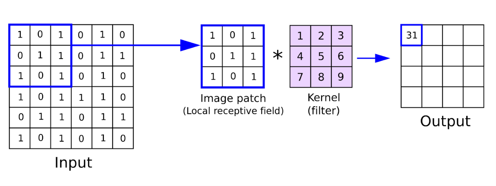

# REDES NEURAIS PROFUNDAS

Enquanto o Perceptron Multicamadas (MLP) introduziu a capacidade de aprender representações não lineares, a adição de múltiplas camadas ocultas (o conceito de **Deep Learning**) trouxe a capacidade de aprender abstrações em diferentes níveis. Em vez de exigir o processo manual de extração de características, as redes neurais profundas aprendem tanto os recursos relevantes quanto a tarefa final de forma ponta a ponta. 

Isso significa que ao fazer uma ação não precisamos descrevê-la passo-a-passo. As camadas ocultas detectam padrões, filtram informações e fazem a ação sem termos de especficar o como fazer. Por exemplo, não precisamos descrever o que define um rosto, a rede descobre sozinho os padrões que o definem. O mesmo vale para comportamentos ou qualquer outra característica menos palpável.

Contudo, empilhar simplesmente várias camadas de MLP gera problemas graves, como o **desaparecimento do gradiente e o custo computacional proibitivo**. Para contornar essas limitações em diferentes tipos de dados (imagens, sequências, texto, grafos), foram criadas **arquiteturas especializadas**. Essas arquiteturas especializadas além de evitar esses problemas também tem alterações que permite tratar tipos de dados específios como imagens, áudios ou dados temporais.

## LINHA DO TEMPO

- 1986: Criação do backpropagation e o reinício das redes neurais.
- 1989: Surgimento da CNN (redes neurais convolucionais) e RNN (redes neurais recorrentes).
  - Primeiro programa a usar CNN era reconhecer desenhos de números
- 1997: Surgimento do LSTM (Long Short-Term Memory) .
  - Surge para resolver o problema de esquecimento e desaparecimento do gradiente da RNN.
- 2007: Lançamento do CUDA, plataforma online pra processar dados e treinar IAs usando GPUs da Nvidia.
  - Importante: o CUDA não é uma arqutetura, mas uma **plataforma para treinar IA na nuvem**.
- **2012**: Deep Learning ganha os holofotes e se destaca entre as formas de machine learning.
  - Destaque vem com o AlexNet vencendo a competição ImageNet com larga vantagem usando arquitetura CNN.
  - AlexNet popularizou a função **ReLU** e o uso de **GPUs** para treinamento.
  - **Primeiro boom do machine learning**.
- 2014: Surgimento das GANs (Generative Adversarial Networks).
  - Revoluciona a criação de imagens e dados através da disputa desenhada por teoria dos jogos.
- **2017**: Surgimento dos Transformers.
  - Criado dentro do Google no artigo "Attention Is All You Need".
  - Elimina a necessidade de recorrência e convolução para processamento de linguagem e sequências.
  - Irá ser a base de todos os LLMs e a base do segundo boom do machine learning.
- 2018: Lançamento o GPT-1, ainda apenas em ambiente fechado e muito limitado comparado aos seus sucessores.
- 2020: Surgimento dos Vision Transformers e Modelos de Difusão. 
  - Transformers dominam a visão computacional e os modelos de difusão superam as GANs no aprendizado gerativo de imagens.
- 2020: Lançamento do GPT-3, agora sim com resultados astronômicos.
  - Provou que aumentar drasticamente o tamanho do modelo (e de dados) o faz alcançar o nível desejado.
- **2022**: Lançamento do ChatGPT, fazendo a IA cair na rotina de quem não era da computação. **Segundo boom do machine learning**.

Importante saber que as redes profundas e o deep learning não surgiram em 2012. Eles apenas se popularizaram em 2012, ganhando destaque dentre as demais formas de machine learning. Suas principais arquiteturas já existiam desde o fim da década de 80 mas com avanços dos processadores, uso de GPUs e acesso a dados massivos ela só se mostrou superior em 2012.

## DEFINIÇÃO

Uma rede neural profunda é toda **rede neural com ao menos 1 camada oculta**. Assim, mesmo uma MLP simples já é uma rede profunda. Como a camada de entrada não faz processamento nenhum quase toda rede neural é deep learning, pois usar apenas 1 camada (a de saída) resulta em uma rede super simples e pouco útil (perceptron).

## CLASSIFICAÇÃO E REGRESSÃO

As redes neurais foram criadas para classificação e reinam nisso, porém também servem bem para regressão. A cada camada a rede distorce um pouco os dados (adiciona uma dimensão na analogia do SVM ou faz um corte novo pensando como uma árvore). Isso a torna excelente para encontrar fórmulas matemáticas complexas que a regressão normal não consegue (como com raiz, exponenciais ou onde x é o expoente). O **Teorema da Aproximação Universal prova que a rede neural pode simular qualquer equação contínua**.

Como as camadas internas apenas torcem e distorcem os dados e seus espaços, a camada de saída tem o dever de formatar esse dado para a finalidade que queremos. Isso tudo (torções e formatações) são feitas pelas funções de ativação de cada camada. Para retornar os dados de uma regressão é usado na camada de saída a função Linear, que não faz nada no dado. Ou seja, apenas retorna o número calculado pela rede. Já que a rede é a própria regressão, não precisa de transformação na saída.

## PRINCIPAIS ARQUITETURAS DE REDES NEURAIS

### Perceptron Multicamadas (MLP)

É a arquitetura padrão de rede neural e ainda muito usada e poderosa. Não é por ser a primeira que era mais fraca. Se caracteriza por ter todos os neurônios de uma camada conectados com todos da próxima.

#### Informações Arquiteturais

- **Conexão dos neurônios:**
  - Densa (todos se conectam com todos)
- **Função de Ativação:**
  - Camada Oculta: ReLU
  - Camada Saída: Softmax ou Sigmoide (para classificação) e Linear (para regressão)

#### Quando Usar

- **Dados massivos**
- **Dados complexos e com alto número de atributos X**: quando métodos tradicionais como regressão, random forest e XGBoost estagnam sem dar um valor bom suficiente.
- **Regressão**: se aproxima de funções matemáticas de qualquer complexidade (desde que contínua)

#### Quando Não Usar

- **Puder separar as categorias com uma reta ou hiperplano:** Usar regressão logística ou SVM.
- **Poucos dados.** Uma rede com muitos parâmetros decora o treino (overfitting). Prefira modelos mais simples ou com regularização.
- **Poucos atributos X:** Melhor usar XGBoost ou Random Forest.
- **Quando a interpretabilidade é obrigatória.** Os pesos da camada oculta não têm um significado direto. Árvores de decisão ou regressão logística explicam melhor.
- **Imagens, texto, sequências.** Um MLP simples ignora a estrutura dos dados. Arquiteturas especializadas (CNN, RNN, Transformers) são mais indicadas.

### Redes Neurais Convolucionais (CNN)

As CNNs foram projetadas para processar dados dispostos em grade, especialmente imagens, vídeo e áudio (espectrogramas). Em vez de conectar cada pixel a cada neurônio (o que explodiria a quantidade de parâmetros), elas usam **filtros/kernels que deslizam sobre a imagem**, extraindo padrões locais como bordas, texturas e formatos complexos em camadas mais profundas.

O dado analisado precisa ser uma matriz (áudio, vídeo ou imagem) para que o filtro/kernel possa encontrar os padrões em cada área. O filtro/kernel é uma matriz menor (tamanho varia) e multiplica um pedaço da matriz dos dados. Com isso uma matriz NxN cria 1 único valor, que é colocado na matriz de saída. Então ele avança uma coluna para o lado e repete o processo. Ao acabar a coluna volta ao início e desce 1 linha. Com isso a matriz de saída será menor que a original (filtro tem tamanho NxN e a matriz de saída perde N-1 linhas e colunas). Isso significa que quanto maior o filtro menor a saída, pois mais ela enxuga os dados.

Escolher a matriz do filtro é essencial para encontrar o padrão escolhido. Uma matriz de detectar contornos é diferente de uma para detectar formas ou sombras. Os valores da matriz devem refletir o que quer encontrar. Por exemplo, um filtro passa-baixas (suavização/blur e apaga contornos) seria 

$\begin{bmatrix}
1/9 & 1/9 & 1/9 \\
1/9 & 1/9 & 1/9 \\
1/9 & 1/9 & 1/9
\end{bmatrix}$

Isso faz os dados de entrada perderem parte do ruído e dos contornos, deixando apenas o que queremos analisar para a próxima camada. Por outro lado um filtro passa-altas seria

$\begin{bmatrix}
-1 & 0 & 1 \\
-2 & 0 & 2 \\
-1 & 0 & 1
\end{bmatrix}$

Para detectar contornos verticais. Encontrar contornos horizontais ou diagonais a matriz muda. Importante entender que **cada camada possui seu próprio filtro**, sendo cada um responsável por encontrar um pedaço do padrão maior. Nenhum filtro sozinho consegue reconhecer um rosto, mas como **cada um detectou um pedaço e passou uma imagem mais limpa para o próximo conseguimos encontrar objetos e padrões desejados**.

#### Informações Arquiteturais

- **Conexão dos neurônios:**
  - Esparsa (neurônio se liga a N-1 da próxima camada)
- **Função de Ativação:**
  - Camada Oculta: ReLU
  - Camada Saída: Softmax ou Sigmoide (para classificação) e Linear (para regressão)

Uma CNN usa sigmoide na saída quando faz classificação binária (é algo, está ou não está na imagem). Caso queira detectar vários objetos terá 1 saída para cada objeto que se deseja encontrar, todos com saída sigmoide. Regressão é feita na CNN quando se quer encontrar as coordenadas de um objeto.

#### Quando usar:
- Visão computacional: classificação de imagens, detecção de objetos e vídeos.
- Processamento de dados espaciais 2D ou 3D (ex.: exames médicos, dados de satélite).

#### Pontos Positivos:
- Reconhece um objeto independentemente de onde ele esteja posicionado na imagem.
- Menos pesos e ligações.
- Altamente otimizada para execução GPUs.

#### Pontos Negativos:
- Dificuldade para capturar relações de longo alcance sem aumentar muito a profundidade ou o tamanho dos filtros.
- **Sensível a rotações e transformações espaciais** para as quais não foi treinada (exige ampliação de dados).

