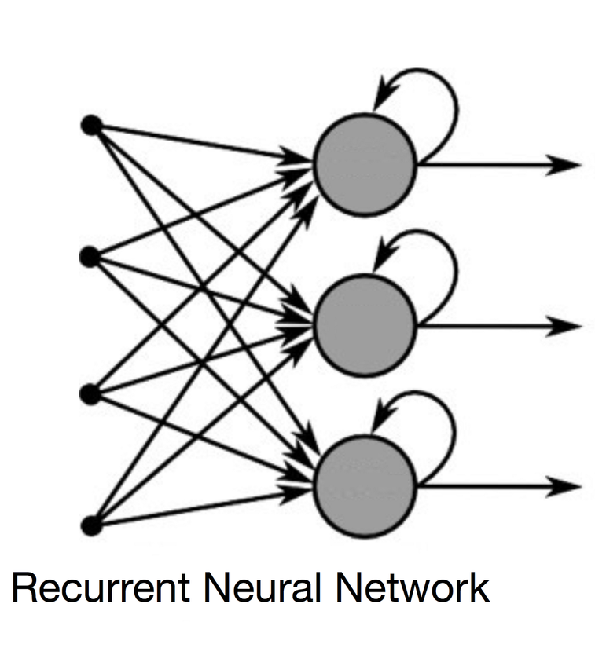
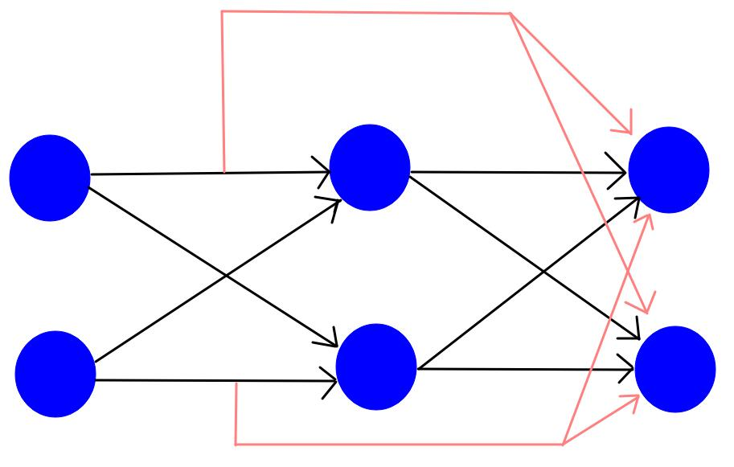
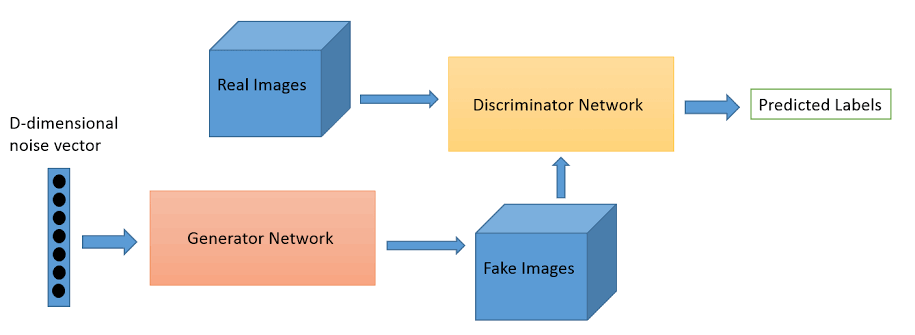
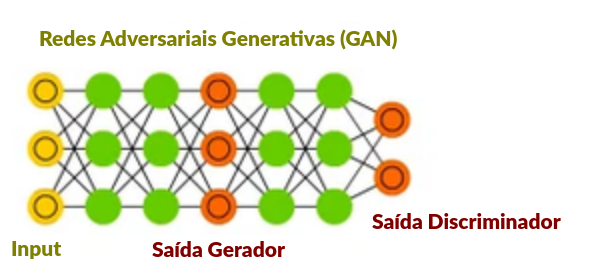
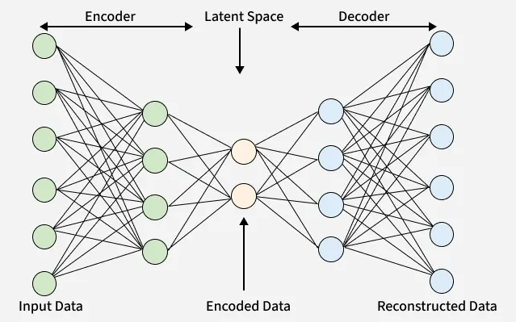

# REDES NEURAIS PROFUNDAS

Enquanto o Perceptron Multicamadas (MLP) introduziu a capacidade de aprender representações não lineares, a adição de múltiplas camadas ocultas (o conceito de **Deep Learning**) trouxe a capacidade de aprender abstrações em diferentes níveis. Em vez de exigir o processo manual de extração de características, as redes neurais profundas aprendem tanto os recursos relevantes quanto a tarefa final de forma ponta a ponta. 

Isso significa que ao fazer uma ação não precisamos descrevê-la passo-a-passo. As camadas ocultas detectam padrões, filtram informações e fazem a ação sem termos de especficar o como fazer. Por exemplo, não precisamos descrever o que define um rosto, a rede descobre sozinho os padrões que o definem. O mesmo vale para comportamentos ou qualquer outra característica menos palpável.

Contudo, empilhar simplesmente várias camadas de MLP gera problemas graves, como o **desaparecimento do gradiente e o custo computacional proibitivo**. Para contornar essas limitações em diferentes tipos de dados (imagens, sequências, texto, grafos), foram criadas **arquiteturas especializadas**. Essas arquiteturas especializadas além de evitar esses problemas também tem alterações que permite tratar tipos de dados específios como imagens, áudios ou dados temporais.

## LINHA DO TEMPO

- 1986: Criação do backpropagation e o reinício das redes neurais.
- 1989: Surgimento da CNN (redes neurais convolucionais) e RNN (redes neurais recorrentes).
  - Primeiro programa a usar CNN era reconhecer desenhos de números
- 1997: Surgimento do LSTM (Long Short-Term Memory) .
  - Surge para resolver o problema de esquecimento e desaparecimento do gradiente da RNN.
- 2007: Lançamento do CUDA, plataforma online pra processar dados e treinar IAs usando GPUs da Nvidia.
  - Importante: o CUDA não é uma arqutetura, mas uma **plataforma para treinar IA na nuvem**.
- **2012**: Deep Learning ganha os holofotes e se destaca entre as formas de machine learning.
  - Destaque vem com o AlexNet vencendo a competição ImageNet com larga vantagem usando arquitetura CNN.
  - AlexNet popularizou a função **ReLU** e o uso de **GPUs** para treinamento.
  - **Primeiro boom do machine learning**.
- 2014: Surgimento das GANs (Generative Adversarial Networks).
  - Revoluciona a criação de imagens e dados através da disputa desenhada por teoria dos jogos.
- 2015: Surgimento da ResNet (Residual Networks) pela Microsoft.
  - Permite treinar redes com centenas ou milhares de camadas sem o gradiente ir a zero.
- **2017**: Surgimento dos Transformers.
  - Criado dentro do Google no artigo "Attention Is All You Need".
  - Elimina a necessidade de recorrência e convolução para processamento de linguagem e sequências.
  - Irá ser a base de todos os LLMs e a base do segundo boom do machine learning.
- 2018: Lançamento o GPT-1, ainda apenas em ambiente fechado e muito limitado comparado aos seus sucessores.
- 2020: Surgimento dos Vision Transformers e Modelos de Difusão. 
  - Transformers dominam a visão computacional e os modelos de difusão superam as GANs no aprendizado gerativo de imagens.
- 2020: Lançamento do GPT-3, agora sim com resultados astronômicos.
  - Provou que aumentar drasticamente o tamanho do modelo (e de dados) o faz alcançar o nível desejado.
- **2022**: Lançamento do ChatGPT, fazendo a IA cair na rotina de quem não era da computação. **Segundo boom do machine learning**.

Importante saber que as redes profundas e o deep learning não surgiram em 2012. Eles apenas se popularizaram em 2012, ganhando destaque dentre as demais formas de machine learning. Suas principais arquiteturas já existiam desde o fim da década de 80 mas com avanços dos processadores, uso de GPUs e acesso a dados massivos ela só se mostrou superior em 2012.

## DEFINIÇÃO

Uma rede neural profunda é toda **rede neural com ao menos 1 camada oculta**. Assim, mesmo uma MLP simples já é uma rede profunda. Como a camada de entrada não faz processamento nenhum quase toda rede neural é deep learning, pois usar apenas 1 camada (a de saída) resulta em uma rede super simples e pouco útil (perceptron).

## CLASSIFICAÇÃO E REGRESSÃO

As redes neurais foram criadas para classificação e reinam nisso, porém também servem bem para regressão. A cada camada a rede distorce um pouco os dados (adiciona uma dimensão na analogia do SVM ou faz um corte novo pensando como uma árvore). Isso a torna excelente para encontrar fórmulas matemáticas complexas que a regressão normal não consegue (como com raiz, exponenciais ou onde x é o expoente). O **Teorema da Aproximação Universal prova que a rede neural pode simular qualquer equação contínua**.

Como as camadas internas apenas torcem e distorcem os dados e seus espaços, a camada de saída tem o dever de formatar esse dado para a finalidade que queremos. Isso tudo (torções e formatações) são feitas pelas funções de ativação de cada camada. Para retornar os dados de uma regressão é usado na camada de saída a função Linear, que não faz nada no dado. Ou seja, apenas retorna o número calculado pela rede. Já que a rede é a própria regressão, não precisa de transformação na saída.

## PRINCIPAIS ARQUITETURAS DE REDES NEURAIS

As principais arquiteturas são:

- MLP
- CNN
- RNN
- ResNet
- GAN
- AutoEncoder
- Transformer

## Perceptron Multicamadas (MLP)

É a arquitetura padrão de rede neural e ainda muito usada e poderosa. Não é por ser a primeira que era mais fraca. Se caracteriza por ter todos os neurônios de uma camada conectados com todos da próxima.

### Informações Arquiteturais

- **Conexão dos neurônios:**
  - Densa (todos se conectam com todos)
- **Função de Ativação:**
  - Camada Oculta: ReLU
  - Camada Saída: Softmax ou Sigmoide (para classificação) e Linear (para regressão)

### Quando Usar

- **Dados massivos**
- **Dados complexos e com alto número de atributos X**: quando métodos tradicionais como regressão, random forest e XGBoost estagnam sem dar um valor bom suficiente.
- **Regressão**: se aproxima de funções matemáticas de qualquer complexidade (desde que contínua)

### Quando Não Usar

- **Puder separar as categorias com uma reta ou hiperplano:** Usar regressão logística ou SVM.
- **Poucos dados.** Uma rede com muitos parâmetros decora o treino (overfitting). Prefira modelos mais simples ou com regularização.
- **Poucos atributos X:** Melhor usar XGBoost ou Random Forest.
- **Quando a interpretabilidade é obrigatória.** Os pesos da camada oculta não têm um significado direto. Árvores de decisão ou regressão logística explicam melhor.
- **Imagens, texto, sequências.** Um MLP simples ignora a estrutura dos dados. Arquiteturas especializadas (CNN, RNN, Transformers) são mais indicadas.

## Redes Neurais Convolucionais (CNN)

As CNNs foram projetadas para processar dados dispostos em grade, especialmente imagens, vídeo e áudio (espectrogramas). Em vez de conectar cada pixel a cada neurônio (o que explodiria a quantidade de parâmetros), elas usam **filtros/kernels que deslizam sobre a imagem**, extraindo padrões locais como bordas, texturas e formatos complexos em camadas mais profundas.

O dado analisado precisa ser uma matriz (áudio, vídeo ou imagem) para que o filtro/kernel possa encontrar os padrões em cada área. O filtro/kernel é uma matriz menor (tamanho varia) e multiplica um pedaço da matriz dos dados. Com isso uma matriz NxN cria 1 único valor, que é colocado na matriz de saída. Então ele avança uma coluna para o lado e repete o processo. Ao acabar a coluna volta ao início e desce 1 linha. Com isso a matriz de saída será menor que a original (filtro tem tamanho NxN e a matriz de saída perde N-1 linhas e colunas). Isso significa que quanto maior o filtro menor a saída, pois mais ela enxuga os dados.

Escolher a matriz do filtro é essencial para encontrar o padrão escolhido. Uma matriz de detectar contornos é diferente de uma para detectar formas ou sombras. Os valores da matriz devem refletir o que quer encontrar. Por exemplo, um filtro passa-baixas (suavização/blur e apaga contornos) seria 

$\begin{bmatrix}
1/9 & 1/9 & 1/9 \\
1/9 & 1/9 & 1/9 \\
1/9 & 1/9 & 1/9
\end{bmatrix}$

Isso faz os dados de entrada perderem parte do ruído e dos contornos, deixando apenas o que queremos analisar para a próxima camada. Por outro lado um filtro passa-altas seria

$\begin{bmatrix}
-1 & 0 & 1 \\
-2 & 0 & 2 \\
-1 & 0 & 1
\end{bmatrix}$

Para detectar contornos verticais. Encontrar contornos horizontais ou diagonais a matriz muda. Importante entender que **cada camada possui seu próprio filtro**, sendo cada um responsável por encontrar um pedaço do padrão maior. Nenhum filtro sozinho consegue reconhecer um rosto, mas como **cada um detectou um pedaço e passou uma imagem mais limpa para o próximo conseguimos encontrar objetos e padrões desejados**.

### Informações Arquiteturais

- **Conexão dos neurônios:**
  - Esparsa (neurônio se liga a N-1 da próxima camada)
- **Função de Ativação:**
  - Camada Oculta: ReLU
  - Camada Saída: Softmax ou Sigmoide (para classificação) e Linear (para regressão)

Uma CNN usa sigmoide na saída quando faz classificação binária (é algo, está ou não está na imagem). Caso queira detectar vários objetos terá 1 saída para cada objeto que se deseja encontrar, todos com saída sigmoide. Regressão é feita na CNN quando se quer encontrar as coordenadas de um objeto.

### Quando usar:
- Visão computacional: classificação de imagens, detecção de objetos e vídeos.
- Processamento de dados espaciais 2D ou 3D (ex.: exames médicos, dados de satélite).

### Pontos Positivos:
- Reconhece um objeto independentemente de onde ele esteja posicionado na imagem.
- Menos pesos e ligações.
- Altamente otimizada para execução GPUs.

### Pontos Negativos:
- Dificuldade para capturar relações de longo alcance sem aumentar muito a profundidade ou o tamanho dos filtros.
- **Sensível a rotações e transformações espaciais** para as quais não foi treinada (exige ampliação de dados).

## Redes Neurais Recorrentes e LSTM/GRU (RNN)

As RNNs trabalham com **dados em sequência**, ou seja, a **ordem dos dados importa**. Esses dados podem ser **temporais ou texto**, aonde as palavras que vieram antes influenciam o que vem depois. Como precisam saber a ordem dos dados eles precisam guardar a informação processada anterior, o que gera ciclos nas ligações dos neurônios. A saída de cada neurônio volta para si mesmo como entrada junto com o próximo dado. Isso significa que ao processar o dado 1 (primeira palavra do texto ou evento mais antigo da lista) todos os K*N resultados de todos os neurônios são guardados em uma memória e quando o dado 2 (segunda palavra ou segundo evento mais antigo) entrar na rede cada neurônios receberá seu respectivo último valor como mais uma das entradas. Esse loop de receber a saída como entrada no próximo loop cria o conceito de **memória interna**. 

Importante: **todos os neurônios da rede recebem um valor do passado** e recebem especificamente **a saída deles mesmos**. Um neurônio nunca recebe como entrada a saída de outro neurônio!

A rede recebe **apenas a saída da última rodada**, ou seja, não há entradas com a saída de 2 ou 3 rodadas atrás. Porém indiretamente todas as saídas anteriores estão compactadas nessa única entrada. Como esse valor foi calculado considerando todas as etapas anteriores, todas elas tem um pouco de peso no valor atual. O valor inicial dessa entrada na primeira rodada geralmente é 0, assim não afeta o primeiro loop. Essa entrada vindo do estado passado também tem um peso que é calculado pelo backpropagation. Ou seja, o backpropagation também mede o qual importante é os estados anteriores (e o quanto cada estado é) para o estado atual.

Os exemplos clássicos de dados desse tipo de arquitetura é texto, áudio, vídeo e séries temporais. Com texto podemos identificar a classe gramatical de cada palavra ou análise de sentimento.

O maior problema das RNNs é o desaparecimento de gradiente (vanish gradient). Isso acontece quando o peso se aproxima de 0, fazendo a rede deixar de considerar para sempre aquela entrada. Deixar de lembrar/considerar dados antigos deixa a rede como se tivesse aminésia igual a Dory, lembrando só do pasado próximo. Para resolver esse problema 2 variações dela foram criadas: LSTM e GRU..

A LSTM (Long ShorT-Term Memory) possui um buffer de memória chamada "estrada" ou Cell State ($C_t$)  e 3 portões por onde os dados de memória passam (esquecimento, entrada e saída). Os portões controlam explicitamente o que manter, adicionar ou descartar no buffer. O GRU (Gated Recurrent Unit) simplifica essa mecânica combinando o estado oculto e a célula em um único vetor gerido por apenas dois portões (atualização e reinicialização), oferecendo menor custo computacional e maior velocidade de treinamento.

Ela foi quase inteiramente abandonada com a chegada dos transformers, que faz tudo que ela faz muito melhor. Para processar texto, áudio e vídeo é muito melhor usar transformers ou CNNs com entrada adaptadas para áudio e vídeio. O único cenário onde ele continua sendo usado é em IOT e embarcados, pois consomem muito menos processamento. **Sensores e robótica seguem usando GRUs** para economia do processador. Celulares ainda usam GRU unicamente para detecção da palavra-chave que inicia a IA do sistema. **Apenas detectam se foi falado "hey Siri" e "OK Google"** e acordam o transformer para processar o resto da conversa. Também segue sendo usado aonde o **fluxo de novos dados nunca para** (como sensores de telemetria que atualizam a cada milissegundo ou mercado financeiro de altíssima frequência - bots que trabalham com atualizações de segundos). Isso por causa da sua velocidade para atualizar o estado, faz em O(N) e acessam em O(1).

> Curiosidade: em 2016 uma RNN escreveu o roteiro de um curta metragem chamado Sunspring. As frases não tinha nexo nenhum umas com as outras. Como uma tentativa de escrever um roteiro foi um fracasso total, mas achei um caso curioso. Foi filmado com atores de Hollywood e pode ser encontrado facilmente.

### Informações Arquiteturais

- **Conexão dos neurônios:**
  - Esparsa (neurônio se liga a N-1 da próxima camada)
- **Função de Ativação:**
  - Camada Oculta: ReLU
  - Camada Saída: Softmax ou Sigmoide (para classificação) e Linear (para regressão)

### Quando usar:
- IOT e robótica
- Detecção de palavra-chave para inicar algo
- Fluxo de dados constante e de alta frequência (dados novos a cada segundo ou menos)

### Pontos Positivos:
- Capacidade nativa de lidar com entradas e saídas de tamanho variável.
- Modela nativamente a relação temporal/ordenada entre os dados.

### Pontos Negativos:
- **Não podem ser facilmente paralelizadas** no treinamento.
- LSTMs e GRUs são lentas para treinar em sequências muito longas.
- Ainda propensas ao esquecimento de informações muito distantes no tempo se a sequência for muito extensa.

## Redes Neurais Residuais (ResNet)

É uma arquitetura criada para facilitar o treinamento de redes com muitas camadas. Ela não tem um tipo de dado específico que trabalhe como as anteriores, seu objetivo é impedir que o gradiente vá tendendo a zero conforme o número de camadas cresce (vanishing gradient). Para tanto ela criou o conceito de **conexões residuais (skip connections)**, onde a entrada de um bloco é somada diretamente à sua saída:

$z = \text{função de ativação}(F(x) + x)$

Isso significa que a camada recebe a saída da camada anterior mais a entrada da camada anterior diretamente na função de ativação. Ela faz a soma ponderada das entrada normalmente, aplicando os pesos como toda rede. A diferença vem que ao aplicar a função de ativação ao final ele soma nesse cálculo as entradas brutas da camada anterior. Essa mudança **só acontece a partir da segunda camada oculta**, já que a primeira camada não possui uma antes dela para receber os dados.

Camada 1: z1 = W1 * x + b1

Camada 1: a1 = ReLU(z1)

Camada 2: z2 = W2 * a1 + b2

Camada 2: a2 = ReLU(z2 + x)

Camada 3: z3 = W3 * a2 + b3

Camada 3: a3 = ReLU(z3 + a1)

Se a quantidade de neurônios for diferente nas duas camadas uma convolução 1x1 é utilizada para unir multiplicar as entradas da camada anterior e diminuir sua quantidade.

Quanto mais camadas a rede tem, mais abstrações ela é capaz de fazer, porém mais difícil é seu treino. Cada camada encontra um padrão diferente oculto nos dados (no caso de imagem, a primeira deteca contornos, a segunda texturas, a terceira partes de objetos...), então ter muitas camadas é importante para projetos complexos (principalmente em visão computacional, onde a ResNet é muito usada).

Embora sua arquitetura possa ser fundida a qualquer outra apresentada aqui, ela é muito encontrada e relacionada diretamente as convolucionais, que são a arquitetura que mais usa sua adaptação.

### Informações Arquiteturais

- **Conexão dos neurônios:**
  - Esparsa (igual a convolucional)
- **Função de Ativação:**
  - Camada Oculta: ReLU
  - Camada Saída: Softmax ou Sigmoide (para classificação) e Linear (para regressão)

### Quando usar:
- redes neurais convolucionais ou MLP extremamente profundas (dezenas ou centenas de camadas).
- Usada como espinha dorsal em arquiteturas de visão e detecção de objetos.

### Pontos Positivos:
- Resolve o problema de vanising gradient.
- Permite um treinamento mais rápido e convergência mais estável.

### Pontos Negativos:
- Aumento no uso de memória.

## Redes Neurais Adversárias Generativas (GAN)

A GAN (Redes Adversariais Generativas) é uma arquitetura feita para aprender a **criar novos dados que se assemelham aos dados de treinamento**. Foi a primeira rede a criar dados, imagens, vídeos ou textos. **Hoje foi totalmente substituída pelos transformers** (seja por LLMs ou por modelos de difusão). As GANs são especialmente úteis para aumentar a base de treino quando não se tem dados suficientes.

As GANs utilizam dois modelos treinados simultaneamente em um jogo de soma zero:
1.  **Gerador:** Tenta criar dados falsos idênticos aos reais a partir de um ruído aleatório.
2.  **Discriminador:** Tenta identificar se o dado apresentado é real ou gerado.

Essa competição entre as duas redes força ambas a sempre melhorarem, gerando cada vez dados mais próximos dos reais e criando detectores mais competentes. A relação entre as duas redes GAN foi inspirada em teoria dos jogos.

Como seu objetivo era criar dados novos que se parecem com os originais que a rede conhece (treino) sua arquitetura é bastante diferente das demais, que só rotulam ou fazem regressão nos dados já existentes. Criar uma informação que pareça com várias outras sem ser uma cópia exige aprender padrões comuns, o que é ignorar o que único de cada dado e recombinar de forma inédita.

A rede geradora busca descobrir uma distribuição de probabilidade para cada característica dos dados, assim pode variar essas características a cada novo dado gerado, gerando objetos diferentes a cada nova criação. A distribuição de probabilidade é o coração do gerador. Outro fator chave do gerador é o vetor de ruído, usado para gerar os dados a partir desse ruído inicial para que nunca crie o mesmo dado.

O discriminador por outro lado receber os dados reais e os gerados e precisa verificar quão parecidos eles são. Ele retorna um valor entre 0 e 1, aonde quando maior mais real é o dado criado. 1 indica 100% de convencimento que o dado é real e 0 não parece nada com dados reais. O discriminador nada mais é que um classificador binário, classificando entre Sim e Não (ou real e falso).

### Informações Arquiteturais

- **Conexão dos neurônios:**
  - Depende do que quer criar (ambos gerador e dicriminador podem ser densos ou esparsos)
- **Função de Ativação:**
  - Camada Oculta: 
    - Gerador: ReLU
    - Discriminador: Leaky ReLU
  - Camada Saída: 
    - Gerador: Tanh
    - Discriminador: Sigmoide

### Quando usar:
- Precisa criar dados em tempo real (velocidade é mais importante que qualidade)
- Filtros de vídeo ao vivo (como os do Instagram)
- Upscaling de jogos em tempo real (como o DLSS da Nvidia)
- Ferramentas de edição de imagem e vídeo com foco em velocidade

> Por que a GAN é tão mais rápida: As GANs geram o resultado em uma única passagem. Os Modelos de Difusão precisam de dezenas de passos iterativos de "remoção de ruído" para criar uma imagem, o que os torna lentos demais para vídeo ou processamento ao vivo.

- Aumentar resolução de imagens
  - Ex: pegar uma imagem médica ou uma foto de segurança antiga em baixa resolução e transformá-la em alta definição.

> A GAN é excelente para preencher texturas realistas microestruturadas (como poros da pele ou fibras de tecido) com base na imagem original, sem inventar elementos totalmente novos.

- Quando precisa rodar a rede neural em hardware limitado (celular, IOT ou embarcado)

> Só o treinamento da GAN é pesado. Depois de treinada ela consome muito menos memória e processamento que um Modelo de Difusão ou uma LLM.

### Pontos Positivos:
- Gera amostras extremamente nítidas e detalhadas.
- Não exige dados rotulados (aprendizado não supervisionado).
- Não exige uma função de reconstrução exata.
- Criação rápida.

### Pontos Negativos:
- **Treinamento altamente instável:** Dificuldade extrema para atingir o equilíbrio de Nash entre as duas redes.
- Problemas frequentes como **Mode Collapse** (o gerador aprende a reproduzir apenas um tipo de imagem para enganar o discriminador).
  - Ex: ao invés de criar imagens de gatos de váras cores e raças e diferentes posições, faz apenas gatos da mesma raça e cor e sempre na mesma posição porque aprendeu que o discriminador sempre aceita essa combinação.
- Memorização dos dados

## Autoencoders (AE e VAE)

Os Autoencoders são arquiteturas de redes neurais usadas para aprender representações compactas dos dados. Eles são especialmente úteis para **reduzir dimensionalidade, remover ruídos, detectar anomalias e aprender características importantes** de imagens, sinais e outros tipos de dados. São amplamente usadas em **aprendizado não supervisionado na redução de dimensão**, junto do PCA.

Uma de suas variantes mais importantes é o VAE (autoencoder variacional). Diferente do autoencoder tradicional (que aprende a reconstruir os dados a partir de uma representação compacta) o VAE aprende uma representação probabilística, permitindo gerar novos dados semelhantes aos utilizados no treinamento.

Redes compostas por duas partes: um **Encoder** que comprime a entrada em uma dimensão menor (chamada de espaço latente ou gargalo) e um **Decoder** que tenta reconstruir a entrada original a partir dessa representação comprimida.

- Encoder: recebe o dado X e gerar Z (espaço latente)
- Decoder: recebe o espaço latente Z e gera $\hat{X}$ (recriação de X)

$$X \rightarrow \text{Encoder} \rightarrow \text{espaço latente} \rightarrow \text{Decoder} \rightarrow \hat{X}$$

Isso significa que o encoder aprende a generalizar os dados, encontrando o que é relevante e quais suas características cruciais e mantendo apenas isso. O espaço latente (gerado pelo encoder) não precisa ser legível ou compreensível para nós. Pode até mesmo representar características que nem sabemos que existe (por isso ele não serve como clustering e o espaço latente só serve para comprimir os dados, não para uso final por nós). Ao manter só as características cruciais, todo o ruído dos dados é eliminado e a seleção de características é feita.

O **decoder não recria o dado original perfeitamente**. A rede treina para que a saída seja o mais próxima possível da entrada original, mas não é idêntica.

O treinamento dos dois lados é feita junto. A função de custo do autoencoder (ambos os lados) é o MSE (erro quadrático médio). O backpropagation calcula os novos pesos de ambos os lados a partir do erro do MSE e os pesos são atualizados segundo o gradiente descendente otimizado com Adam. Outras opções de função de custo usadas também no autoencoder são o MAE e a entropia cruzada.

> Importante ressaltar que o **autoencoder pode ser usado em qualqur arquitetura da rede**, ele não é uma arquitetura por si só, mas uma técnica que pode ser usada nas arquiteturas já existentes. Portanto ele pode ser usado com MLP, CNN ou RNN (igual o ResNet).

### Autoencoder Variacional VAE 

O VAE representa os dados por meio de distribuições de probabilidade. Isso faz que, diferente do tradicional que sempre gera o mesmo valor latente para a mesma entrada, possamos gerar valores latentes diferentes para a mesma entrada, fazendo com que a resposta intermediária nunca seja a mesma para o mesmo dado (e por consequência a saída do decoder também nunca seja idêntica). Isso adiciona um gradu de **temperatura** (aleatoriedade) nas respostas intermediárias e finais. Também permite **criar dados novos** como o GAN, apesar de seguirem por caminhos totalmente diferentes para fazer a mesma tarefa.

Isso significa que ele aprende uma representação probabilística das características que compoem os dados e com isso pode criar dados novos usando essas probabilidades, sorteando valores mais prováveis para cada feature.

Enquanto um autoencoder produz um espaço latente assim $z = [0.4, -0.7, 0.2]$ no VAE o espaço latente será uma média e um desvio padrão.

$$\mu = [0.4, -0.7, 0.2] \qquad\qquad \sigma = [0.1, 0.3, 0.2]$$

A média pode ser igual a saída do autoencoder tradicional, mas como o VAE também retorna o desvio padrão podmos gerar uma curva normal e distribuir os dados nela.

Para isso o VAE usa uma função de custo diferente da tradicional. Sua função de custo é a **normal multivariada com matriz de covariância diagonal**. Apesar do nome assustador é a equação da normal considerando vários X e com desvio padrão sendo a matriz de covariância desses X.

$$q_\phi(z \mid x) = N \left( \mu_\phi(x), \text{diag}(\sigma_\phi^2(x)) \right)$$

Por fim, ao final da rede encoder teremos 2 saídas (média e desvio). Precisamos transformar essas 2 saídas em 1 valor novamente para passarao decoder. Isso significa sortear um valor dessa distribuição para passar ao decoder (e é aqui que surge a aleatoriedade). Esse cálculo é feitp por

$$z = \mu + \sigma * N(0,1)$$

Aonde N(0,1) é a normal padrão. **É esse valor N(0,1) que sempre muda**. Esse fator é o ruído.

### Detecção de Anomalias

O autoencoder e o VAE falham ao reconstruir um dado anômalo (decoder o refaz mas com um erro imenso). Isso se deve por usar dados normais no treino e a rede aprender a desmontar e remontar dados normais apenas. Quando chega um dado anômalo sua remontagem o deixa todo diferente a entrada original. Assim **ao comparar a entrada original e a saída, se a diferença ultrapassar um limiar podemos considerá-lo anômalo**. A rede neural consegue fazer essa detecção mesmo em dados não lineares.

### Informações Arquiteturais

- **Conexão dos neurônios:**
  - Varia do uso (pode ser usado com MLP, CNN e GRU, etc)
- **Função de Ativação:**
  - Encoder:
    - Camada Oculta: ReLU, Leaky ReLU ou tanh
    - Camada Saída: Linear (para a média) e $e^{log(x)}$ (para desvio padrão)
  - Decoder:
    - Camada Oculta: ReLU, Leaky ReLU ou tanh
    - Camada Saída: sigmoide ou tanh (se os dados originais foram normalizados ou não antes de entrar no encoder) ou Linear (caso os dados não tenham sido transformados)

### Quando usar:
- Redução de dimensionalidade não linear (PCA funciona bem para dados lineares por usar covariância. Autoencoder extrapola para casos não lineares).
- Detecção de anomalias (o modelo falha em reconstruir dados anômalos).
- Remoção de ruído em imagens.

### Pontos Positivos:
- Excelente para **aprendizado não supervisionado** e extração de representações compactas.
- Útil para **compressão de dados**.

### Pontos Negativos:
- Imagens geradas por VAEs tradicionais tendem a ser mais embaçadas comparadas às geradas por GANs ou Modelos de Difusão.

## COMO TRATAR ÁUDIO COM REDE NEURAL

Áudio pode ser tratado de diferentes formas a depender do objetivo. Podemos transformá-lo em uma matriz 2D (tempo x frequência) chamada Espectrograma. Isso nos permite usar CNNs para processar o áudio. Podemos usar o áudio bruto 1D também, que é como todas as demais arquiteturas usam (incluisve a CNN com adaptações). As arquiteturas usadas hoje são: CNN, Transformer e Modelos de Difusão.

A CNN pode trabalhar com o áudio 1D bruto fazendo convulações dilatadas para aumentar a janela e capturar contextos temporais longos. É usado nos sistemas WaveNet (DeepMind) e SoundNet.

RNNs já foram a melhor escolha para áudio, inclusive devido a sua arquitetura temporal eram a escolha óbvia. Porém com o advento dos transformers ela perdeu seu espaço por ela se mostrar muito melhor. Os CNN 1D e 2D terminaram de matar as RNN para áudio, pois são absurdamente mais rápidas e não esquecem dados muito antigos.

> Uma ferramenta de transformer para áudio muito famosa é o Whisper da OpenAI, que aplica o mecanismo de auto-atenção diretamente sobre retalhos (patches) de espectrogramas.

- Classificar gênero musical: CNN 2D
- Detectar sons específicos: CNN 2D
- Identificar palavras-chave: CNN 2D
- Identificar quem tá falando: CNN 2D
- Criar voz e transformar texto em voz (text-to-speech): CNN 1D
- Transcrição do áudio (speech-to-text): Transformer
- Tradução de áudio: Transformer
- Criação de áudio (cloneagem de voz, criação de voz sintética ou criar música): Modelos de Difusão
- Cancelamento de ruído: Modelos de Difusão

## MÉTRCAS

## RESUMO COMPARATIVO DE APLICAÇÃO

| Arquitetura | Estrutura Chave | Tipo de Dado Ideal | Principal Vantagem | Principal Desvantagem |
| :--- | :--- | :--- | :--- | :--- |
| **CNN** | Convolução | Imagens / Matrizes 2D/3D | Invariância espacial e baixo número de parâmetros | Dificuldade com dependências globais |
| **RNN/LSTM** | Conexões em Loop | Sequências / Séries Temporais | Preserva ordem temporal nativamente | Treinamento não paralelizável |
| **ResNet** | Conexões Residuais | Imagens / Redes Profundas em geral | Permite criar redes super profundas sem degradação | Maior uso de memória |
| **GAN** | Gerador vs Discriminador | Criação de Imagens e Áudio | Alta fidelidade visual nas saídas | Treinamento muito instável |
| **Autoencoder** | Encoder - Gargalo - Decoder | Qualquer tipo de dado | Ótimo para detecção de anomalias | Reconstruções podem ser ruidosas ou borradas |
| **Transformer** | Autoatenção | Texto / Sequências Longas / Multimodal | Paralelização massiva e contexto amplo | Custo computacional $O(N^2)$ |